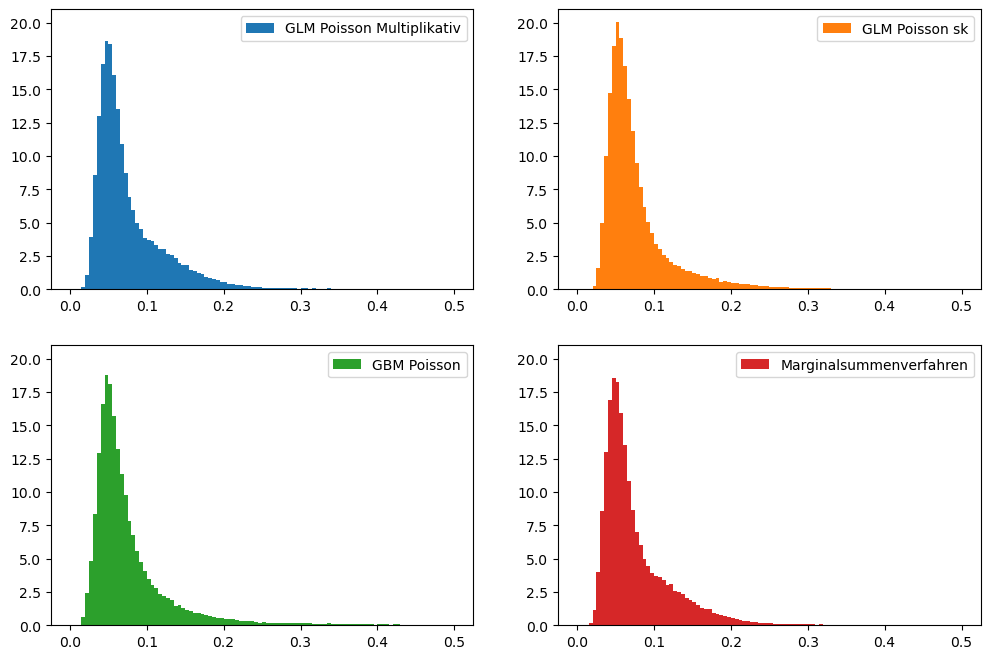
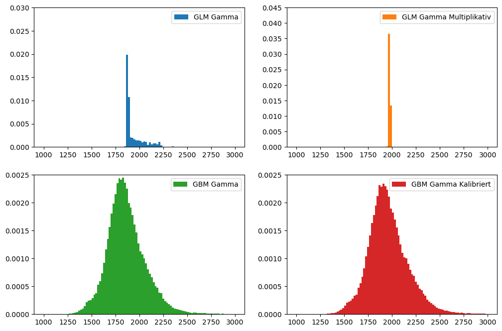
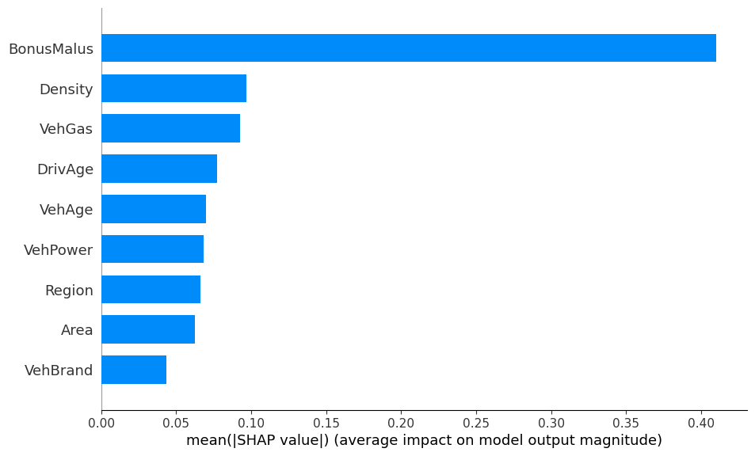
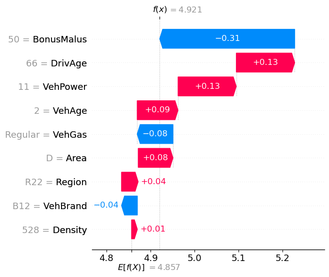
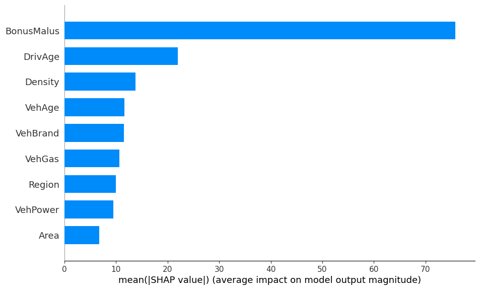
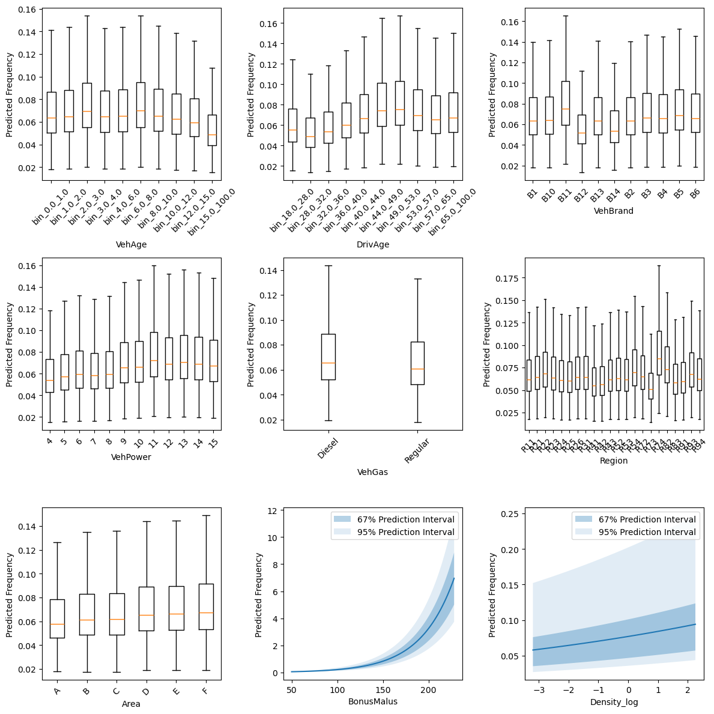

# Risikomodellierung in der Schadenversicherung mit Python

Dieses Notebook dient als Begleitmaterial zur Masterthesis "Risikomodellierung in der Schadenverischerung mit Python". Am einfachsten kann das Notebook interaktiv über Binder ausgeführt werden. Dazu einfach auf den folgenden Button klicken:

[](https://mybinder.org/v2/gh/Diadochokinetic/fremtpl/HEAD?labpath=Risikomodellierung+in+der+Schadenversicherung+mit+Python.ipynb)
[](https://nbviewer.org/github/Diadochokinetic/fremtpl/blob/main/Risikomodellierung%20in%20der%20Schadenversicherung%20mit%20Python.ipynb)

Alternativ kann auch eine eigene Jupyter-Umgebung mit den in `requirements.txt` hinterlegten Abhängigkeiten genutzt werden. Der grundlegende Aufbau wurde inspieriert durch das scikit-learn Tutorial [Tweedie regression on insurance claims](https://scikit-learn.org/stable/auto_examples/linear_model/plot_tweedie_regression_insurance_claims.html).

Es werden verschiedene Modelltypen vorgestellt. Wir betrachten hierbei ältere Modelle, wie das Marginalsummenverfahren nach Bailey, die aktuell überlicherweise verwendeten Generalisierten Linearen Modelle (GLMs), sowie die potentiell für die Risikomodellierung interessanten Gradient Boosting Modelle (GBMs). Es wird gezeigt, wie diese Modelle zur Ermittlung der Netto-Risikoprämie verwendet werden können. Dabei werden direkte Modellierungsansätze, sowie kombinierte Ansätze auf Basis der Schadenhäufigkeit und -höhe vorgestellt. Die entwickelten Modelle werden anhand verschiedener Dimensionen bewertet:

- verschiedene Metriken zur Vorhersagequalität
- der Vorhersage des Gesamtschadenaufwands
- der Fähigkeit, Risiken zu ordnen

Schließlich werden verschiedene Methoden zur Erklärung der Modelle vorgestellt.

## Daten

Die in diesem Notebook verwendeten Daten sind die "French Motor Third-Party Liability Claims" Datensätze von [OpenML](https://www.openml.org/). Diese bestehen aus einem separaten Datensatz für die Schadenhäufigkeit: [freMTPL2freq](https://www.openml.org/d/41214) und einem für die Schadenhöhe: [freMTPL2sev](https://www.openml.org/d/41214).


```python
from IPython import get_ipython
import pandas as pd
from sklearn.datasets import fetch_openml

# formatter for DataFrames to make them readable as markdown
html_formatter = get_ipython().display_formatter.formatters["text/html"]

html_formatter.for_type(
    pd.DataFrame,
    lambda df: df.to_html(
        max_rows=pd.get_option("display.max_rows"), show_dimensions=True
    ),
)

# freMTPL2freq dataset from https://www.openml.org/d/41214
df_freq = fetch_openml(data_id=41214, as_frame=True, parser="pandas").data
df_freq["IDpol"] = df_freq["IDpol"].astype(int)
df_freq.set_index("IDpol", inplace=True)

# freMTPL2sev dataset from https://www.openml.org/d/41215
df_sev = fetch_openml(data_id=41215, as_frame=True, parser="pandas").data
```

    /tmp/ipykernel_19031/3148050672.py:2: DeprecationWarning: 
    Pyarrow will become a required dependency of pandas in the next major release of pandas (pandas 3.0),
    (to allow more performant data types, such as the Arrow string type, and better interoperability with other libraries)
    but was not found to be installed on your system.
    If this would cause problems for you,
    please provide us feedback at https://github.com/pandas-dev/pandas/issues/54466
            
      import pandas as pd


### Datenaufbereitung

Es gibt einige Aufbereitungsschritte, die für beide Datensätze durchgeführt werden müssen, andere Schritte müssen nur für bestimmte Modelltypen durchgeführt werden.

#### Allgemeine Schritte

Für die folgenden Modellierungszwecke werden die beiden Datensätze auf Basis der Policy-ID zusammengeführt. Eine Police kann hierbei mehrere Schäden haben, diese müssen vor der Zusammenführung aggregiert werden.


```python
# sum ClaimAmount over identical IDs
df_sev = df_sev.groupby("IDpol").sum()

df = df_freq.join(df_sev, how="left")
df["ClaimAmount"] = df["ClaimAmount"].fillna(0)

# unquote string fields
for column_name in df.columns[df.dtypes.values == object]:
    df[column_name] = df[column_name].str.strip("'")
```

Die Schadenanzahl wird später als Gewicht in der Modellierung der Schadenhähe verwendet. Da hierbei nur strikt positive Werte verwendet werden können, wird die Schadenanzahl für Schäden ohne Aufwand auf 0 gesetzt.


```python
df.loc[(df["ClaimAmount"] == 0) & (df["ClaimNb"] >= 1), "ClaimNb"] = 0
```

Außergewöhnlich hohe Werte für die Anzahl der Schäden, die Jahreseinheiten und die Schadenhöhe werden abgeschnitten. Dies ist notwendig, um die Modelle zu stabilisieren und zu verhindern, dass sie von Ausreißern dominiert werden.

Beachte: In einem realen Szenario können wir den Schadenaufwand nicht einfach kappen und den gekappten Teil ignorieren. Wir müssten den überschüssigen Schadenaufwand auf die anderen Schäden verteilen. Es gibt verschiedene Möglichkeiten, dies zu tun. Dies wird hier aus Gründen der Einfachheit nicht durchgeführt.


```python
df["ClaimNb"] = df["ClaimNb"].clip(upper=4)
df["Exposure"] = df["Exposure"].clip(upper=1)
df["ClaimAmount"] = df["ClaimAmount"].clip(upper=200000)
```

Bildung der verschiedenen Zielvariablen


```python
import numpy as np

# Insurances companies are interested in modeling the Pure Premium, that is
# the expected total claim amount per unit of exposure for each policyholder
# in their portfolio:
df["PurePremium"] = df["ClaimAmount"] / df["Exposure"]

# This can be indirectly approximated by a 2-step modeling: the product of the
# Frequency times the average claim amount per claim:
df["Frequency"] = df["ClaimNb"] / df["Exposure"]
# original approach
df["AvgClaimAmount"] = df["ClaimAmount"] / np.fmax(df["ClaimNb"], 1)
```

Die Daten mit den angereicherten Zielvariablen sehen wie folgt aus:


```python
sample = df.sample(5, random_state=6)
display(sample.T)
```


<table border="1" class="dataframe">
  <thead>
    <tr style="text-align: right;">
      <th>IDpol</th>
      <th>4027244</th>
      <th>3014632</th>
      <th>2022844</th>
      <th>6066130</th>
      <th>31135</th>
    </tr>
  </thead>
  <tbody>
    <tr>
      <th>ClaimNb</th>
      <td>0</td>
      <td>1</td>
      <td>1</td>
      <td>0</td>
      <td>0</td>
    </tr>
    <tr>
      <th>Exposure</th>
      <td>0.54</td>
      <td>0.63</td>
      <td>0.05</td>
      <td>0.74</td>
      <td>0.57</td>
    </tr>
    <tr>
      <th>Area</th>
      <td>D</td>
      <td>D</td>
      <td>C</td>
      <td>A</td>
      <td>D</td>
    </tr>
    <tr>
      <th>VehPower</th>
      <td>7</td>
      <td>5</td>
      <td>8</td>
      <td>4</td>
      <td>5</td>
    </tr>
    <tr>
      <th>VehAge</th>
      <td>3</td>
      <td>2</td>
      <td>1</td>
      <td>2</td>
      <td>0</td>
    </tr>
    <tr>
      <th>DrivAge</th>
      <td>49</td>
      <td>69</td>
      <td>57</td>
      <td>46</td>
      <td>33</td>
    </tr>
    <tr>
      <th>BonusMalus</th>
      <td>53</td>
      <td>76</td>
      <td>50</td>
      <td>50</td>
      <td>50</td>
    </tr>
    <tr>
      <th>VehBrand</th>
      <td>B12</td>
      <td>B2</td>
      <td>B12</td>
      <td>B12</td>
      <td>B5</td>
    </tr>
    <tr>
      <th>VehGas</th>
      <td>Diesel</td>
      <td>Diesel</td>
      <td>Diesel</td>
      <td>Regular</td>
      <td>Diesel</td>
    </tr>
    <tr>
      <th>Density</th>
      <td>1287</td>
      <td>678</td>
      <td>106</td>
      <td>25</td>
      <td>1974</td>
    </tr>
    <tr>
      <th>Region</th>
      <td>R72</td>
      <td>R23</td>
      <td>R11</td>
      <td>R91</td>
      <td>R54</td>
    </tr>
    <tr>
      <th>ClaimAmount</th>
      <td>0.0</td>
      <td>1204.0</td>
      <td>1172.0</td>
      <td>0.0</td>
      <td>0.0</td>
    </tr>
    <tr>
      <th>PurePremium</th>
      <td>0.0</td>
      <td>1911.111111</td>
      <td>23440.0</td>
      <td>0.0</td>
      <td>0.0</td>
    </tr>
    <tr>
      <th>Frequency</th>
      <td>0.0</td>
      <td>1.587302</td>
      <td>20.0</td>
      <td>0.0</td>
      <td>0.0</td>
    </tr>
    <tr>
      <th>AvgClaimAmount</th>
      <td>0.0</td>
      <td>1204.0</td>
      <td>1172.0</td>
      <td>0.0</td>
      <td>0.0</td>
    </tr>
  </tbody>
</table>
<p>15 rows × 5 columns</p>


```python
# TODO - Entfernen, wenn Arbeit fertig.
# sample.T.to_latex(
#     buf="/home/fabian/Projects/master-thesis/thesis/Tables/dataset_final.tex",
#     float_format="%.2f",
#     caption=("Beispiele aus dem zusammengeführten Datensatz mit den Zielvariablen", "Datensatz mit Zielvariablen"),
#     label="tab:dataset_final"
# )
```

Train-Test Split mit den Standard Parametern

- train_size=0.75
- test_size=0.25


```python
from sklearn.model_selection import train_test_split

df_train, df_test = train_test_split(df, random_state=0)
print(f"Train Samples: {len(df_train)}")
print(f"Test Samples: {len(df_test)}")
```

    Train Samples: 508509
    Test Samples: 169504


Die Modelle für die Schadenhöhe werden nur auf Beobachtungen mit mindestens einem Schaden trainiert. Daher müssen wir nach diesen Beobachtungen filtern.


```python
mask_train = df_train["ClaimAmount"] > 0
mask_test = df_test["ClaimAmount"] > 0
```

#### Marginalsummenverfahren spezifische Schritte

Die Implementierung des Marginalsummenverfahrens erfordert, dass alle Merkmale binär sind. Für die Merkmale ["VehAge", "DrivAge", "VehBrand", "VehPower", "VehGas", "Region", "Area"] können wir die Aufbereitung aus dem [scikit-learn Tutorial](https://scikit-learn.org/stable/auto_examples/linear_model/plot_tweedie_regression_insurance_claims.html) verwenden. Für die Merkmale ["BonusMalus", "Density"] müssen wir die binären Merkmale selbst erstellen.

Beachte: In einem realen Szenario ist die Merkmalskonstruktion ein entscheidender Teil des Modellierungsprozesses. Es kann sehr mühsam und zeitaufwändig sein. In diesem Notebook gehen wir davon aus, dass die transformierten Merkmale gegeben sind und konzentrieren uns auf den Modellierungsteil.


```python
from sklearn.compose import ColumnTransformer
from sklearn.pipeline import make_pipeline
from sklearn.preprocessing import (
    FunctionTransformer,
    KBinsDiscretizer,
    OneHotEncoder,
    StandardScaler,
)

df_train["BonusMalusBin"] = pd.cut(
    df_train["BonusMalus"], bins=[0, 55, 57, 60, 68, 74, 86, 100, 120, 300]
)
df_train["DensityBin"] = pd.cut(
    df_train["Density"].apply(np.log),
    bins=[0, 2.5, 3, 3.8, 5, 6, 6.5, 7, 8, 11],
    include_lowest=True,
)
df_test["BonusMalusBin"] = pd.cut(
    df_test["BonusMalus"], bins=[0, 55, 57, 60, 68, 74, 86, 100, 120, 300]
)
df_test["DensityBin"] = pd.cut(
    df_test["Density"].apply(np.log),
    bins=[0, 2.5, 3, 3.8, 5, 6, 6.5, 7, 8, 11],
    include_lowest=True,
)

column_trans_mmt = ColumnTransformer(
    [
        (
            "binned_numeric",
            KBinsDiscretizer(n_bins=10, subsample=int(2e5), random_state=0),
            ["VehAge", "DrivAge"],
        ),
        (
            "onehot_categorical",
            OneHotEncoder(),
            [
                "VehBrand",
                "VehPower",
                "VehGas",
                "Region",
                "Area",
                "BonusMalusBin",
                "DensityBin",
            ],
        ),
    ],
    remainder="drop",
)
column_trans_mmt.fit(df_train)

X_train_mmt = column_trans_mmt.transform(
    df_train
).toarray()  # the implementation can't handle sparse matrix
X_test_mmt = column_trans_mmt.transform(
    df_test
).toarray()  # the implementation can't handle sparse matrix
```

Damit die nun neu erstellten binären Merkmale später erklärbar sind, speichern wir die Merkmalsnamen in einer Liste.


```python
# Get feature names
feature_names_mmt = []

# For binned_numeric
binned_numeric_transformer = column_trans_mmt.named_transformers_["binned_numeric"]
for feature, bin_edges in zip(
    ["VehAge", "DrivAge"], binned_numeric_transformer.bin_edges_
):
    for start, end in zip(bin_edges[:-1], bin_edges[1:]):
        feature_names_mmt.append(f"{feature}_bin_{start}_{end}")

# For onehot_categorical
onehot_features = column_trans_mmt.named_transformers_[
    "onehot_categorical"
].get_feature_names_out(
    [
        "VehBrand",
        "VehPower",
        "VehGas",
        "Region",
        "Area",
        "BonusMalusBin",
        "DensityBin",
    ]
)
feature_names_mmt.extend(onehot_features)
```

Aus den 9 urpsürnglichen Merkmalen werden 91 binär transformierte Merkmale.


```python
X_train_mmt.shape
```


    (508509, 91)


Nicht jedes Merkmal hat hierbei die gleiche Anzahl an Kategorien und auch nicht jeden Kategorie hat stets viele Beobachtungen. In Region R43 gibt es z.B. weniger als 1000 Beobachtungen. In einem realen Szenario kann man an dieser Stelle überlegen, ob man die Regionen nicht weiter zusammenfasst.


```python
cols = [
    "VehAge",
    "DrivAge",
    "VehBrand",
    "VehPower",
    "VehGas",
    "Region",
    "Area",
    "BonusMalusBin",
    "DensityBin",
]

df_train_mmt = pd.DataFrame(X_train_mmt, columns=feature_names_mmt)

counts = {col: [] for col in cols}
for col in df_train_mmt.columns:
    for prefix in cols:
        if col.startswith(prefix):
            feature = col[len(prefix) + 1 :]
            feature = feature.replace("_", "-")
            feature = feature.replace("bin-", "")
            count = df_train_mmt[col].sum()
            counts[prefix].append((feature, count))

df_counts = pd.concat(
    {k: pd.DataFrame(v, columns=["Kategorie", "Anzahl"]) for k, v in counts.items()},
    axis=1,
)
df_counts
```


<table border="1" class="dataframe">
  <thead>
    <tr>
      <th></th>
      <th colspan="2" halign="left">VehAge</th>
      <th colspan="2" halign="left">DrivAge</th>
      <th colspan="2" halign="left">VehBrand</th>
      <th colspan="2" halign="left">VehPower</th>
      <th colspan="2" halign="left">VehGas</th>
      <th colspan="2" halign="left">Region</th>
      <th colspan="2" halign="left">Area</th>
      <th colspan="2" halign="left">BonusMalusBin</th>
      <th colspan="2" halign="left">DensityBin</th>
    </tr>
    <tr>
      <th></th>
      <th>Kategorie</th>
      <th>Anzahl</th>
      <th>Kategorie</th>
      <th>Anzahl</th>
      <th>Kategorie</th>
      <th>Anzahl</th>
      <th>Kategorie</th>
      <th>Anzahl</th>
      <th>Kategorie</th>
      <th>Anzahl</th>
      <th>Kategorie</th>
      <th>Anzahl</th>
      <th>Kategorie</th>
      <th>Anzahl</th>
      <th>Kategorie</th>
      <th>Anzahl</th>
      <th>Kategorie</th>
      <th>Anzahl</th>
    </tr>
  </thead>
  <tbody>
    <tr>
      <th>0</th>
      <td>0.0-1.0</td>
      <td>43384.0</td>
      <td>18.0-28.0</td>
      <td>45915.0</td>
      <td>B1</td>
      <td>121823.0</td>
      <td>4</td>
      <td>86587.0</td>
      <td>Diesel</td>
      <td>249052.0</td>
      <td>R11</td>
      <td>52344.0</td>
      <td>A</td>
      <td>78022.0</td>
      <td>(0, 55]</td>
      <td>323094.0</td>
      <td>(-0.001, 2.5]</td>
      <td>11044.0</td>
    </tr>
    <tr>
      <th>1</th>
      <td>1.0-2.0</td>
      <td>53301.0</td>
      <td>28.0-32.0</td>
      <td>44642.0</td>
      <td>B10</td>
      <td>13232.0</td>
      <td>5</td>
      <td>93563.0</td>
      <td>Regular</td>
      <td>259457.0</td>
      <td>R21</td>
      <td>2240.0</td>
      <td>B</td>
      <td>56725.0</td>
      <td>(55, 57]</td>
      <td>16059.0</td>
      <td>(2.5, 3.0]</td>
      <td>15342.0</td>
    </tr>
    <tr>
      <th>2</th>
      <td>2.0-3.0</td>
      <td>44422.0</td>
      <td>32.0-36.0</td>
      <td>50617.0</td>
      <td>B11</td>
      <td>10154.0</td>
      <td>6</td>
      <td>111678.0</td>
      <td>NaN</td>
      <td>NaN</td>
      <td>R22</td>
      <td>5949.0</td>
      <td>C</td>
      <td>143933.0</td>
      <td>(57, 60]</td>
      <td>19559.0</td>
      <td>(3.0, 3.8]</td>
      <td>43220.0</td>
    </tr>
    <tr>
      <th>3</th>
      <td>3.0-4.0</td>
      <td>37648.0</td>
      <td>36.0-40.0</td>
      <td>52248.0</td>
      <td>B12</td>
      <td>124757.0</td>
      <td>7</td>
      <td>108919.0</td>
      <td>NaN</td>
      <td>NaN</td>
      <td>R23</td>
      <td>6658.0</td>
      <td>D</td>
      <td>113577.0</td>
      <td>(60, 68]</td>
      <td>41135.0</td>
      <td>(3.8, 5.0]</td>
      <td>99553.0</td>
    </tr>
    <tr>
      <th>4</th>
      <td>4.0-6.0</td>
      <td>61610.0</td>
      <td>40.0-44.0</td>
      <td>50563.0</td>
      <td>B13</td>
      <td>9188.0</td>
      <td>8</td>
      <td>35399.0</td>
      <td>NaN</td>
      <td>NaN</td>
      <td>R24</td>
      <td>120359.0</td>
      <td>E</td>
      <td>102810.0</td>
      <td>(68, 74]</td>
      <td>18386.0</td>
      <td>(5.0, 6.0]</td>
      <td>89253.0</td>
    </tr>
    <tr>
      <th>5</th>
      <td>6.0-8.0</td>
      <td>51547.0</td>
      <td>44.0-48.0</td>
      <td>49570.0</td>
      <td>B14</td>
      <td>3009.0</td>
      <td>9</td>
      <td>22654.0</td>
      <td>NaN</td>
      <td>NaN</td>
      <td>R25</td>
      <td>8058.0</td>
      <td>F</td>
      <td>13442.0</td>
      <td>(74, 86]</td>
      <td>43693.0</td>
      <td>(6.0, 6.5]</td>
      <td>42159.0</td>
    </tr>
    <tr>
      <th>6</th>
      <td>8.0-10.0</td>
      <td>48392.0</td>
      <td>48.0-53.0</td>
      <td>62082.0</td>
      <td>B2</td>
      <td>119846.0</td>
      <td>10</td>
      <td>23413.0</td>
      <td>NaN</td>
      <td>NaN</td>
      <td>R26</td>
      <td>7919.0</td>
      <td>NaN</td>
      <td>NaN</td>
      <td>(86, 100]</td>
      <td>40754.0</td>
      <td>(6.5, 7.0]</td>
      <td>39628.0</td>
    </tr>
    <tr>
      <th>7</th>
      <td>10.0-12.0</td>
      <td>50887.0</td>
      <td>53.0-57.0</td>
      <td>44607.0</td>
      <td>B3</td>
      <td>40079.0</td>
      <td>11</td>
      <td>13763.0</td>
      <td>NaN</td>
      <td>NaN</td>
      <td>R31</td>
      <td>20516.0</td>
      <td>NaN</td>
      <td>NaN</td>
      <td>(100, 120]</td>
      <td>4164.0</td>
      <td>(7.0, 8.0]</td>
      <td>73727.0</td>
    </tr>
    <tr>
      <th>8</th>
      <td>12.0-15.0</td>
      <td>60700.0</td>
      <td>57.0-65.0</td>
      <td>53352.0</td>
      <td>B4</td>
      <td>18857.0</td>
      <td>12</td>
      <td>6176.0</td>
      <td>NaN</td>
      <td>NaN</td>
      <td>R41</td>
      <td>9699.0</td>
      <td>NaN</td>
      <td>NaN</td>
      <td>(120, 300]</td>
      <td>1665.0</td>
      <td>(8.0, 11.0]</td>
      <td>94583.0</td>
    </tr>
    <tr>
      <th>9</th>
      <td>15.0-100.0</td>
      <td>56618.0</td>
      <td>65.0-100.0</td>
      <td>54913.0</td>
      <td>B5</td>
      <td>26145.0</td>
      <td>13</td>
      <td>2403.0</td>
      <td>NaN</td>
      <td>NaN</td>
      <td>R42</td>
      <td>1654.0</td>
      <td>NaN</td>
      <td>NaN</td>
      <td>NaN</td>
      <td>NaN</td>
      <td>NaN</td>
      <td>NaN</td>
    </tr>
    <tr>
      <th>10</th>
      <td>NaN</td>
      <td>NaN</td>
      <td>NaN</td>
      <td>NaN</td>
      <td>B6</td>
      <td>21419.0</td>
      <td>14</td>
      <td>1755.0</td>
      <td>NaN</td>
      <td>NaN</td>
      <td>R43</td>
      <td>975.0</td>
      <td>NaN</td>
      <td>NaN</td>
      <td>NaN</td>
      <td>NaN</td>
      <td>NaN</td>
      <td>NaN</td>
    </tr>
    <tr>
      <th>11</th>
      <td>NaN</td>
      <td>NaN</td>
      <td>NaN</td>
      <td>NaN</td>
      <td>NaN</td>
      <td>NaN</td>
      <td>15</td>
      <td>2199.0</td>
      <td>NaN</td>
      <td>NaN</td>
      <td>R52</td>
      <td>29103.0</td>
      <td>NaN</td>
      <td>NaN</td>
      <td>NaN</td>
      <td>NaN</td>
      <td>NaN</td>
      <td>NaN</td>
    </tr>
    <tr>
      <th>12</th>
      <td>NaN</td>
      <td>NaN</td>
      <td>NaN</td>
      <td>NaN</td>
      <td>NaN</td>
      <td>NaN</td>
      <td>NaN</td>
      <td>NaN</td>
      <td>NaN</td>
      <td>NaN</td>
      <td>R53</td>
      <td>31549.0</td>
      <td>NaN</td>
      <td>NaN</td>
      <td>NaN</td>
      <td>NaN</td>
      <td>NaN</td>
      <td>NaN</td>
    </tr>
    <tr>
      <th>13</th>
      <td>NaN</td>
      <td>NaN</td>
      <td>NaN</td>
      <td>NaN</td>
      <td>NaN</td>
      <td>NaN</td>
      <td>NaN</td>
      <td>NaN</td>
      <td>NaN</td>
      <td>NaN</td>
      <td>R54</td>
      <td>14255.0</td>
      <td>NaN</td>
      <td>NaN</td>
      <td>NaN</td>
      <td>NaN</td>
      <td>NaN</td>
      <td>NaN</td>
    </tr>
    <tr>
      <th>14</th>
      <td>NaN</td>
      <td>NaN</td>
      <td>NaN</td>
      <td>NaN</td>
      <td>NaN</td>
      <td>NaN</td>
      <td>NaN</td>
      <td>NaN</td>
      <td>NaN</td>
      <td>NaN</td>
      <td>R72</td>
      <td>23490.0</td>
      <td>NaN</td>
      <td>NaN</td>
      <td>NaN</td>
      <td>NaN</td>
      <td>NaN</td>
      <td>NaN</td>
    </tr>
    <tr>
      <th>15</th>
      <td>NaN</td>
      <td>NaN</td>
      <td>NaN</td>
      <td>NaN</td>
      <td>NaN</td>
      <td>NaN</td>
      <td>NaN</td>
      <td>NaN</td>
      <td>NaN</td>
      <td>NaN</td>
      <td>R73</td>
      <td>12901.0</td>
      <td>NaN</td>
      <td>NaN</td>
      <td>NaN</td>
      <td>NaN</td>
      <td>NaN</td>
      <td>NaN</td>
    </tr>
    <tr>
      <th>16</th>
      <td>NaN</td>
      <td>NaN</td>
      <td>NaN</td>
      <td>NaN</td>
      <td>NaN</td>
      <td>NaN</td>
      <td>NaN</td>
      <td>NaN</td>
      <td>NaN</td>
      <td>NaN</td>
      <td>R74</td>
      <td>3370.0</td>
      <td>NaN</td>
      <td>NaN</td>
      <td>NaN</td>
      <td>NaN</td>
      <td>NaN</td>
      <td>NaN</td>
    </tr>
    <tr>
      <th>17</th>
      <td>NaN</td>
      <td>NaN</td>
      <td>NaN</td>
      <td>NaN</td>
      <td>NaN</td>
      <td>NaN</td>
      <td>NaN</td>
      <td>NaN</td>
      <td>NaN</td>
      <td>NaN</td>
      <td>R82</td>
      <td>63741.0</td>
      <td>NaN</td>
      <td>NaN</td>
      <td>NaN</td>
      <td>NaN</td>
      <td>NaN</td>
      <td>NaN</td>
    </tr>
    <tr>
      <th>18</th>
      <td>NaN</td>
      <td>NaN</td>
      <td>NaN</td>
      <td>NaN</td>
      <td>NaN</td>
      <td>NaN</td>
      <td>NaN</td>
      <td>NaN</td>
      <td>NaN</td>
      <td>NaN</td>
      <td>R83</td>
      <td>4001.0</td>
      <td>NaN</td>
      <td>NaN</td>
      <td>NaN</td>
      <td>NaN</td>
      <td>NaN</td>
      <td>NaN</td>
    </tr>
    <tr>
      <th>19</th>
      <td>NaN</td>
      <td>NaN</td>
      <td>NaN</td>
      <td>NaN</td>
      <td>NaN</td>
      <td>NaN</td>
      <td>NaN</td>
      <td>NaN</td>
      <td>NaN</td>
      <td>NaN</td>
      <td>R91</td>
      <td>26815.0</td>
      <td>NaN</td>
      <td>NaN</td>
      <td>NaN</td>
      <td>NaN</td>
      <td>NaN</td>
      <td>NaN</td>
    </tr>
    <tr>
      <th>20</th>
      <td>NaN</td>
      <td>NaN</td>
      <td>NaN</td>
      <td>NaN</td>
      <td>NaN</td>
      <td>NaN</td>
      <td>NaN</td>
      <td>NaN</td>
      <td>NaN</td>
      <td>NaN</td>
      <td>R93</td>
      <td>59500.0</td>
      <td>NaN</td>
      <td>NaN</td>
      <td>NaN</td>
      <td>NaN</td>
      <td>NaN</td>
      <td>NaN</td>
    </tr>
    <tr>
      <th>21</th>
      <td>NaN</td>
      <td>NaN</td>
      <td>NaN</td>
      <td>NaN</td>
      <td>NaN</td>
      <td>NaN</td>
      <td>NaN</td>
      <td>NaN</td>
      <td>NaN</td>
      <td>NaN</td>
      <td>R94</td>
      <td>3413.0</td>
      <td>NaN</td>
      <td>NaN</td>
      <td>NaN</td>
      <td>NaN</td>
      <td>NaN</td>
      <td>NaN</td>
    </tr>
  </tbody>
</table>
<p>22 rows × 18 columns</p>


```python
# TODO - Entfernen, wenn Arbeit fertig.
# for col in cols:
#     df_counts[col].dropna().to_latex(
#     buf=f"/home/fabian/Projects/master-thesis/thesis/Tables/{col}_all_binary.tex",
#     float_format="%.0f",
#     multicolumn_format="c",
#     na_rep="",
#     index=False
# )
```

#### GLM spezifische Schritte

Im Gegensatz zum Marginalsummenverfahren, können GLMs auch kontinuierliche Merkmale verarbeiten. Für die GLM können wir das Preprocessing genau so verwenden, wie es im [scikit-learn Tutorial](https://scikit-learn.org/stable/auto_examples/linear_model/plot_tweedie_regression_insurance_claims.html) vorgestellt wird.


```python
log_scale_transformer = make_pipeline(
    FunctionTransformer(func=np.log),
    StandardScaler(),
)

column_trans = ColumnTransformer(
    [
        (
            "binned_numeric",
            KBinsDiscretizer(n_bins=10, subsample=int(2e5), random_state=0),
            ["VehAge", "DrivAge"],
        ),
        (
            "onehot_categorical",
            OneHotEncoder(),
            ["VehBrand", "VehPower", "VehGas", "Region", "Area"],
        ),
        ("passthrough_numeric", "passthrough", ["BonusMalus"]),
        ("log_scaled_numeric", log_scale_transformer, ["Density"]),
    ],
    remainder="drop",
)
column_trans.fit(df);
```

Damit die nun zum Teil neu erstellten binären Merkmale später erklärbar sind, konstruieren wir einen neuen DataFrame mit den neuen Merkmalsnamen.


```python
# Get feature names
feature_names_glm = []

# For binned_numeric
binned_numeric_transformer = column_trans.named_transformers_["binned_numeric"]
for feature, bin_edges in zip(
    ["VehAge", "DrivAge"], binned_numeric_transformer.bin_edges_
):
    for start, end in zip(bin_edges[:-1], bin_edges[1:]):
        feature_names_glm.append(f"{feature}_bin_{start}_{end}")

# For onehot_categorical
onehot_features = column_trans.named_transformers_[
    "onehot_categorical"
].get_feature_names_out(["VehBrand", "VehPower", "VehGas", "Region", "Area"])
feature_names_glm.extend(onehot_features)

# For passthrough_numeric
feature_names_glm.append("BonusMalus")

# For log_scaled_numeric
feature_names_glm.append("Density_log")

X_train_glm = pd.DataFrame(
    column_trans.transform(df_train).toarray(),
    columns=feature_names_glm,
    index=df_train.index,
)
X_test_glm = pd.DataFrame(
    column_trans.transform(df_test).toarray(),
    columns=feature_names_glm,
    index=df_test.index,
)
```

#### GBM spezifische Schritte

Als Implementierung für Gradient Boosting Modelle verwenden wir die `XGBoost` Bibliothek. Wir nutzen die `scikit-learn` kompatible API. `XGBoost` ist grundsätzlich in der Lage direkt mit kategorischen Merkmalen umzugehen. Aus Kompatibilitätsgründen zu `shap` werden wir die kategorischen Merkmale ordinal kodieren. Für kategorische Merkmale mit einer überschaubaren Anzahl an Ausprägungen ist das unkritisch. Siehe hierzu: [Limiting the number of splits](https://scikit-learn.org/stable/auto_examples/ensemble/plot_gradient_boosting_categorical.html#limiting-the-number-of-splits). Für den vorliegenden Datensatz können wir uns aber dieses Tricks bedienen.


```python
from sklearn.preprocessing import OrdinalEncoder

numeric_features = ["BonusMalus", "VehAge", "DrivAge", "Density"]
categorical_features = ["VehBrand", "VehPower", "VehGas", "Region", "Area"]
feature_names_xgb = numeric_features + categorical_features

column_trans_xgb = ColumnTransformer(
    [
        ("passthrough", "passthrough", numeric_features),
        ("label", OrdinalEncoder(), categorical_features),
    ],
    remainder="drop",
)

column_trans_xgb.fit(df_train)

X_train_xgb = pd.DataFrame(
    column_trans_xgb.transform(df_train),
    columns=feature_names_xgb,
    index=df_train.index,
)
X_test_xgb = pd.DataFrame(
    column_trans_xgb.transform(df_test), columns=feature_names_xgb, index=df_test.index
)
```

## Evaluierungsverfahren

Wie oben erwähnt, werden die Modelle anhand von drei verschiedenen Dimensionen bewertet. Die erste ist die Vorhersagekraft der Modelle. Die zweite ist die Vorhersage des Gesamtschadenaufwands. Die dritte ist die Fähigkeit, Risiken zu ordnen.

### Metriken zur Vorhersagekraft


Die Modelle werden basierend auf der jeweiligen Zielvariablen bewertet:

- Alle Zielvariablen:
    - [Mittlerer absoluter Fehler](https://scikit-learn.org/stable/modules/generated/sklearn.metrics.mean_absolute_error.html#sklearn.metrics.mean_absolute_error)
    - [Mittlerer quadratischer Fehler](https://scikit-learn.org/stable/modules/generated/sklearn.metrics.mean_squared_error.html#sklearn.metrics.mean_squared_error)
    - [D² erklärt](https://scikit-learn.org/stable/modules/generated/sklearn.metrics.d2_tweedie_score.html#sklearn.metrics.d2_tweedie_score)
- Nettorisikoprämie:
    - [Mittlere Tweedie-Abweichung mit verschiedenen Exponentialparametern](https://scikit-learn.org/stable/modules/generated/sklearn.metrics.mean_tweedie_deviance.html#sklearn.metrics.mean_tweedie_deviance)*
- Schadenhäufigkeit    
    - [Mittlere Poisson-Abweichung](https://scikit-learn.org/stable/modules/generated/sklearn.metrics.)
- Schadenhöhe:
    - [Mittlere Gamma-Abweichung](https://scikit-learn.org/stable/modules/generated/sklearn.metrics.mean_gamma_deviance.html#sklearn.metrics.mean_gamma_deviance)

Zur Vereinfachung wird die Bewertung mit einer Funktion basierend auf der jeweiligen Zielvariable durchgeführt.

\* Da wir a-priori nicht wissen, welcher Exponentialparameter der Tweedie-Verteilung am besten geeignet ist, verwenden wir mehrere Exponentialparameter und erwarten, dass das beste Modell über alle Exponentialparameter hinweg das beste Ergebnis liefert.


```python
from functools import partial
from sklearn.metrics import (
    mean_absolute_error,
    mean_squared_error,
    mean_tweedie_deviance,
    mean_poisson_deviance,
    mean_gamma_deviance,
    d2_tweedie_score,
)

# tweedie_powers = [1.5, 1.7, 1.8, 1.9, 1.99, 1.999, 1.9999]
tweedie_powers = [1.5, 1.7, 1.8, 1.9, 1.99]


def score_estimator(
    estimator,
    X_train,
    X_test,
    df_train,
    df_test,
    target,
    weights,
    tweedie_powers=None,
):
    """Evaluate an estimator on train and test sets with different metrics

    Parameters
    ----------
    estimator : scikit-learn compatible object
        The object to use to predict the data.
    X_train : ndarray
        The input samples for training.
    X_test : ndarray
        The input samples for testing.
    df_train : DataFrame
        The target values for training.
    df_test : DataFrame
        The target values for testing.
    target : str
        The target column to predict.
    weights : str
        The column with the weights.
    tweedie_powers : list of floats or None
        The list of exponents for the tweedie loss function.
        If None, the tweedie loss function is not used.

    Returns
    -------
    res : DataFrame
        A DataFrame with the scores of the estimator.

    """

    metrics = [
        ("mean abs. error", mean_absolute_error),
        ("mean squared error", mean_squared_error),
    ]
    if target == "PurePremium":
        metrics += [("D² explained", partial(d2_tweedie_score, power=1.9))]
        metrics += [
            (
                "mean Tweedie dev p={:.4f}".format(power),
                partial(mean_tweedie_deviance, power=power),
            )
            for power in tweedie_powers
        ]
    if target == "Frequency":
        metrics += [
            ("D² explained", partial(d2_tweedie_score, power=1)),
            ("mean Poisson dev", mean_poisson_deviance),
        ]
    if target == "AvgClaimAmount":
        metrics += [
            ("D² explained", partial(d2_tweedie_score, power=2)),
            ("mean Gamma dev", mean_gamma_deviance),
        ]

    res = []
    for subset_label, X, df in [
        ("train", X_train, df_train),
        ("test", X_test, df_test),
    ]:
        y, _weights = df[target], df[weights]
        for score_label, metric in metrics:
            if isinstance(estimator, tuple) and len(estimator) == 2:
                # Score the model consisting of the product of frequency and
                # severity models.
                est_freq, est_sev = estimator
                X_freq, X_sev = X
                y_pred = est_freq.predict(X_freq) * est_sev.predict(X_sev)
            else:
                y_pred = estimator.predict(X)

            score = metric(y, y_pred, sample_weight=_weights)

            res.append({"subset": subset_label, "metric": score_label, "score": score})

    res = (
        pd.DataFrame(res)
        .set_index(["metric", "subset"])
        .score.unstack(-1)
        .round(4)
        .loc[:, ["train", "test"]]
    )
    return res
```

### Gesamter Schadenaufwand

Der Gesamtschadenaufwand der Vorhersage sollte so nah wie möglich am Gesamtschadenaufwand der tatsächlichen Daten liegen. Wenn der Gesamtschadenaufwand der Vorhersage zu hoch ist, wird der Versicherer zu viel Prämie verlangen und könnte Kunden verlieren. Wenn der Gesamtschadenaufwand der Vorhersage zu niedrig ist, wird der Versicherer nicht genug Prämie verlangen und könnte bankrott gehen.

Wir vergleichen $\sum_{i=1}^{n} ClaimAmount_{i}$ mit $\sum_{i=1}^{n} PurePremiumPred_i \cdot Exposure_i$. Im Fall der Häufigkeits- und Schadenhöhenmodelle wird der $PurePremiumPred$ als $FreqPred_i \cdot SevPred_i$ berechnet.

### Risikodifferenzierung

Die Fähigkeit Risiken zu differenzieren ist essentiell für den Versicherer, um für jedes Risiko die richtige Prämie zu verlangen. Wir verwenden den Gini-Koeffzienten als quantitatives Maß in Kombination mit den korrespondierenden Lorenzkurven zur visuellen Darstellung.


```python
from sklearn.metrics import auc
from matplotlib import pyplot as plt
from matplotlib import cm

%matplotlib inline


def lorenz_curve(y_true, y_pred, exposure):
    y_true, y_pred = np.asarray(y_true), np.asarray(y_pred)
    exposure = np.asarray(exposure)

    # order samples by increasing predicted risk:
    ranking = np.argsort(y_pred)
    ranked_exposure = exposure[ranking]
    ranked_pure_premium = y_true[ranking]
    cumulated_claim_amount = np.cumsum(ranked_pure_premium * ranked_exposure)
    cumulated_claim_amount /= cumulated_claim_amount[-1]
    cumulated_samples = np.linspace(0, 1, len(cumulated_claim_amount))
    return cumulated_samples, cumulated_claim_amount


def gini_score(cumulated_samples, cumulated_claim_amount):
    return 1 - 2 * auc(cumulated_samples, cumulated_claim_amount)


def plot_lorenz_curve(y_true, y_pred, exposure, label, ax):
    cumulated_samples, cumulated_claim_amount = lorenz_curve(y_true, y_pred, exposure)
    gini = gini_score(cumulated_samples, cumulated_claim_amount)
    label += " (Gini-Koeffizient: {:.3f})".format(gini)
    ax.plot(cumulated_samples, cumulated_claim_amount, linestyle="-", label=label)


def plot_oracle(y_true, exposure, ax):
    cumulated_samples, cumulated_claim_amount = lorenz_curve(y_true, y_true, exposure)
    gini = gini_score(cumulated_samples, cumulated_claim_amount)
    label = "Orakel (Gini-Koeffizient: {:.3f})".format(gini)
    ax.plot(
        cumulated_samples,
        cumulated_claim_amount,
        linestyle="-.",
        color="gray",
        label=label,
    )


def plot_random(ax):
    label = "Zufällige Referenzlinie (Gini-Koeffizient: 0)"
    ax.plot([0, 1], [0, 1], linestyle="--", color="black", label=label)


def plot_config(ax, xlabel, ylabel):
    ax.set(
        title="Lorenzkurven",
        xlabel=xlabel,
        ylabel=ylabel,
    )
    ax.legend(loc="upper left")


def plot_risk_ranking(
    y_true,
    exposure,
    model_predicitons,
    xlabel="Anteil an Versicherungsnehmern\n(vom Modell geordnet nach steigendem Risiko)",
    ylabel="Anteil des gesamten Schadenaufwands",
    plot=None,
):
    fig, ax = plt.subplots(figsize=(8, 8))
    plot_random(ax)
    plot_oracle(y_true, exposure, ax)
    for label, y_pred in model_predicitons.items():
        plot_lorenz_curve(y_true, y_pred, exposure, label, ax)
    plot_config(ax, xlabel, ylabel)

    if plot is not None:
        fig.savefig(plot, bbox_inches="tight")
```

Basisplot mit den Referenzwerten Zufall und Orakel-Modell.


```python
plot_risk_ranking(
    df_train["PurePremium"],
    df_train["Exposure"],
    {},
)
```


    

    


## Modellierung der Schadenhäufigkeit

Die Anzahl der Schäden folgt einem Poissonprozess. Auch die auf die Jahreseinheiten normierte Schadenhäufigkeit folgt einem Poissonprozess und kann entsprechend modelliert werden. Die Jahreseinheiten werden hierbei in der Modellierung als Gewichte verwendet.

### Marginalsummenverfahren

In den üblichen Machine Learning Bibliotheken gibt es keine direkte Implementierung des Marginalsummenverfahrens. Das ist in der Praxis auch nicht zwingend notwendig, da das MSV über ein GLM mit Poisson-Verteilung modelliert werden kann. Der Vollständigkeit halber wird das MSV hier dennoch vorgestellt.


```python
import warnings


class MarginalTotalsRegression:
    """Method of Marignal Totals used for regression.

    This estimator is based on the Method of Marginal Ttotals (MMT) by Bailey (1963).
    See https://www.casact.org/abstract/insurance-rates-minimum-bias for details.

    Parameters
    ----------
    max_iter : int, default=100
        Maximum number of iterations to perform.

    min_factor_change : float, default=0.001
        Minimum change in any factor to continue iterations.

    min_y_change : float, default=0.01
        Minimum change in y to continue iterations.

    baselines : list of int, default=[0]
        List of baseline features per group. The factors are 1 by design.

    verbose : int, default=0
        Controls verbosity of output.

    basevalue_name : list of str, default=["$\gamma_0$"]
        Name of the base value.

    feature_names : list of str, default=None
        Names of features. If None, feature names are set to ["feature_1", "feature_2", ...].

    Attributes
    ----------
    factors_ : ndarray of shape (n_features,)
        The fitted factors.

    factors_change_ : ndarray of shape (n_features,)
        The change in factors between iterations.

    marginal_totals_ : ndarray of shape (n_features,)
        Marginal totals per feature.

    n_iter_ : int
        Number of iterations performed.

    results_ : pd.DataFrame
        Results of the iterations. The first column is the base value. The following columns are the factors.

    total_ : float
        Total sum of y.

    y_change_ : float
        Change in y between iterations.

    y_mean_ : float
        Base value of the model.

    References
    ----------
    .. [1] Bailey, R. A. (1963). Insurance rates by minimum bias. Transactions of the Casualty Actuarial Society, 50, 4ff.


    Examples
    --------
    weights = np.array([300, 700, 600, 200])
    y = np.array([220, 330, 200, 300])
    X = np.array(
        [
            [1.0, 0.0, 0.0, 1.0],
            [1.0, 0.0, 1.0, 0.0],
            [0.0, 1.0, 0.0, 1.0],
            [0.0, 1.0, 1.0, 0.0],
        ]
    )

    mmt = MarginalTotalsRegression()
    mmt.fit(X, y, sample_weight=weights)
    """

    def __init__(
        self,
        max_iter=100,
        min_factor_change=0.001,
        min_y_change=0.001,
        baselines=[0],
        verbose=0,
        basevalue_name="basevalue",
        feature_names=None,
    ):
        self.max_iter = max_iter
        self.min_factor_change = min_factor_change
        self.min_y_change = min_y_change
        self.baselines = baselines if baselines is not None else []
        self.verbose = verbose
        self.basevalue_name = basevalue_name
        self.feature_names = feature_names

    def _get_feature_names(self):
        """Get feature names. If not set, set to default names.

        Returns
        -------
        feature_names : list of str
            Names of features.
        """
        if self.feature_names is None:
            self.feature_names = [
                f"feature_{i}" for i in range(1, self.factors_.shape[0] + 1)
            ]
        return self.feature_names

    def fit(self, X, y, sample_weight=None):
        """Fit the model to data matrix X and target(s) y.

        Parameters
        ----------
        X : ndarray of shape (n_samples, n_features)
            Training data. The model expects all features to be binary.
            Sparse matrices are not supported.

        y : ndarray of shape (n_samples,)
            Target values.

        sample_weight : ndarray of shape (n_samples,), default=None
            Individual weights for each sample. If None, uniform weights are used.
        """
        if sample_weight is None:
            sample_weight = np.ones(X.shape[0])

        # init factors
        self.factors_ = np.ones(X.shape[1])
        self.updated_factors_ = np.ones(X.shape[1])
        self.factors_change_ = np.zeros(X.shape[1])

        # calculate marginal totals of original data
        self.marginal_totals_ = np.dot(X.T, y * sample_weight)

        # calculate total of original data
        self.total_ = np.sum(y * sample_weight)

        # init mean y
        X_factor = np.multiply(self.factors_, X)
        self.y_mean_ = self.total_ / np.sum(
            np.prod(X_factor, axis=1, where=X_factor > 0) * sample_weight
        )

        # init results
        self.results_ = pd.DataFrame(
            columns=[self.basevalue_name] + self._get_feature_names()
        )

        for i in range(1, self.max_iter + 1):
            self.n_iter_ = i

            # update y mean
            X_factor = np.multiply(self.factors_, X)
            updated_y_mean = self.total_ / np.sum(
                np.prod(X_factor, axis=1, where=X_factor > 0) * sample_weight
            )
            self.y_change_ = np.absolute(self.y_mean_ - updated_y_mean)
            self.y_mean_ = updated_y_mean

            # update factors
            for feature in range(X.shape[1]):
                # except baseline feature of group
                if feature not in self.baselines:
                    col_mask = [
                        True if i != feature else False for i in range(X.shape[1])
                    ]
                    row_mask = X[:, feature] > 0

                    X_factor = np.multiply(
                        self.factors_[col_mask], X[row_mask][:, col_mask]
                    )

                    calc_marginal_total = (
                        np.sum(
                            sample_weight[row_mask]
                            * np.prod(X_factor, axis=1, where=X_factor > 0)
                        )
                        * self.y_mean_
                    )

                    self.updated_factors_[feature] = (
                        self.marginal_totals_[feature] / calc_marginal_total
                    )
                    self.factors_change_[feature] = np.absolute(
                        self.factors_[feature] - self.updated_factors_[feature]
                    )
                    self.factors_[feature] = self.updated_factors_[feature]

            # update results
            self.results_ = pd.concat(
                [
                    self.results_ if not self.results_.empty else None,
                    pd.DataFrame(
                        [np.append(self.y_mean_, self.factors_)],
                        columns=self.results_.columns,
                    ),
                ],
                ignore_index=True,
            )
            if self.verbose > 1:
                print(f"Iteration {i} - y mean: {self.y_mean_}")

            if self.verbose > 2:
                print(
                    f"Iteration {i} - max absolute factor change:"
                    f" {np.max(self.factors_change_)}, y change:"
                    f" {self.y_change_}"
                )

            # Check early stopping criteria after each iteration
            if (
                np.max(self.factors_change_) < self.min_factor_change
                and self.y_change_ < self.min_y_change
            ):
                if self.verbose > 0:
                    print(f"Converged after {self.n_iter_} iterations.")
                break

            if i == self.max_iter:
                warnings.warn(
                    f"Did not converge after {self.max_iter} iterations.", UserWarning
                )

    def predict(self, X):
        """Predict target values for X.

        Parameters
        ----------
        X : ndarray of shape (n_samples, n_features)
            Samples.

        Returns
        -------
        y : ndarray of shape (n_samples,)
            Predicted target values.
        """
        X_factor = np.multiply(self.factors_, X)
        return np.prod(X_factor, axis=1, where=X_factor != 0) * self.y_mean_
```

Der Einfachheit halber verwenden wir das erste Merkmal in jeder Gruppe als Referenzkategorie. In einem realen Szenario würden wir die Referenzkategorie mit einer Heuristik wählen.

Achtung! Die obige Implementierung ist sehr langsam. Es dauert ~ 320 Iterationen und ~ 30 Minuten, um zu konvergieren. Man kann diesen Teil überspringen, indem man `run_mmt = False` in der untenstehenden Zelle setzen. Die Ergebnisse für das MSV können der Thesis entnommen werden.


```python
run_mmt = False
```


```python
if run_mmt:
    mmt = MarginalTotalsRegression(
        max_iter=1000,
        baselines=[0, 10, 20, 31, 43, 45, 67, 73, 82],
        feature_names=feature_names_mmt,
    )
    mmt.fit(X_train_mmt, df_train["Frequency"], sample_weight=df_train["Exposure"])

    scores_mmt = score_estimator(
        mmt,
        X_train_mmt,
        X_test_mmt,
        df_train,
        df_test,
        target="Frequency",
        weights="Exposure",
    )

    scores_mmt
```

Basiswert und Faktoren in den letzten Iterationen.


```python
if run_mmt:
    mmt.results_.tail()
```

### Generalisierte Lineare Modelle

Glücklicherweise sind wir nicht an die obige, langsame Implementierung des MSV gebunden. Die Faktoren, die sich aus dem MSV ergebenen, können auch aus einem [Poisson GLM abgeleitet](https://www.cambridge.org/core/journals/astin-bulletin-journal-of-the-iaa/article/on-automobile-insurance-ratemaking/8986C8F3B46597B172F2FCAFCC170B2C) werden. Hierbei ist es wichtig, dass das Poisson GLM mit Interzept und ohne Regularisierung trainiert wird. Zur Durchführung dieser Transformation nutzen wir die folgende Hilfsklasse. Diese kann unabhängig der Zielvariablen für die Transformation von Koeffizienten und Interzept in Faktoren verwendet werden.


```python
class AdditiveToMultiplicativeModel:
    """Convert an additive model to a multiplicative model.

    Parameters
    ----------
    model : object
        Additive model to convert. Must have a `coef_` and `intercept_` attribute.

    baselines : list of int, default=None
        List of baseline features, that are taken as reference categories. There should
        be one baseline feature per category. The factors are 1 by design.

    category_splits : list of int, default=None
        List of indices to split `coef_` into categories.

    Attributes
    ----------
    factors_ : ndarray of shape (n_features,)
        The fitted factors.

    y_mean_ : float
        Base value of the model.

    Examples
    --------
    from sklearn.linear_model import PoissonRegressor

    model = PoissonRegressor(alpha=0, fit_intercept=True)

    amm = AdditiveToMultiplicativeModel(model)
    amm.fit(X_train, y_train)

    amm.predict(X_test)
    """

    def __init__(self, model, baselines=None, category_splits=None):
        self.model = model
        self.baselines = baselines
        self.category_splits = category_splits if category_splits is not None else []

    def fit(self, X, y, sample_weight=None):
        """AdditiveToMultiplicativeModel fit.

        Parameters
        ----------
        X : ndarray of shape (n_samples, n_features)
            Training data.

        y : ndarray of shape (n_samples,)
            Target values.

        sample_weight : ndarray of shape (n_samples,), default=None
            Individual weights for each sample. If None, uniform weights are used.
        """
        if sample_weight is None:
            sample_weight = np.ones(X.shape[0])

        self.model.fit(X, y, sample_weight=sample_weight)

        if self.baselines is None:
            self.factors_ = np.exp(self.model.coef_)
            self.y_mean_ = np.exp(self.model.intercept_)
        else:
            categories = np.split(self.model.coef_, self.category_splits)
            for category, baseline in zip(range(len(categories)), self.baselines):
                categories[category] = np.exp(
                    categories[category] - self.model.coef_[baseline]
                )
            self.factors_ = np.concatenate(categories)
            self.y_mean_ = np.exp(
                self.model.intercept_ + np.sum(self.model.coef_[self.baselines])
            )

    def predict(self, X):
        """Predict target values for X.

        Parameters
        ----------
        X : ndarray of shape (n_samples, n_features)
            Samples.

        Returns
        -------

        y : ndarray of shape (n_samples,)
            Predicted target values.
        """
        X_factor = np.multiply(self.factors_, X)
        return np.prod(X_factor, axis=1, where=X_factor > 0) * self.y_mean_
```

Für Poisson GLMs können wir die Implementierung aus der `scikit-learn` Bibliothek verwenden. Interzept und Koeffizienten können dann einfach in die MSV-Faktoren umgewandelt werden.


```python
from sklearn.linear_model import PoissonRegressor

glm_poisson_multiplicative = AdditiveToMultiplicativeModel(
    PoissonRegressor(alpha=0, max_iter=1000, fit_intercept=True),
    baselines=[0, 10, 20, 31, 43, 45, 67, 73, 82],
    category_splits=[10, 20, 31, 43, 45, 67, 73, 82],
)
glm_poisson_multiplicative.fit(
    X_train_mmt, df_train["Frequency"], sample_weight=df_train["Exposure"]
)

score_glm_poisson_multiplicative = score_estimator(
    glm_poisson_multiplicative,
    X_train_mmt,
    X_test_mmt,
    df_train,
    df_test,
    target="Frequency",
    weights="Exposure",
)

score_glm_poisson_multiplicative
```


<table border="1" class="dataframe">
  <thead>
    <tr style="text-align: right;">
      <th>subset</th>
      <th>train</th>
      <th>test</th>
    </tr>
    <tr>
      <th>metric</th>
      <th></th>
      <th></th>
    </tr>
  </thead>
  <tbody>
    <tr>
      <th>D² explained</th>
      <td>0.0493</td>
      <td>0.0466</td>
    </tr>
    <tr>
      <th>mean Poisson dev</th>
      <td>0.4550</td>
      <td>0.4543</td>
    </tr>
    <tr>
      <th>mean abs. error</th>
      <td>0.1375</td>
      <td>0.1373</td>
    </tr>
    <tr>
      <th>mean squared error</th>
      <td>0.2437</td>
      <td>0.2235</td>
    </tr>
  </tbody>
</table>
<p>4 rows × 2 columns</p>


Alternativ kann man auch ein Poisson GLM trainieren, ohne dass die Koeffizienten in MMT-Faktoren umgewandelt werden müssen. Neben `scikit-learn` gibt es in der Bibliothek `statsmodels` eine eher nach klassischer Statistik orientierte Implementierung. Beide Implementierung bieten uns die Möglichkeit numerische Merkmale und Regularisierung zu verwenden. Wir trainieren das `scikit-learn` Modell mit einer kleinen Regularisierung und das `statsmodel` Modell gänzlich ohne Regularisierung, um es später als Beispiel für die statistische Inferenz in der Modellerklärbarkeit verwenden zu können.

Beachte: Binder stellt nur 2GB Arbeitsspeicher zur Verfügung. Für `scikit-learn` Modelle ist das ausreichend. Für `statsmodels` Modelle kann es zu Problemen kommen. Im Code gibt es die Möglich das `statsmodels` Modell auf 20000 Samples zu limitieren. Hierzu einfach `samples = df_train.index` als Kommentar setzen und  `samples = df_train.sample(int(2E4), random_state=0).index` entkommentieren. Die Ergebnisse für das `statsmodels` Modell werden dadruch deutlich schlechter. Wir benötigen das Modell jedoch später zur Demonstration der Modellerklärbarkeit.


```python
import statsmodels.api as sm
from sklearn.linear_model import PoissonRegressor

glm_poisson_freq_sk = PoissonRegressor(alpha=1e-4, solver="newton-cholesky")
glm_poisson_freq_sk.fit(
    X_train_glm, df_train["Frequency"], sample_weight=df_train["Exposure"]
)

# statsmodels is resource hungry and Binder is resource poor
# samples = df_train.sample(int(2E4), random_state=0).index
samples = df_train.index

glm_poisson_freq_sm = sm.GLM(
    df_train.loc[samples, "Frequency"].values,
    sm.add_constant(X_train_glm.loc[samples,:]),
    family=sm.families.Poisson(sm.families.links.Log()),
    var_weights=df_train.loc[samples, "Exposure"],
).fit()

scores_glm_poisson_freq_sk = score_estimator(
    glm_poisson_freq_sk,
    X_train_glm,
    X_test_glm,
    df_train,
    df_test,
    target="Frequency",
    weights="Exposure",
)

scores_glm_poisson_freq_sm = score_estimator(
    glm_poisson_freq_sm,
    sm.add_constant(X_train_glm),
    sm.add_constant(X_test_glm),
    df_train,
    df_test,
    target="Frequency",
    weights="Exposure",
)

scores = pd.concat(
    [
        scores_glm_poisson_freq_sk,
        scores_glm_poisson_freq_sm,
    ],
    axis=1,
    sort=True,
    keys=("GLM Poisson sk", "GLM Poisson sm"),
)
```


```python
scores.T.loc[(slice(None), "train"), :].droplevel(1).rename_axis(None, axis=1)
```


<table border="1" class="dataframe">
  <thead>
    <tr style="text-align: right;">
      <th></th>
      <th>D² explained</th>
      <th>mean Poisson dev</th>
      <th>mean abs. error</th>
      <th>mean squared error</th>
    </tr>
  </thead>
  <tbody>
    <tr>
      <th>GLM Poisson sk</th>
      <td>0.0448</td>
      <td>0.4572</td>
      <td>0.1379</td>
      <td>0.2441</td>
    </tr>
    <tr>
      <th>GLM Poisson sm</th>
      <td>0.0448</td>
      <td>0.4572</td>
      <td>0.1378</td>
      <td>0.2441</td>
    </tr>
  </tbody>
</table>
<p>2 rows × 4 columns</p>


```python
scores.T.loc[(slice(None), "test"), :].droplevel(1).rename_axis(None, axis=1)
```


<table border="1" class="dataframe">
  <thead>
    <tr style="text-align: right;">
      <th></th>
      <th>D² explained</th>
      <th>mean Poisson dev</th>
      <th>mean abs. error</th>
      <th>mean squared error</th>
    </tr>
  </thead>
  <tbody>
    <tr>
      <th>GLM Poisson sk</th>
      <td>0.0427</td>
      <td>0.4561</td>
      <td>0.1378</td>
      <td>0.2246</td>
    </tr>
    <tr>
      <th>GLM Poisson sm</th>
      <td>0.0426</td>
      <td>0.4562</td>
      <td>0.1378</td>
      <td>0.2247</td>
    </tr>
  </tbody>
</table>
<p>2 rows × 4 columns</p>


### Gradient Boosting Modelle

Im nächsten Abschnitt trainieren wir ein Gradient Boosting Modell mit einer Poisson Verlustfunktion.

#### Hyperparameter Optimierung

Gradient Boosting funktioniert für diese Modellierungsaufgabe nicht sehr gut mit den Standard Hyperparametern. Die Hyperparameter müssen üblicherweise optimiert werden. Wir nehmen die folgenden Hyperparameter als gegeben an.


```python
best_params_xgb_poisson = {
    "alpha": 1.994140493625288,
    "colsample_bytree": 0.6340734410360876,
    "lambda": 0.008013593648196619,
    "learning_rate": 0.022071505695314412,
    "max_depth": 7,
    "min_child_weight": 145,
    "subsample": 0.9302303532384276,
}
boost_rounds_poisson = 945
```


```python
import xgboost as xgb

xgb_poisson_freq = xgb.XGBRegressor(
    objective="count:poisson",
    tree_method="hist",
    device="cuda",
    n_estimators=boost_rounds_poisson,
    n_jobs=-1,
    **best_params_xgb_poisson,
)

xgb_poisson_freq.fit(
    X_train_xgb, df_train["Frequency"], sample_weight=df_train["Exposure"]
)

scores_xgb_poisson_freq = score_estimator(
    xgb_poisson_freq,
    X_train_xgb,
    X_test_xgb,
    df_train,
    df_test,
    target="Frequency",
    weights="Exposure",
)

scores_xgb_poisson_freq
```

    /home/fabian/miniforge3/envs/fremtpl/lib/python3.10/site-packages/xgboost/core.py:160: UserWarning: [16:45:55] WARNING: /home/conda/feedstock_root/build_artifacts/xgboost-split_1705650282415/work/src/common/error_msg.cc:58: Falling back to prediction using DMatrix due to mismatched devices. This might lead to higher memory usage and slower performance. XGBoost is running on: cuda:0, while the input data is on: cpu.
    Potential solutions:
    - Use a data structure that matches the device ordinal in the booster.
    - Set the device for booster before call to inplace_predict.
    
    This warning will only be shown once.
    
      warnings.warn(smsg, UserWarning)


<table border="1" class="dataframe">
  <thead>
    <tr style="text-align: right;">
      <th>subset</th>
      <th>train</th>
      <th>test</th>
    </tr>
    <tr>
      <th>metric</th>
      <th></th>
      <th></th>
    </tr>
  </thead>
  <tbody>
    <tr>
      <th>D² explained</th>
      <td>0.0849</td>
      <td>0.0644</td>
    </tr>
    <tr>
      <th>mean Poisson dev</th>
      <td>0.4379</td>
      <td>0.4458</td>
    </tr>
    <tr>
      <th>mean abs. error</th>
      <td>0.1355</td>
      <td>0.1361</td>
    </tr>
    <tr>
      <th>mean squared error</th>
      <td>0.2414</td>
      <td>0.2224</td>
    </tr>
  </tbody>
</table>
<p>4 rows × 2 columns</p>


### Vorhersagekraft Schadenhäufigkeit
<a id='scores_frequency'></a>

Wir haben bereits beim Training der obigen Modelle vereinzelt die Scores sehen können. Im Folgenden betrachten wir die Ergebnisse der Vorhersagemetriken gesamtheitlich.


```python
if run_mmt:
    scores = pd.concat(
        [
            scores_mmt,
            score_glm_poisson_multiplicative,
            scores_glm_poisson_freq_sk,
            scores_glm_poisson_freq_sm,
            scores_xgb_poisson_freq,
        ],
        axis=1,
        sort=True,
        keys=(
            "Marginalsummenverfahren",
            "GLM Poisson Multiplikativ",
            "GLM Poisson sk",
            "GLM Poisson sm",
            "GBM Poisson",
        ),
    )

else:
    scores = pd.concat(
        [
            score_glm_poisson_multiplicative,
            scores_glm_poisson_freq_sk,
            scores_glm_poisson_freq_sm,
            scores_xgb_poisson_freq,
        ],
        axis=1,
        sort=True,
        keys=(
            "GLM Poisson Multiplikativ",
            "GLM Poisson sk",
            "GLM Poisson sm",
            "GBM Poisson",
        ),
    )
```

Trainingsdaten


```python
scores.T.loc[(slice(None), "train"), :].droplevel(1).rename_axis(None, axis=1)
```


<table border="1" class="dataframe">
  <thead>
    <tr style="text-align: right;">
      <th></th>
      <th>D² explained</th>
      <th>mean Poisson dev</th>
      <th>mean abs. error</th>
      <th>mean squared error</th>
    </tr>
  </thead>
  <tbody>
    <tr>
      <th>GLM Poisson Multiplikativ</th>
      <td>0.0493</td>
      <td>0.4550</td>
      <td>0.1375</td>
      <td>0.2437</td>
    </tr>
    <tr>
      <th>GLM Poisson sk</th>
      <td>0.0448</td>
      <td>0.4572</td>
      <td>0.1379</td>
      <td>0.2441</td>
    </tr>
    <tr>
      <th>GLM Poisson sm</th>
      <td>0.0448</td>
      <td>0.4572</td>
      <td>0.1378</td>
      <td>0.2441</td>
    </tr>
    <tr>
      <th>GBM Poisson</th>
      <td>0.0849</td>
      <td>0.4379</td>
      <td>0.1355</td>
      <td>0.2414</td>
    </tr>
  </tbody>
</table>
<p>4 rows × 4 columns</p>


```python
# scores.T.loc[(slice(None), "train"), :].droplevel(1).rename_axis(None, axis=1).to_latex(
#     buf="/home/fabian/Projects/master-thesis/thesis/Tables/scores_frequency_train.tex",
#     float_format="%.4f",
#     multicolumn_format="c",
#     na_rep="",
#     header=["$D^2$", "$D_P$", "$MAE$", "$MSE$"],
# )
```

Testdaten


```python
scores.T.loc[(slice(None), "test"), :].droplevel(1).rename_axis(None, axis=1)
```


<table border="1" class="dataframe">
  <thead>
    <tr style="text-align: right;">
      <th></th>
      <th>D² explained</th>
      <th>mean Poisson dev</th>
      <th>mean abs. error</th>
      <th>mean squared error</th>
    </tr>
  </thead>
  <tbody>
    <tr>
      <th>GLM Poisson Multiplikativ</th>
      <td>0.0466</td>
      <td>0.4543</td>
      <td>0.1373</td>
      <td>0.2235</td>
    </tr>
    <tr>
      <th>GLM Poisson sk</th>
      <td>0.0427</td>
      <td>0.4561</td>
      <td>0.1378</td>
      <td>0.2246</td>
    </tr>
    <tr>
      <th>GLM Poisson sm</th>
      <td>0.0426</td>
      <td>0.4562</td>
      <td>0.1378</td>
      <td>0.2247</td>
    </tr>
    <tr>
      <th>GBM Poisson</th>
      <td>0.0644</td>
      <td>0.4458</td>
      <td>0.1361</td>
      <td>0.2224</td>
    </tr>
  </tbody>
</table>
<p>4 rows × 4 columns</p>


```python
# scores.T.loc[(slice(None), "test"), :].droplevel(1).rename_axis(None, axis=1).to_latex(
#     buf="/home/fabian/Projects/master-thesis/thesis/Tables/scores_frequency_test.tex",
#     float_format="%.4f",
#     multicolumn_format="c",
#     na_rep="",
#     header=["$D^2$", "$D_P$", "$MAE$", "$MSE$"],
# )
```

Für die mittlere absolute Abweichung $MAE$ und die mittlere quadratische Abweichung $MSE$ bewegen sich die Differenzen für alle vier Modelle in der dritten Nachkommastelle. In der Theorie sollten die Metriken für das Marginalsummenverfahren und das multiplikative Modelle auf Basis eines Poisson GLM, die exakt gleichen Werte liefern. Praktisch sind diese auch fast identisch, mit vernachlässigbar kleinen Abweichungen in der vierte Nachkommastellen. Das ist dem Umstand geschuldet, dass beide Verfahren numerisch implementiert sind und die Abbruchbedingungen nicht 1:1 übertragbar sind. Beide Poisson GLMs schneiden in den Metriken etwas schlechter ab, als die multiplikativen Modelle. Die Differenzen sind aber auch nur in der dritten Nachkommastelle und somit eher gering. Das Gradient Boosting Modell kann zumindest für den erklärten Teil der Poisson Abweichung $D^2$ und in der Poisson Abweichung $D_P$ sich mit Differenzen in der zweiten Nachkommastelle von den anderen Modellen etwas absetzen.

### Gesamtzahl der Schäden

Eine Betrachtung des gesamten Schadenaufwands ergibt isoliert für die Schadenhäufigkeit keinen Sinn. Alternativ hierzu kann jedoch die Gesamtzahl der Schäden betrachtet werden.


```python
if run_mmt:
    train_index = [
        "Trainingsdaten",
        "Marginalsummenverfahren",
        "GLM Poisson Multiplikativ",
        "GLM Poisson sk",
        "GLM Poisson sm",
        "GBM Poisson",
    ]
    test_index = [
        "Testdaten",
        "Marginalsummenverfahren",
        "GLM Poisson Multiplikativ",
        "GLM Poisson sk",
        "GLM Poisson sm",
        "GBM Poisson",
    ]
    train_mean_freq = [
        np.average(df_train["Frequency"], weights=df_train["Exposure"]),
        np.average(mmt.predict(X_train_mmt), weights=df_train["Exposure"]),
        np.average(
            glm_poisson_multiplicative.predict(X_train_mmt),
            weights=df_train["Exposure"],
        ),
        np.average(
            glm_poisson_freq_sk.predict(X_train_glm), weights=df_train["Exposure"]
        ),
        np.average(
            glm_poisson_freq_sm.predict(sm.add_constant(X_train_glm)),
            weights=df_train["Exposure"],
        ),
        np.average(xgb_poisson_freq.predict(X_train_xgb), weights=df_train["Exposure"]),
    ]
    test_mean_freq = [
        np.average(df_test["Frequency"], weights=df_test["Exposure"]),
        np.average(mmt.predict(X_test_mmt), weights=df_test["Exposure"]),
        np.average(
            glm_poisson_multiplicative.predict(X_test_mmt), weights=df_test["Exposure"]
        ),
        np.average(
            glm_poisson_freq_sk.predict(X_test_glm), weights=df_test["Exposure"]
        ),
        np.average(
            glm_poisson_freq_sm.predict(sm.add_constant(X_test_glm)),
            weights=df_test["Exposure"],
        ),
        np.average(xgb_poisson_freq.predict(X_test_xgb), weights=df_test["Exposure"]),
    ]
    train_ClaimNb = [
        df_train["ClaimNb"].sum(),
        (mmt.predict(X_train_mmt) * df_train["Exposure"]).sum(),
        (glm_poisson_multiplicative.predict(X_train_mmt) * df_train["Exposure"]).sum(),
        (glm_poisson_freq_sk.predict(X_train_glm) * df_train["Exposure"]).sum(),
        (
            glm_poisson_freq_sm.predict(sm.add_constant(X_train_glm))
            * df_train["Exposure"]
        ).sum(),
        (xgb_poisson_freq.predict(X_train_xgb) * df_train["Exposure"]).sum(),
    ]
    test_ClaimNb = [
        df_test["ClaimNb"].sum(),
        (mmt.predict(X_test_mmt) * df_test["Exposure"]).sum(),
        (glm_poisson_multiplicative.predict(X_test_mmt) * df_test["Exposure"]).sum(),
        (glm_poisson_freq_sk.predict(X_test_glm) * df_test["Exposure"]).sum(),
        (
            glm_poisson_freq_sm.predict(sm.add_constant(X_test_glm))
            * df_test["Exposure"]
        ).sum(),
        (xgb_poisson_freq.predict(X_test_xgb) * df_test["Exposure"]).sum(),
    ]
else:
    train_index = [
        "Trainingsdaten",
        "GLM Poisson Multiplikativ",
        "GLM Poisson sk",
        "GLM Poisson sm",
        "GBM Poisson",
    ]
    test_index = [
        "Testdaten",
        "GLM Poisson Multiplikativ",
        "GLM Poisson sk",
        "GLM Poisson sm",
        "GBM Poisson",
    ]
    train_mean_freq = [
        np.average(df_train["Frequency"], weights=df_train["Exposure"]),
        np.average(
            glm_poisson_multiplicative.predict(X_train_mmt),
            weights=df_train["Exposure"],
        ),
        np.average(
            glm_poisson_freq_sk.predict(X_train_glm), weights=df_train["Exposure"]
        ),
        np.average(
            glm_poisson_freq_sm.predict(sm.add_constant(X_train_glm)),
            weights=df_train["Exposure"],
        ),
        np.average(xgb_poisson_freq.predict(X_train_xgb), weights=df_train["Exposure"]),
    ]
    test_mean_freq = [
        np.average(df_test["Frequency"], weights=df_test["Exposure"]),
        np.average(
            glm_poisson_multiplicative.predict(X_test_mmt), weights=df_test["Exposure"]
        ),
        np.average(
            glm_poisson_freq_sk.predict(X_test_glm), weights=df_test["Exposure"]
        ),
        np.average(
            glm_poisson_freq_sm.predict(sm.add_constant(X_test_glm)),
            weights=df_test["Exposure"],
        ),
        np.average(xgb_poisson_freq.predict(X_test_xgb), weights=df_test["Exposure"]),
    ]
    train_ClaimNb = [
        df_train["ClaimNb"].sum(),
        (glm_poisson_multiplicative.predict(X_train_mmt) * df_train["Exposure"]).sum(),
        (glm_poisson_freq_sk.predict(X_train_glm) * df_train["Exposure"]).sum(),
        (
            glm_poisson_freq_sm.predict(sm.add_constant(X_train_glm))
            * df_train["Exposure"]
        ).sum(),
        (xgb_poisson_freq.predict(X_train_xgb) * df_train["Exposure"]).sum(),
    ]
    test_ClaimNb = [
        df_test["ClaimNb"].sum(),
        (glm_poisson_multiplicative.predict(X_test_mmt) * df_test["Exposure"]).sum(),
        (glm_poisson_freq_sk.predict(X_test_glm) * df_test["Exposure"]).sum(),
        (
            glm_poisson_freq_sm.predict(sm.add_constant(X_test_glm))
            * df_test["Exposure"]
        ).sum(),
        (xgb_poisson_freq.predict(X_test_xgb) * df_test["Exposure"]).sum(),
    ]

train_freq_summary = pd.DataFrame(
    {
        "Mittlere Häufigkeit": train_mean_freq,
        "Anzahl Schadenfälle": [int(ClaimNb) for ClaimNb in train_ClaimNb],
    },
    index=train_index,
)
test_freq_summary = pd.DataFrame(
    {
        "Mittlere Häufigkeit": test_mean_freq,
        "Anzahl Schadenfälle": [int(ClaimNb) for ClaimNb in test_ClaimNb],
    },
    index=test_index,
)
```


```python
train_freq_summary
```


<table border="1" class="dataframe">
  <thead>
    <tr style="text-align: right;">
      <th></th>
      <th>Mittlere Häufigkeit</th>
      <th>Anzahl Schadenfälle</th>
    </tr>
  </thead>
  <tbody>
    <tr>
      <th>Trainingsdaten</th>
      <td>0.073724</td>
      <td>19800</td>
    </tr>
    <tr>
      <th>GLM Poisson Multiplikativ</th>
      <td>0.073716</td>
      <td>19797</td>
    </tr>
    <tr>
      <th>GLM Poisson sk</th>
      <td>0.073724</td>
      <td>19800</td>
    </tr>
    <tr>
      <th>GLM Poisson sm</th>
      <td>0.073724</td>
      <td>19800</td>
    </tr>
    <tr>
      <th>GBM Poisson</th>
      <td>0.073732</td>
      <td>19801</td>
    </tr>
  </tbody>
</table>
<p>5 rows × 2 columns</p>


```python
# train_freq_summary.to_latex(
#     buf="/home/fabian/Projects/master-thesis/thesis/Tables/freq_summary_train.tex",
#     float_format="%.4f",
#     multicolumn_format="c",
#     na_rep="",
# )
```


```python
test_freq_summary
```


<table border="1" class="dataframe">
  <thead>
    <tr style="text-align: right;">
      <th></th>
      <th>Mittlere Häufigkeit</th>
      <th>Anzahl Schadenfälle</th>
    </tr>
  </thead>
  <tbody>
    <tr>
      <th>Testdaten</th>
      <td>0.073570</td>
      <td>6606</td>
    </tr>
    <tr>
      <th>GLM Poisson Multiplikativ</th>
      <td>0.073809</td>
      <td>6627</td>
    </tr>
    <tr>
      <th>GLM Poisson sk</th>
      <td>0.073890</td>
      <td>6634</td>
    </tr>
    <tr>
      <th>GLM Poisson sm</th>
      <td>0.073897</td>
      <td>6635</td>
    </tr>
    <tr>
      <th>GBM Poisson</th>
      <td>0.073780</td>
      <td>6624</td>
    </tr>
  </tbody>
</table>
<p>5 rows × 2 columns</p>


```python
# test_freq_summary.to_latex(
#     buf="/home/fabian/Projects/master-thesis/thesis/Tables/freq_summary_test.tex",
#     float_format="%.4f",
#     multicolumn_format="c",
#     na_rep="",
# )
```

Auf dem Trainingsdatensatz sind alle Modelle in der Lage die Gesamtzahl der Schäden nahe an der Realität zu prognostizieren. Auf dem Testdatensatz überschätzen alle Modelle die Anzahl der Schäden leicht. Das Gradient Boosting Modell liegt hierbei am nächsten an der Realität. Die Differenzen sind allerdings alle nur sehr gering, so dass man in dieser Dimension die Modelle als gleichwertig betrachten kann.

Verteilung der Vorhersagen für die Schadenhäufigkeit:


```python
if run_mmt:
    model_predictions = {
        "GLM Poisson Multiplikativ": glm_poisson_multiplicative.predict(X_test_mmt),
        "GLM Poisson sk": glm_poisson_freq_sk.predict(X_test_glm),
        "GBM Poisson": xgb_poisson_freq.predict(X_test_xgb),
        "Marginalsummenverfahren": mmt.predict(X_test_mmt),
    }
else:
    model_predictions = {
        "GLM Poisson Multiplikativ": glm_poisson_multiplicative.predict(X_test_mmt),
        "GLM Poisson": glm_poisson_freq_sk.predict(X_test_glm),
        "GBM Poisson": xgb_poisson_freq.predict(X_test_xgb),
    }
```


```python
fig, ax = plt.subplots(figsize=(12, 6))

for label, y_pred in model_predictions.items():
    ax.hist(
        y_pred,
        bins=100,
        density=True,
        alpha=0.3,
        label=label,
        range=(0, 0.5),
    )

ax.set(
    title="Verteilung der Vorhersagen",
    xlabel="Schadenhäufigkeit",
    ylabel="Dichte",
)
ax.legend(loc="upper right");
# fig.savefig(
#     "/home/fabian/Projects/master-thesis/thesis/Figures/dist_freq_predictions.png",
#     bbox_inches="tight",
# )
```


    

    


```python
fig, axs = plt.subplots(ncols=2, nrows=2, figsize=(12, 8))

colors = plt.rcParams["axes.prop_cycle"].by_key()["color"]

for (label, y_pred), color, ax in zip(model_predictions.items(), colors, axs.flatten()):
    ax.hist(
        y_pred,
        bins=100,
        density=True,
        color=color,
        label=label,
        range=(0, 0.5),
    )
    ax.legend(loc="upper right")
    ax.set_ylim(0, 21)
```


    

    


Betrachten wir die Verteilungen der Vorhersagen für die Schadenhäufigkeit, dann lassen sich ein paar Unterschiede zwischen den Modellen feststellen. Das multiplikative Modell unterscheidet sich in den Häufigkeiten zwischen 0.1 bis 0.2 deutlich von den anderen beiden Modellen. Es hat an dieser Stelle eine viel höhere Dichte. Das Poisson GLM und das Gradient Boosting Modell unterscheiden sich im Bereich mit der größten Dichte. Dieser liegt beim GBM bei etwas geringeren Schadenhäufigkeiten.

### Risikodifferenzierung


```python
if run_mmt:
    plot_risk_ranking(
        df_test["Frequency"],
        df_test["Exposure"],
        {
            "GLM Poisson Multiplikativ": glm_poisson_multiplicative.predict(X_test_mmt),
            "GLM Poisson sk": glm_poisson_freq_sk.predict(X_test_glm),
            "GLM Poisson sm": glm_poisson_freq_sm.predict(sm.add_constant(X_test_glm)),
            "GBM Poisson": xgb_poisson_freq.predict(X_test_xgb),
            "Marginalsummenverfahren": mmt.predict(X_test_mmt),
        },
        ylabel="Anteil der gesamten Schäden",
        # plot="/home/fabian/Projects/master-thesis/thesis/Figures/lorenz_curve_frequency.png",
    )

else:
    plot_risk_ranking(
        df_test["Frequency"],
        df_test["Exposure"],
        {
            "GLM Poisson Multiplikativ": glm_poisson_multiplicative.predict(X_test_mmt),
            "GLM Poisson sk": glm_poisson_freq_sk.predict(X_test_glm),
            "GLM Poisson sm": glm_poisson_freq_sm.predict(sm.add_constant(X_test_glm)),
            "GBM Poisson": xgb_poisson_freq.predict(X_test_xgb),
        },
        ylabel="Anteil der gesamten Schäden",
    )
```


    

    


Man erkennt, dass alle Modelle weit vom Orakel-Modell entfernt sind. Im Gegenzug sind aber auch alle Modelle besser als die zufällige Referenzlinie, d.h. es liegt auf jeden Fall eine Form der Risikodifferenzierung vor. Die Poisson GLMs schneiden hierbei am schlechtesten ab. Darauf folgen die beiden multiplikativen Modelle, die sich erwartungsgemäß, wie auch die Poisson GLMs, überlappen. Das Gradient Boosting Modell liefert die beste Risikodifferenzierung der untersuchten Modelle.

## Modellierung der Schadenhöhe

Für die Modellierung kommen in der Theorie verschiedene rechtsschiefe, stets positive Verteilungen für die Schadenhöhe in Frage. In der Praxis hat sich die Gammaverteilung bewährt.

Beachte:
- Wir nutzen die obigen Filtermasken, um die Schäden $(-\infty, 0]$ herauszufiltern.
- Die Anzahl der Schäden wird als Geweicht in der Modellierung verwendet.
- Aus Performancegründen betrachten wir nur das multiplikative Poisson GLM, auf eine erneute Anwendung des MSV wird verzichtet.

### Generalsierte Lineare Modelle

Wir nutzen hierbei eine Gamma GLM in seiner nativen Form und transformiert in ein multiplikatives Modell.


```python
from sklearn.linear_model import GammaRegressor

glm_gamma_sev = GammaRegressor(alpha=10.0, solver="newton-cholesky")
glm_gamma_sev.fit(
    X_train_glm[mask_train.values],
    df_train.loc[mask_train, "AvgClaimAmount"],
    sample_weight=df_train.loc[mask_train, "ClaimNb"],
)

glm_gamma_multiplicative = AdditiveToMultiplicativeModel(
    GammaRegressor(alpha=10, max_iter=1000),
    baselines=[0, 10, 20, 31, 43, 45, 67, 73, 82],
    category_splits=[10, 20, 31, 43, 45, 67, 73, 82],
)
glm_gamma_multiplicative.fit(
    X_train_mmt[mask_train.values],
    df_train.loc[mask_train, "AvgClaimAmount"],
    sample_weight=df_train.loc[mask_train, "ClaimNb"],
)

scores_glm_gamma_sev = score_estimator(
    glm_gamma_sev,
    X_train_glm[mask_train.values],
    X_test_glm[mask_test.values],
    df_train[mask_train],
    df_test[mask_test],
    target="AvgClaimAmount",
    weights="ClaimNb",
)

scores_glm_gamma_multiplicative = score_estimator(
    glm_gamma_multiplicative,
    X_train_mmt[mask_train.values],
    X_test_mmt[mask_test.values],
    df_train[mask_train],
    df_test[mask_test],
    target="AvgClaimAmount",
    weights="ClaimNb",
)

display(scores_glm_gamma_sev)
display(scores_glm_gamma_multiplicative)
```


<table border="1" class="dataframe">
  <thead>
    <tr style="text-align: right;">
      <th>subset</th>
      <th>train</th>
      <th>test</th>
    </tr>
    <tr>
      <th>metric</th>
      <th></th>
      <th></th>
    </tr>
  </thead>
  <tbody>
    <tr>
      <th>D² explained</th>
      <td>3.900000e-03</td>
      <td>4.400000e-03</td>
    </tr>
    <tr>
      <th>mean Gamma dev</th>
      <td>1.435100e+00</td>
      <td>1.394700e+00</td>
    </tr>
    <tr>
      <th>mean abs. error</th>
      <td>1.756746e+03</td>
      <td>1.744042e+03</td>
    </tr>
    <tr>
      <th>mean squared error</th>
      <td>5.801770e+07</td>
      <td>5.030677e+07</td>
    </tr>
  </tbody>
</table>
<p>4 rows × 2 columns</p>


<table border="1" class="dataframe">
  <thead>
    <tr style="text-align: right;">
      <th>subset</th>
      <th>train</th>
      <th>test</th>
    </tr>
    <tr>
      <th>metric</th>
      <th></th>
      <th></th>
    </tr>
  </thead>
  <tbody>
    <tr>
      <th>D² explained</th>
      <td>1.000000e-03</td>
      <td>5.000000e-04</td>
    </tr>
    <tr>
      <th>mean Gamma dev</th>
      <td>1.439300e+00</td>
      <td>1.400200e+00</td>
    </tr>
    <tr>
      <th>mean abs. error</th>
      <td>1.755518e+03</td>
      <td>1.743285e+03</td>
    </tr>
    <tr>
      <th>mean squared error</th>
      <td>5.803309e+07</td>
      <td>5.033476e+07</td>
    </tr>
  </tbody>
</table>
<p>4 rows × 2 columns</p>


### Gradient Boosting Modelle

Analog zur Modellierung der Schadenhäufigkeit nutzen wir eine GBM mit Gamma Verlustfunktion. Die Hyperparameter nehmen wir wieder als geben an.


```python
best_params_xgb_gamma = {
    "alpha": 0.6399765728900835,
    "colsample_bytree": 0.30104790017247346,
    "lambda": 0.0012592046178894732,
    "learning_rate": 0.07456133834046624,
    "max_depth": 3,
    "min_child_weight": 281,
    "subsample": 0.6532237673584566,
}
boost_rounds_gamma = 141
```

GBMs sind nicht parametrisierte Modelle. D.h. sie treffen keine Annahme über die Verteilung der Zielvariablen. Daher kann es bei unsymmetrischen Verlustfunktionen passieren, dass das 1. Moment der Verteilung der Zielvariablen, nicht dem 1. Moment der Vorhersage entspricht. Im Konktext der Schadenhöhe ist das ein Problem. Eine massive Über- oder Unterschätzung des Durchschnittsschadens kann zu Problemen in der Kundenaquise oder massivem Verlust für den Versicherer führen. Entsprechend kann es notwendig sein, dass man das Niveau nach der Baumbildung noch einmal kallibriert. Hierzu wird der folgende Wrapper genutzt.


```python
class CalibratedRegressor:
    """Wrapper to calibrate the output of a regression estimator based
    on the training data.

    Parameters
    ----------
    estimator : estimator
        The trained estimator object.
    X : array-like of shape (n_samples, n_features)
        The training data.
    y : array-like of shape (n_samples,)
        The target values.
    weights : array-like of shape (n_samples,), default=None
        Individual weights for each sample. If None, uniform weights are used.
    """

    def __init__(self, estimator, X, y, weights=None):
        self.estimator = estimator
        self.X = X
        self.y = y
        self.weights = weights if weights is not None else np.ones(X.shape[0])
        self.factor = self._get_factor()

    def _get_factor(self):
        """Compute the factor for calibration.

        The factor for calibration is the ratio of the sum of the target
        variable to the sum of the predictions of the regression estimator on
        the training data.
        """
        y_sum = np.sum(self.y * self.weights)
        predt = np.sum(self.estimator.predict(self.X) * self.weights)
        return y_sum / predt

    def predict(self, X, **kwargs):
        """Predict using the calibrated regression estimator.

        Parameters
        ----------
        X : array-like of shape (n_samples, n_features)
            The input samples.
        **kwargs : dict
            Additional keyword arguments are passed to the predict method of the
            estimator.

        Returns
        -------
        y : ndarray of shape (n_samples,)
            The predicted values.
        """

        return self.estimator.predict(X, **kwargs) * self.factor
```


```python
xgb_gamma_sev = xgb.XGBRegressor(
    objective="reg:gamma",
    tree_method="hist",
    device="cuda",
    n_estimators=boost_rounds_gamma,
    n_jobs=-1,
    **best_params_xgb_gamma,
)

xgb_gamma_sev.fit(
    X_train_xgb[mask_train.values],
    df_train.loc[mask_train, "AvgClaimAmount"],
    sample_weight=df_train.loc[mask_train, "ClaimNb"],
)

xgb_gamma_sev_calibrated = CalibratedRegressor(
    xgb_gamma_sev,
    X_train_xgb[mask_train.values],
    df_train.loc[mask_train, "AvgClaimAmount"],
    weights=df_train.loc[mask_train, "ClaimNb"],
)

scores_xgb_gamma_sev = score_estimator(
    xgb_gamma_sev,
    X_train_xgb[mask_train.values],
    X_test_xgb[mask_test.values],
    df_train[mask_train],
    df_test[mask_test],
    target="AvgClaimAmount",
    weights="ClaimNb",
)

scores_xgb_gamma_sev_calibrated = score_estimator(
    xgb_gamma_sev_calibrated,
    X_train_xgb[mask_train.values],
    X_test_xgb[mask_test.values],
    df_train[mask_train],
    df_test[mask_test],
    target="AvgClaimAmount",
    weights="ClaimNb",
)

display(scores_xgb_gamma_sev)
display(scores_xgb_gamma_sev_calibrated)
```


<table border="1" class="dataframe">
  <thead>
    <tr style="text-align: right;">
      <th>subset</th>
      <th>train</th>
      <th>test</th>
    </tr>
    <tr>
      <th>metric</th>
      <th></th>
      <th></th>
    </tr>
  </thead>
  <tbody>
    <tr>
      <th>D² explained</th>
      <td>4.640000e-02</td>
      <td>8.800000e-03</td>
    </tr>
    <tr>
      <th>mean Gamma dev</th>
      <td>1.373900e+00</td>
      <td>1.388600e+00</td>
    </tr>
    <tr>
      <th>mean abs. error</th>
      <td>1.683039e+03</td>
      <td>1.670748e+03</td>
    </tr>
    <tr>
      <th>mean squared error</th>
      <td>5.773907e+07</td>
      <td>5.027763e+07</td>
    </tr>
  </tbody>
</table>
<p>4 rows × 2 columns</p>


<table border="1" class="dataframe">
  <thead>
    <tr style="text-align: right;">
      <th>subset</th>
      <th>train</th>
      <th>test</th>
    </tr>
    <tr>
      <th>metric</th>
      <th></th>
      <th></th>
    </tr>
  </thead>
  <tbody>
    <tr>
      <th>D² explained</th>
      <td>4.630000e-02</td>
      <td>1.030000e-02</td>
    </tr>
    <tr>
      <th>mean Gamma dev</th>
      <td>1.374100e+00</td>
      <td>1.386500e+00</td>
    </tr>
    <tr>
      <th>mean abs. error</th>
      <td>1.749944e+03</td>
      <td>1.739230e+03</td>
    </tr>
    <tr>
      <th>mean squared error</th>
      <td>5.771594e+07</td>
      <td>5.026899e+07</td>
    </tr>
  </tbody>
</table>
<p>4 rows × 2 columns</p>


Die Schadenhöhe ist eine sehr schwierige Modellierungsaufgabe, so dass die Scores der Metriken nicht sonderlich überwältigen. Daher macht es Sinn, hier zusätzlich ein Dummy-Modell, das konstant den Mittelwert vorhersagt, als Referenz zu betrachten.


```python
from sklearn.dummy import DummyRegressor

dummy_sev = DummyRegressor(strategy="mean")
dummy_sev.fit(
    X_train_glm[mask_train.values],
    df_train.loc[mask_train, "AvgClaimAmount"],
    sample_weight=df_train.loc[mask_train, "ClaimNb"],
)

scores_dummy = score_estimator(
    dummy_sev,
    X_train_glm[mask_train.values],
    X_test_glm[mask_test.values],
    df_train[mask_train],
    df_test[mask_test],
    target="AvgClaimAmount",
    weights="ClaimNb",
)

scores_dummy
```


<table border="1" class="dataframe">
  <thead>
    <tr style="text-align: right;">
      <th>subset</th>
      <th>train</th>
      <th>test</th>
    </tr>
    <tr>
      <th>metric</th>
      <th></th>
      <th></th>
    </tr>
  </thead>
  <tbody>
    <tr>
      <th>D² explained</th>
      <td>0.000000e+00</td>
      <td>-0.000000e+00</td>
    </tr>
    <tr>
      <th>mean Gamma dev</th>
      <td>1.440800e+00</td>
      <td>1.400900e+00</td>
    </tr>
    <tr>
      <th>mean abs. error</th>
      <td>1.756687e+03</td>
      <td>1.744497e+03</td>
    </tr>
    <tr>
      <th>mean squared error</th>
      <td>5.803882e+07</td>
      <td>5.033764e+07</td>
    </tr>
  </tbody>
</table>
<p>4 rows × 2 columns</p>


### Vorhersagekraft der Schadenhöhe


```python
scores = pd.concat(
    [
        scores_glm_gamma_sev,
        scores_glm_gamma_multiplicative,
        scores_xgb_gamma_sev,
        scores_xgb_gamma_sev_calibrated,
        scores_dummy,
    ],
    axis=1,
    sort=True,
    keys=(
        "GLM Gamma",
        "GLM Gamma Multiplikativ",
        "GBM Gamma",
        "GBM Gamma Kalibriert",
        "Dummy",
    ),
)
```


```python
scores.T.loc[(slice(None), "train"), :].droplevel(1).rename_axis(None, axis=1)
```


<table border="1" class="dataframe">
  <thead>
    <tr style="text-align: right;">
      <th></th>
      <th>D² explained</th>
      <th>mean Gamma dev</th>
      <th>mean abs. error</th>
      <th>mean squared error</th>
    </tr>
  </thead>
  <tbody>
    <tr>
      <th>GLM Gamma</th>
      <td>0.0039</td>
      <td>1.4351</td>
      <td>1756.7459</td>
      <td>5.801770e+07</td>
    </tr>
    <tr>
      <th>GLM Gamma Multiplikativ</th>
      <td>0.0010</td>
      <td>1.4393</td>
      <td>1755.5178</td>
      <td>5.803309e+07</td>
    </tr>
    <tr>
      <th>GBM Gamma</th>
      <td>0.0464</td>
      <td>1.3739</td>
      <td>1683.0390</td>
      <td>5.773907e+07</td>
    </tr>
    <tr>
      <th>GBM Gamma Kalibriert</th>
      <td>0.0463</td>
      <td>1.3741</td>
      <td>1749.9435</td>
      <td>5.771594e+07</td>
    </tr>
    <tr>
      <th>Dummy</th>
      <td>0.0000</td>
      <td>1.4408</td>
      <td>1756.6873</td>
      <td>5.803882e+07</td>
    </tr>
  </tbody>
</table>
<p>5 rows × 4 columns</p>


```python
# scores.T.loc[(slice(None), "train"), :].droplevel(1).rename_axis(None, axis=1).to_latex(
#     buf="/home/fabian/Projects/master-thesis/thesis/Tables/scores_severity_train.tex",
#     # float_format="%.4f",
#     formatters=[
#         "{:.4f}".format,
#         "{:.4f}".format,
#         "{:.0f}".format,
#         "{:.3E}".format,
#     ],
#     multicolumn_format="c",
#     na_rep="",
#     header=["$D^2$", "$D_G$", "$MAE$", "$MSE$"],
# )
```


```python
scores.T.loc[(slice(None), "test"), :].droplevel(1).rename_axis(None, axis=1)
```


<table border="1" class="dataframe">
  <thead>
    <tr style="text-align: right;">
      <th></th>
      <th>D² explained</th>
      <th>mean Gamma dev</th>
      <th>mean abs. error</th>
      <th>mean squared error</th>
    </tr>
  </thead>
  <tbody>
    <tr>
      <th>GLM Gamma</th>
      <td>0.0044</td>
      <td>1.3947</td>
      <td>1744.0418</td>
      <td>5.030677e+07</td>
    </tr>
    <tr>
      <th>GLM Gamma Multiplikativ</th>
      <td>0.0005</td>
      <td>1.4002</td>
      <td>1743.2855</td>
      <td>5.033476e+07</td>
    </tr>
    <tr>
      <th>GBM Gamma</th>
      <td>0.0088</td>
      <td>1.3886</td>
      <td>1670.7478</td>
      <td>5.027763e+07</td>
    </tr>
    <tr>
      <th>GBM Gamma Kalibriert</th>
      <td>0.0103</td>
      <td>1.3865</td>
      <td>1739.2299</td>
      <td>5.026899e+07</td>
    </tr>
    <tr>
      <th>Dummy</th>
      <td>-0.0000</td>
      <td>1.4009</td>
      <td>1744.4968</td>
      <td>5.033764e+07</td>
    </tr>
  </tbody>
</table>
<p>5 rows × 4 columns</p>


```python
# scores.T.loc[(slice(None), "test"), :].droplevel(1).rename_axis(None, axis=1).to_latex(
#     buf="/home/fabian/Projects/master-thesis/thesis/Tables/scores_severity_test.tex",
#     formatters=[
#         "{:.4f}".format,
#         "{:.4f}".format,
#         "{:.0f}".format,
#         "{:.3E}".format,
#     ],
#     multicolumn_format="c",
#     na_rep="",
#     header=["$D^2$", "$D_G$", "$MAE$", "$MSE$"],
# )
```

Auf dem Trainingsdatensatz können sich die Gradient Boosting Modelle leicht von den anderen Modellen absetzen. Allerdings sind diese Differenzen auf dem Testdatensatz deutlich geringer. Generell sind die Modelle kaum in der Lage sich nennenswert vom Dummy Modell zu unterscheiden. Der Anteil der erklärten Poisson Abweichung lässt darauf schließen, dass sie immer noch etwas besser sind. Allerdings ist der Lift durch die Modelle bedeutend kleiner als bei der Schadenhäufigkeit.

### Gesamt- und Durchschnittsschaden


```python
train_index = [
    "Trainingsdaten",
    "GLM Gamma",
    "GLM Gamma Multiplikativ",
    "GBM Gamma",
    "GBM Gamma Kalibriert",
    "DummyRegressor",
]

test_index = [
    "Testdaten",
    "GLM Gamma",
    "GLM Gamma Multiplikativ",
    "GBM Gamma",
    "GBM Gamma Kalibriert",
    "DummyRegressor",
]

train_mean_sev = [
    df_train.loc[mask_train, "AvgClaimAmount"].mean(),
    glm_gamma_sev.predict(X_train_glm).mean(),
    glm_gamma_multiplicative.predict(X_train_mmt).mean(),
    xgb_gamma_sev.predict(X_train_xgb).mean(),
    xgb_gamma_sev_calibrated.predict(X_train_xgb).mean(),
    dummy_sev.predict(X_train_glm).mean(),
]

test_mean_sev = [
    df_test.loc[mask_test, "AvgClaimAmount"].mean(),
    glm_gamma_sev.predict(X_test_glm).mean(),
    glm_gamma_multiplicative.predict(X_test_mmt).mean(),
    xgb_gamma_sev.predict(X_test_xgb).mean(),
    xgb_gamma_sev_calibrated.predict(X_test_xgb).mean(),
    dummy_sev.predict(X_test_glm).mean(),
]

train_ClaimAmount = [
    df_train["ClaimAmount"].sum(),
    (glm_gamma_sev.predict(X_train_glm) * df_train["ClaimNb"]).sum(),
    (glm_gamma_multiplicative.predict(X_train_mmt) * df_train["ClaimNb"]).sum(),
    (xgb_gamma_sev.predict(X_train_xgb) * df_train["ClaimNb"]).sum(),
    (xgb_gamma_sev_calibrated.predict(X_train_xgb) * df_train["ClaimNb"]).sum(),
    (dummy_sev.predict(X_train_glm) * df_train["ClaimNb"]).sum(),
]

test_ClaimAmount = [
    df_test["ClaimAmount"].sum(),
    (glm_gamma_sev.predict(X_test_glm) * df_test["ClaimNb"]).sum(),
    (glm_gamma_multiplicative.predict(X_test_mmt) * df_test["ClaimNb"]).sum(),
    (xgb_gamma_sev.predict(X_test_xgb) * df_test["ClaimNb"]).sum(),
    (xgb_gamma_sev_calibrated.predict(X_test_xgb) * df_test["ClaimNb"]).sum(),
    (dummy_sev.predict(X_test_glm) * df_test["ClaimNb"]).sum(),
]

train_min_sev = [
    df_train.loc[mask_train, "AvgClaimAmount"].min(),
    glm_gamma_sev.predict(X_train_glm).min(),
    glm_gamma_multiplicative.predict(X_train_mmt).min(),
    xgb_gamma_sev.predict(X_train_xgb).min(),
    xgb_gamma_sev_calibrated.predict(X_train_xgb).min(),
    dummy_sev.predict(X_train_glm).min(),
]

test_min_sev = [
    df_test.loc[mask_test, "AvgClaimAmount"].min(),
    glm_gamma_sev.predict(X_test_glm).min(),
    glm_gamma_multiplicative.predict(X_test_mmt).min(),
    xgb_gamma_sev.predict(X_test_xgb).min(),
    xgb_gamma_sev_calibrated.predict(X_test_xgb).min(),
    dummy_sev.predict(X_test_glm).min(),
]

train_max_sev = [
    df_train.loc[mask_train, "AvgClaimAmount"].max(),
    glm_gamma_sev.predict(X_train_glm).max(),
    glm_gamma_multiplicative.predict(X_train_mmt).max(),
    xgb_gamma_sev.predict(X_train_xgb).max(),
    xgb_gamma_sev_calibrated.predict(X_train_xgb).max(),
    dummy_sev.predict(X_train_glm).max(),
]

test_max_sev = [
    df_test.loc[mask_test, "AvgClaimAmount"].max(),
    glm_gamma_sev.predict(X_test_glm).max(),
    glm_gamma_multiplicative.predict(X_test_mmt).max(),
    xgb_gamma_sev.predict(X_test_xgb).max(),
    xgb_gamma_sev_calibrated.predict(X_test_xgb).max(),
    dummy_sev.predict(X_test_glm).max(),
]

train_sev_summary = pd.DataFrame(
    {
        "Mittlerer Schadenhöhe": train_mean_sev,
        "Gesamte Schadenhöhe": train_ClaimAmount,
        "Minimale Schadenhöhe": train_min_sev,
        "Maximale Schadenhöhe": train_max_sev,
    },
    index=train_index,
)

test_sev_summary = pd.DataFrame(
    {
        "Mittlerer Schadenhöhe": test_mean_sev,
        "Gesamte Schadenhöhe": test_ClaimAmount,
        "Minimale Schadenhöhe": test_min_sev,
        "Maximale Schadenhöhe": test_max_sev,
    },
    index=test_index,
)
```


```python
train_sev_summary
```


<table border="1" class="dataframe">
  <thead>
    <tr style="text-align: right;">
      <th></th>
      <th>Mittlerer Schadenhöhe</th>
      <th>Gesamte Schadenhöhe</th>
      <th>Minimale Schadenhöhe</th>
      <th>Maximale Schadenhöhe</th>
    </tr>
  </thead>
  <tbody>
    <tr>
      <th>Trainingsdaten</th>
      <td>1951.209522</td>
      <td>3.917618e+07</td>
      <td>1.000000</td>
      <td>200000.000000</td>
    </tr>
    <tr>
      <th>GLM Gamma</th>
      <td>1940.946696</td>
      <td>3.915529e+07</td>
      <td>1849.768720</td>
      <td>3371.625147</td>
    </tr>
    <tr>
      <th>GLM Gamma Multiplikativ</th>
      <td>1976.438476</td>
      <td>3.914687e+07</td>
      <td>1953.151061</td>
      <td>2003.999926</td>
    </tr>
    <tr>
      <th>GBM Gamma</th>
      <td>1865.106445</td>
      <td>3.722511e+07</td>
      <td>1100.803467</td>
      <td>3599.080322</td>
    </tr>
    <tr>
      <th>GBM Gamma Kalibriert</th>
      <td>1962.861572</td>
      <td>3.917618e+07</td>
      <td>1158.499634</td>
      <td>3787.718018</td>
    </tr>
    <tr>
      <th>DummyRegressor</th>
      <td>1978.594850</td>
      <td>3.917618e+07</td>
      <td>1978.594850</td>
      <td>1978.594850</td>
    </tr>
  </tbody>
</table>
<p>6 rows × 4 columns</p>


```python
# train_sev_summary.to_latex(
#     buf="/home/fabian/Projects/master-thesis/thesis/Tables/sev_summary_train.tex",
#     formatters=[
#         "{:.0f}".format,
#         "{:.3E}".format,
#         "{:.0f}".format,
#         "{:.0f}".format,
#     ],
#     multicolumn_format="c",
#     na_rep="",
#     header=[
#         "Mittelwert",
#         "Gesamt",
#         "Min",
#         "Max",
#     ],
# )
```


```python
test_sev_summary
```


<table border="1" class="dataframe">
  <thead>
    <tr style="text-align: right;">
      <th></th>
      <th>Mittlerer Schadenhöhe</th>
      <th>Gesamte Schadenhöhe</th>
      <th>Minimale Schadenhöhe</th>
      <th>Maximale Schadenhöhe</th>
    </tr>
  </thead>
  <tbody>
    <tr>
      <th>Testdaten</th>
      <td>1927.976907</td>
      <td>1.299546e+07</td>
      <td>1.490000</td>
      <td>200000.000000</td>
    </tr>
    <tr>
      <th>GLM Gamma</th>
      <td>1940.701088</td>
      <td>1.306552e+07</td>
      <td>1849.922470</td>
      <td>3389.341044</td>
    </tr>
    <tr>
      <th>GLM Gamma Multiplikativ</th>
      <td>1976.421931</td>
      <td>1.306042e+07</td>
      <td>1954.137289</td>
      <td>2003.491999</td>
    </tr>
    <tr>
      <th>GBM Gamma</th>
      <td>1864.413452</td>
      <td>1.240900e+07</td>
      <td>1135.186890</td>
      <td>3494.851562</td>
    </tr>
    <tr>
      <th>GBM Gamma Kalibriert</th>
      <td>1962.132568</td>
      <td>1.305939e+07</td>
      <td>1194.685181</td>
      <td>3678.026367</td>
    </tr>
    <tr>
      <th>DummyRegressor</th>
      <td>1978.594850</td>
      <td>1.307060e+07</td>
      <td>1978.594850</td>
      <td>1978.594850</td>
    </tr>
  </tbody>
</table>
<p>6 rows × 4 columns</p>


```python
# test_sev_summary.to_latex(
#     buf="/home/fabian/Projects/master-thesis/thesis/Tables/sev_summary_test.tex",
#     formatters=[
#         "{:.0f}".format,
#         "{:.3E}".format,
#         "{:.0f}".format,
#         "{:.0f}".format,
#     ],
#     multicolumn_format="c",
#     na_rep="",
#     header=[
#         "Mittelwert",
#         "Gesamt",
#         "Min",
#         "Max",
#     ],
# )
```

Wir sehen, dass das unkalibrierte Gradient Boosting Modell den Gesamt- und Durchschnittsschaden sowohl auf dem Trainings-, als auch auf dem Testdatensatz massiv unterschätzt. Ein solches Modell würde in der Praxis zu massiven Verlusten für den Versicherer führen. Die anderen Modelle können den Gesamtschaden auf dem Trainingsdatensatz in ähnlichen Größenordnungen vorhersagen. Auf dem Testdatensatz wird es etwas schwieriger. Der Durchschnittsschaden unterscheidet sich recht stark vom Trainingsdatensatz. Das führt dazu, dass einige Modelle den Bedarf hier auch überschätzen.

Verteilungen der vorhergesagten Schadenhöhe:


```python
model_predictions = {
    "GLM Gamma": glm_gamma_sev.predict(X_test_glm),
    "GLM Gamma Multiplikativ": glm_gamma_multiplicative.predict(X_test_mmt),
    "GBM Gamma": xgb_gamma_sev.predict(X_test_xgb),
    "GBM Gamma Kalibriert": xgb_gamma_sev_calibrated.predict(X_test_xgb),
}
```


```python
fig, ax = plt.subplots(figsize=(12, 6))

for label, y_pred in model_predictions.items():
    ax.hist(
        y_pred,
        bins=100,
        density=True,
        alpha=0.4,
        label=label,
        range=(1000, 3000),
    )

ax.set(
    title="Verteilung der Vorhersagen",
    xlabel="Schadenhöhe",
    ylabel="Dichte",
)
ax.legend(loc="upper right");

# fig.savefig(
#     "/home/fabian/Projects/master-thesis/thesis/Figures/dist_sev_predictions.png"
# )
```


    

    


```python
fig, axs = plt.subplots(ncols=2, nrows=2, figsize=(12, 8))

colors = plt.rcParams["axes.prop_cycle"].by_key()["color"]
ylims = [0.03, 0.045, 0.0025, 0.0025]

for (label, y_pred), color, ax, ylim in zip(
    model_predictions.items(), colors, axs.flatten(), ylims
):
    ax.hist(
        y_pred,
        bins=100,
        density=True,
        color=color,
        label=label,
        range=(1000, 3000),
    )
    ax.legend(loc="upper right")
    ax.set_ylim(0, ylim)
```


    

    


Generell wirken die Verteilungen der GBMs eher wie eine Normalverteilung als eine Gammaverteilung. Die Verteilungen der GLMs sehen eher aus wie eine Gammaverteilung unterscheiden sich aber untereinander. Das Gamma GLM hat seine größte Dichte bei einer Schadenhöhe von ca. 1850. Darauf folgt ein doch stark abnehmender Tail. Das multiplikative Modell hat seine größte Dichte ca. bei 1950. Ein Tail ist nicht wirklich erkennbar.

### Risikodifferenzierung

Da sich die Kalibrierung der GBM nur auf das Niveau auswirkt, genügt die Darstellung eines der beiden Modelle, da sie vollständig überlappen.


```python
plot_risk_ranking(
    df_test["AvgClaimAmount"],
    df_test["ClaimNb"],
    {
        "GLM Gamma": glm_gamma_sev.predict(X_test_glm),
        "GLM Gamma Multiplikativ": glm_gamma_multiplicative.predict(X_test_mmt),
        "GBM Gamma": xgb_gamma_sev.predict(X_test_xgb),
    },
    # plot="/home/fabian/Projects/master-thesis/thesis/Figures/lorenz_curve_severity.png",
)
```


    

    


Die Gini-Koeffizienten sind deutlich geringer als bei der Schadenhäufigkeit. Das GBM und das multiplikative Modelle können Risiken ähnlich gut differenzieren. Das Gamma GLM kann sich in dieser Dimension von den anderen Modellen absetzen und liefert eine etwas bessere Risikodifferenzierung.

## Modellierung der Nettorisikoprämie

### Direkte Modellierung

#### Generalisierte Lineare Modelle

Für die direkte Modellierung der Nettorisikoprämie eignen sich GLMs auf Basis der Tweedie Familie mit einem Exponentialparameter $1 \lt p \lt 2$. Je näher der Parameter bei 1 liegt, desto mehr ähnelt die Verteilung einer Poisson Verteilung. Für Werte nahe der 2, nähert man sich der Gamma Verteilung an.

Die Praxis zeigt, dass obwohl es sich bei der Poisson Verteilung um eine diskrete Verteilung handelt, man auch mittels Poisson GLMs gute Ergebnisse für die Nettorisikoprämie erzielen kann. Wir betrachten im Folgenden Poisson und Tweedie GLMs. Auf die Transformation in multiplikative Modelle wird der Übersichtlichkeit halber verzichtet. Diese ist analog den Modellierungen für die Schadenhäufigkeit und -höhe möglich. Für den Exponentialparameter nehmen wir für das Modelltraining den Wert 1.9 an. In einem realen Szenario sollte man hier über die Behandlung als Hyperparameter oder geschäftspolitische Entscheidung nachdenken.


```python
from sklearn.linear_model import TweedieRegressor

glm_tweedie_pure = TweedieRegressor(power=1.9, alpha=0.1, solver="newton-cholesky")
glm_tweedie_pure.fit(
    X_train_glm, df_train["PurePremium"], sample_weight=df_train["Exposure"]
)

glm_poisson_pure = PoissonRegressor(alpha=0.1, solver="newton-cholesky")
glm_poisson_pure.fit(
    X_train_glm, df_train["PurePremium"], sample_weight=df_train["Exposure"]
)

scores_glm_tweedie_pure = score_estimator(
    glm_tweedie_pure,
    X_train_glm,
    X_test_glm,
    df_train,
    df_test,
    target="PurePremium",
    weights="Exposure",
    tweedie_powers=tweedie_powers,
)

scores_glm_poisson_pure = score_estimator(
    glm_poisson_pure,
    X_train_glm,
    X_test_glm,
    df_train,
    df_test,
    target="PurePremium",
    weights="Exposure",
    tweedie_powers=tweedie_powers,
)


scores = pd.concat(
    [
        scores_glm_tweedie_pure,
        scores_glm_poisson_pure,
    ],
    axis=1,
    sort=True,
    keys=(
        "GLM Tweedie",
        "GLM Poisson",
    ),
)
```


```python
scores.T.loc[(slice(None), "train"), :].droplevel(1).rename_axis(None, axis=1)
```


<table border="1" class="dataframe">
  <thead>
    <tr style="text-align: right;">
      <th></th>
      <th>D² explained</th>
      <th>mean Tweedie dev p=1.5000</th>
      <th>mean Tweedie dev p=1.7000</th>
      <th>mean Tweedie dev p=1.8000</th>
      <th>mean Tweedie dev p=1.9000</th>
      <th>mean Tweedie dev p=1.9900</th>
      <th>mean abs. error</th>
      <th>mean squared error</th>
    </tr>
  </thead>
  <tbody>
    <tr>
      <th>GLM Tweedie</th>
      <td>0.0164</td>
      <td>76.4077</td>
      <td>36.8288</td>
      <td>30.3760</td>
      <td>33.8212</td>
      <td>201.5347</td>
      <td>273.9865</td>
      <td>3.295505e+07</td>
    </tr>
    <tr>
      <th>GLM Poisson</th>
      <td>0.0168</td>
      <td>76.1431</td>
      <td>36.7659</td>
      <td>30.3472</td>
      <td>33.8091</td>
      <td>201.5299</td>
      <td>273.3377</td>
      <td>3.294714e+07</td>
    </tr>
  </tbody>
</table>
<p>2 rows × 8 columns</p>


```python
scores.T.loc[(slice(None), "test"), :].droplevel(1).rename_axis(None, axis=1)
```


<table border="1" class="dataframe">
  <thead>
    <tr style="text-align: right;">
      <th></th>
      <th>D² explained</th>
      <th>mean Tweedie dev p=1.5000</th>
      <th>mean Tweedie dev p=1.7000</th>
      <th>mean Tweedie dev p=1.8000</th>
      <th>mean Tweedie dev p=1.9000</th>
      <th>mean Tweedie dev p=1.9900</th>
      <th>mean abs. error</th>
      <th>mean squared error</th>
    </tr>
  </thead>
  <tbody>
    <tr>
      <th>GLM Tweedie</th>
      <td>0.0137</td>
      <td>76.4088</td>
      <td>36.9227</td>
      <td>30.4539</td>
      <td>33.8783</td>
      <td>201.5587</td>
      <td>273.1249</td>
      <td>3.213056e+07</td>
    </tr>
    <tr>
      <th>GLM Poisson</th>
      <td>0.0142</td>
      <td>76.2371</td>
      <td>36.8694</td>
      <td>30.4237</td>
      <td>33.8611</td>
      <td>201.5482</td>
      <td>272.5738</td>
      <td>3.211700e+07</td>
    </tr>
  </tbody>
</table>
<p>2 rows × 8 columns</p>


#### Gradient Boosting Modelle

Analog dem GLM gehen wir auch hier von einer Tweedie-Verteilung aus. Hyperparameter und Tweedie-Exponent werden als gegeben betrachtet.


```python
best_params_xgb_tweedie = {
    "alpha": 0.028072221800410555,
    "colsample_bytree": 0.7468053850541801,
    "lambda": 1.4601095085621913,
    "learning_rate": 0.02732393009139623,
    "max_depth": 3,
    "min_child_weight": 177,
    "subsample": 0.6413275834237984,
}
boost_rounds_tweedie = 281
```


```python
xgb_tweedie_pure = xgb.XGBRegressor(
    objective="reg:tweedie",
    tweedie_variance_power=1.9,
    tree_method="hist",
    device="cuda",
    n_estimators=boost_rounds_tweedie,
    n_jobs=-1,
    **best_params_xgb_tweedie,
)

xgb_tweedie_pure.fit(
    X_train_xgb, df_train["PurePremium"], sample_weight=df_train["Exposure"]
)

xgb_tweedie_pure_calibrated = CalibratedRegressor(
    xgb_tweedie_pure,
    X_train_xgb,
    df_train["PurePremium"],
    weights=df_train["Exposure"],
)


score_xgb_tweedie_pure = score_estimator(
    xgb_tweedie_pure,
    X_train_xgb,
    X_test_xgb,
    df_train,
    df_test,
    target="PurePremium",
    weights="Exposure",
    tweedie_powers=tweedie_powers,
)

score_xgb_tweedie_pure_calibrated = score_estimator(
    xgb_tweedie_pure_calibrated,
    X_train_xgb,
    X_test_xgb,
    df_train,
    df_test,
    target="PurePremium",
    weights="Exposure",
    tweedie_powers=tweedie_powers,
)

scores = pd.concat(
    [
        score_xgb_tweedie_pure,
        score_xgb_tweedie_pure_calibrated,
    ],
    axis=1,
    sort=True,
    keys=(
        "XGB Tweedie",
        "XGB Tweedie Kalibriert",
    ),
)
```


```python
scores.T.loc[(slice(None), "train"), :].droplevel(1).rename_axis(None, axis=1)
```


<table border="1" class="dataframe">
  <thead>
    <tr style="text-align: right;">
      <th></th>
      <th>D² explained</th>
      <th>mean Tweedie dev p=1.5000</th>
      <th>mean Tweedie dev p=1.7000</th>
      <th>mean Tweedie dev p=1.8000</th>
      <th>mean Tweedie dev p=1.9000</th>
      <th>mean Tweedie dev p=1.9900</th>
      <th>mean abs. error</th>
      <th>mean squared error</th>
    </tr>
  </thead>
  <tbody>
    <tr>
      <th>XGB Tweedie</th>
      <td>0.0243</td>
      <td>74.3993</td>
      <td>36.1011</td>
      <td>29.9335</td>
      <td>33.5504</td>
      <td>201.3598</td>
      <td>258.9600</td>
      <td>3.294002e+07</td>
    </tr>
    <tr>
      <th>XGB Tweedie Kalibriert</th>
      <td>0.0239</td>
      <td>74.3910</td>
      <td>36.1186</td>
      <td>29.9504</td>
      <td>33.5645</td>
      <td>201.3710</td>
      <td>273.5062</td>
      <td>3.293848e+07</td>
    </tr>
  </tbody>
</table>
<p>2 rows × 8 columns</p>


```python
scores.T.loc[(slice(None), "test"), :].droplevel(1).rename_axis(None, axis=1)
```


<table border="1" class="dataframe">
  <thead>
    <tr style="text-align: right;">
      <th></th>
      <th>D² explained</th>
      <th>mean Tweedie dev p=1.5000</th>
      <th>mean Tweedie dev p=1.7000</th>
      <th>mean Tweedie dev p=1.8000</th>
      <th>mean Tweedie dev p=1.9000</th>
      <th>mean Tweedie dev p=1.9900</th>
      <th>mean abs. error</th>
      <th>mean squared error</th>
    </tr>
  </thead>
  <tbody>
    <tr>
      <th>XGB Tweedie</th>
      <td>0.0160</td>
      <td>75.8406</td>
      <td>36.7134</td>
      <td>30.3264</td>
      <td>33.8004</td>
      <td>201.5086</td>
      <td>257.8162</td>
      <td>3.211121e+07</td>
    </tr>
    <tr>
      <th>XGB Tweedie Kalibriert</th>
      <td>0.0164</td>
      <td>75.7436</td>
      <td>36.6799</td>
      <td>30.3062</td>
      <td>33.7881</td>
      <td>201.5006</td>
      <td>272.3598</td>
      <td>3.211026e+07</td>
    </tr>
  </tbody>
</table>
<p>2 rows × 8 columns</p>


### Frequency-Severity Modellierung

Für die Frequency-Severity Modellierung betrachten wir drei Kombinationen

- GLM Poisson * GLM Gamma
- XGB Poisson * XGB Gamma (kalibriert)
- XGB Poisson * GLM Gamma 


```python
scores_glm_product = score_estimator(
    (glm_poisson_freq_sk, glm_gamma_sev),
    (X_train_glm, X_train_glm),
    (X_test_glm, X_test_glm),
    df_train,
    df_test,
    target="PurePremium",
    weights="Exposure",
    tweedie_powers=tweedie_powers,
)

scores_xgb_product = score_estimator(
    (xgb_poisson_freq, xgb_gamma_sev_calibrated),
    (X_train_xgb, X_train_xgb),
    (X_test_xgb, X_test_xgb),
    df_train,
    df_test,
    target="PurePremium",
    weights="Exposure",
    tweedie_powers=tweedie_powers,
)

scores_xgb_glm_product = score_estimator(
    (xgb_poisson_freq, glm_gamma_sev),
    (X_train_xgb, X_train_glm),
    (X_test_xgb, X_test_glm),
    df_train,
    df_test,
    target="PurePremium",
    weights="Exposure",
    tweedie_powers=tweedie_powers,
)

scores = pd.concat(
    [
        scores_glm_product,
        scores_xgb_product,
        scores_xgb_glm_product,
    ],
    axis=1,
    sort=True,
    keys=("GLM Produkt", "GBM Produkt", "GBM/GLM Produkt"),
)
```


```python
scores.T.loc[(slice(None), "train"), :].droplevel(1).rename_axis(None, axis=1)
```


<table border="1" class="dataframe">
  <thead>
    <tr style="text-align: right;">
      <th></th>
      <th>D² explained</th>
      <th>mean Tweedie dev p=1.5000</th>
      <th>mean Tweedie dev p=1.7000</th>
      <th>mean Tweedie dev p=1.8000</th>
      <th>mean Tweedie dev p=1.9000</th>
      <th>mean Tweedie dev p=1.9900</th>
      <th>mean abs. error</th>
      <th>mean squared error</th>
    </tr>
  </thead>
  <tbody>
    <tr>
      <th>GLM Produkt</th>
      <td>0.0148</td>
      <td>76.6993</td>
      <td>36.9574</td>
      <td>30.4601</td>
      <td>33.8758</td>
      <td>201.5716</td>
      <td>273.0119</td>
      <td>3.295040e+07</td>
    </tr>
    <tr>
      <th>GBM Produkt</th>
      <td>0.0274</td>
      <td>73.3240</td>
      <td>35.7610</td>
      <td>29.7420</td>
      <td>33.4426</td>
      <td>201.2956</td>
      <td>269.0106</td>
      <td>3.293048e+07</td>
    </tr>
    <tr>
      <th>GBM/GLM Produkt</th>
      <td>0.0249</td>
      <td>73.9908</td>
      <td>36.0000</td>
      <td>29.8863</td>
      <td>33.5301</td>
      <td>201.3516</td>
      <td>268.4550</td>
      <td>3.293475e+07</td>
    </tr>
  </tbody>
</table>
<p>3 rows × 8 columns</p>


```python
scores.T.loc[(slice(None), "test"), :].droplevel(1).rename_axis(None, axis=1)
```


<table border="1" class="dataframe">
  <thead>
    <tr style="text-align: right;">
      <th></th>
      <th>D² explained</th>
      <th>mean Tweedie dev p=1.5000</th>
      <th>mean Tweedie dev p=1.7000</th>
      <th>mean Tweedie dev p=1.8000</th>
      <th>mean Tweedie dev p=1.9000</th>
      <th>mean Tweedie dev p=1.9900</th>
      <th>mean abs. error</th>
      <th>mean squared error</th>
    </tr>
  </thead>
  <tbody>
    <tr>
      <th>GLM Produkt</th>
      <td>0.0146</td>
      <td>76.1705</td>
      <td>36.8398</td>
      <td>30.4053</td>
      <td>33.8500</td>
      <td>201.5414</td>
      <td>272.2128</td>
      <td>3.212197e+07</td>
    </tr>
    <tr>
      <th>GBM Produkt</th>
      <td>0.0194</td>
      <td>74.6854</td>
      <td>36.3462</td>
      <td>30.1191</td>
      <td>33.6835</td>
      <td>201.4389</td>
      <td>269.2882</td>
      <td>3.210152e+07</td>
    </tr>
    <tr>
      <th>GBM/GLM Produkt</th>
      <td>0.0189</td>
      <td>74.7662</td>
      <td>36.3817</td>
      <td>30.1428</td>
      <td>33.6994</td>
      <td>201.4501</td>
      <td>268.7088</td>
      <td>3.210232e+07</td>
    </tr>
  </tbody>
</table>
<p>3 rows × 8 columns</p>


### Vorhersagekraft der Nettorisikoprämie


```python
scores = pd.concat(
    [
        scores_glm_tweedie_pure,
        scores_glm_poisson_pure,
        score_xgb_tweedie_pure,
        score_xgb_tweedie_pure_calibrated,
        scores_glm_product,
        scores_xgb_product,
        scores_xgb_glm_product,
    ],
    axis=1,
    sort=True,
    keys=(
        "GLM Tweedie",
        "GLM Poisson",
        "GBM Tweedie",
        "GBM Tweedie Kal.",
        "GLM Prod.",
        "GBM Prod.",
        "GBM/GLM Prod.",
    ),
)
```


```python
scores.T.loc[(slice(None), "train"), :].droplevel(1).rename_axis(None, axis=1)
```


<table border="1" class="dataframe">
  <thead>
    <tr style="text-align: right;">
      <th></th>
      <th>D² explained</th>
      <th>mean Tweedie dev p=1.5000</th>
      <th>mean Tweedie dev p=1.7000</th>
      <th>mean Tweedie dev p=1.8000</th>
      <th>mean Tweedie dev p=1.9000</th>
      <th>mean Tweedie dev p=1.9900</th>
      <th>mean abs. error</th>
      <th>mean squared error</th>
    </tr>
  </thead>
  <tbody>
    <tr>
      <th>GLM Tweedie</th>
      <td>0.0164</td>
      <td>76.4077</td>
      <td>36.8288</td>
      <td>30.3760</td>
      <td>33.8212</td>
      <td>201.5347</td>
      <td>273.9865</td>
      <td>3.295505e+07</td>
    </tr>
    <tr>
      <th>GLM Poisson</th>
      <td>0.0168</td>
      <td>76.1431</td>
      <td>36.7659</td>
      <td>30.3472</td>
      <td>33.8091</td>
      <td>201.5299</td>
      <td>273.3377</td>
      <td>3.294714e+07</td>
    </tr>
    <tr>
      <th>GBM Tweedie</th>
      <td>0.0243</td>
      <td>74.3993</td>
      <td>36.1011</td>
      <td>29.9335</td>
      <td>33.5504</td>
      <td>201.3598</td>
      <td>258.9600</td>
      <td>3.294002e+07</td>
    </tr>
    <tr>
      <th>GBM Tweedie Kal.</th>
      <td>0.0239</td>
      <td>74.3910</td>
      <td>36.1186</td>
      <td>29.9504</td>
      <td>33.5645</td>
      <td>201.3710</td>
      <td>273.5062</td>
      <td>3.293848e+07</td>
    </tr>
    <tr>
      <th>GLM Prod.</th>
      <td>0.0148</td>
      <td>76.6993</td>
      <td>36.9574</td>
      <td>30.4601</td>
      <td>33.8758</td>
      <td>201.5716</td>
      <td>273.0119</td>
      <td>3.295040e+07</td>
    </tr>
    <tr>
      <th>GBM Prod.</th>
      <td>0.0274</td>
      <td>73.3240</td>
      <td>35.7610</td>
      <td>29.7420</td>
      <td>33.4426</td>
      <td>201.2956</td>
      <td>269.0106</td>
      <td>3.293048e+07</td>
    </tr>
    <tr>
      <th>GBM/GLM Prod.</th>
      <td>0.0249</td>
      <td>73.9908</td>
      <td>36.0000</td>
      <td>29.8863</td>
      <td>33.5301</td>
      <td>201.3516</td>
      <td>268.4550</td>
      <td>3.293475e+07</td>
    </tr>
  </tbody>
</table>
<p>7 rows × 8 columns</p>


```python
# scores.T.loc[(slice(None), "train"), :].droplevel(1).rename_axis(None, axis=1).to_latex(
#     buf="/home/fabian/Projects/master-thesis/thesis/Tables/scores_pure_train.tex",
#     # float_format="%.4f",
#     formatters=[
#         "{:.4f}".format,
#         "{:.2f}".format,
#         "{:.2f}".format,
#         "{:.2f}".format,
#         "{:.2f}".format,
#         "{:.2f}".format,
#         "{:.0f}".format,
#         "{:.2E}".format,
#     ],
#     multicolumn_format="c",
#     na_rep="",
#     header=["$D^2$", "$D_{{T_{{p=1.5}}}}$", "$D_{{T_{{p=1.7}}}}$", "$D_{{T_{{p=1.8}}}}$", "$D_{{T_{{p=1.9}}}}$", "$D_{{T_{{p=1.99}}}}$", "$MAE$", "$MSE$"],
# )
```


```python
scores.T.loc[(slice(None), "test"), :].droplevel(1).rename_axis(None, axis=1)
```


<table border="1" class="dataframe">
  <thead>
    <tr style="text-align: right;">
      <th></th>
      <th>D² explained</th>
      <th>mean Tweedie dev p=1.5000</th>
      <th>mean Tweedie dev p=1.7000</th>
      <th>mean Tweedie dev p=1.8000</th>
      <th>mean Tweedie dev p=1.9000</th>
      <th>mean Tweedie dev p=1.9900</th>
      <th>mean abs. error</th>
      <th>mean squared error</th>
    </tr>
  </thead>
  <tbody>
    <tr>
      <th>GLM Tweedie</th>
      <td>0.0137</td>
      <td>76.4088</td>
      <td>36.9227</td>
      <td>30.4539</td>
      <td>33.8783</td>
      <td>201.5587</td>
      <td>273.1249</td>
      <td>3.213056e+07</td>
    </tr>
    <tr>
      <th>GLM Poisson</th>
      <td>0.0142</td>
      <td>76.2371</td>
      <td>36.8694</td>
      <td>30.4237</td>
      <td>33.8611</td>
      <td>201.5482</td>
      <td>272.5738</td>
      <td>3.211700e+07</td>
    </tr>
    <tr>
      <th>GBM Tweedie</th>
      <td>0.0160</td>
      <td>75.8406</td>
      <td>36.7134</td>
      <td>30.3264</td>
      <td>33.8004</td>
      <td>201.5086</td>
      <td>257.8162</td>
      <td>3.211121e+07</td>
    </tr>
    <tr>
      <th>GBM Tweedie Kal.</th>
      <td>0.0164</td>
      <td>75.7436</td>
      <td>36.6799</td>
      <td>30.3062</td>
      <td>33.7881</td>
      <td>201.5006</td>
      <td>272.3598</td>
      <td>3.211026e+07</td>
    </tr>
    <tr>
      <th>GLM Prod.</th>
      <td>0.0146</td>
      <td>76.1705</td>
      <td>36.8398</td>
      <td>30.4053</td>
      <td>33.8500</td>
      <td>201.5414</td>
      <td>272.2128</td>
      <td>3.212197e+07</td>
    </tr>
    <tr>
      <th>GBM Prod.</th>
      <td>0.0194</td>
      <td>74.6854</td>
      <td>36.3462</td>
      <td>30.1191</td>
      <td>33.6835</td>
      <td>201.4389</td>
      <td>269.2882</td>
      <td>3.210152e+07</td>
    </tr>
    <tr>
      <th>GBM/GLM Prod.</th>
      <td>0.0189</td>
      <td>74.7662</td>
      <td>36.3817</td>
      <td>30.1428</td>
      <td>33.6994</td>
      <td>201.4501</td>
      <td>268.7088</td>
      <td>3.210232e+07</td>
    </tr>
  </tbody>
</table>
<p>7 rows × 8 columns</p>


```python
# scores.T.loc[(slice(None), "test"), :].droplevel(1).rename_axis(None, axis=1).to_latex(
#     buf="/home/fabian/Projects/master-thesis/thesis/Tables/scores_pure_test.tex",
#     # float_format="%.4f",
#     formatters=[
#         "{:.4f}".format,
#         "{:.2f}".format,
#         "{:.2f}".format,
#         "{:.2f}".format,
#         "{:.2f}".format,
#         "{:.2f}".format,
#         "{:.0f}".format,
#         "{:.2E}".format,
#     ],
#     multicolumn_format="c",
#     na_rep="",
#     header=["$D^2$", "$D_{{T_{{p=1.5}}}}$", "$D_{{T_{{p=1.7}}}}$", "$D_{{T_{{p=1.8}}}}$", "$D_{{T_{{p=1.9}}}}$", "$D_{{T_{{p=1.99}}}}$", "$MAE$", "$MSE$"],
# )
```

Die Gradient Boosting Modelle liefern durchweg bessere oder gleichwertige Werte für die Metriken, als ihre GLM-Pendants. Dies gilt sowohl auf dem Traings-, als auch auf den Testdaten. Die Produkt-Modelle schneiden in der Regel besser ab, als ihre direkt modellierten Pendants. Insgesamt betrachtet, liefern das GBM-Produktmodell, sowie das GBM/GLM Produktmodell, die besten Ergebnisse für die Vorhersagekraft der Nettorisikoprämie.

### Gesamtschaden


```python
train_index = [
    "Trainingsdaten",
    "GLM Tweedie",
    "GLM Poisson",
    "GBM Tweedie",
    "GBM Tweedie Kal.",
    "GLM Produkt",
    "GBM Produkt",
    "GBM/GLM Prod.",
]

test_index = [
    "Testdaten",
    "GLM Tweedie",
    "GLM Poisson",
    "GBM Tweedie",
    "GBM Tweedie Kal.",
    "GLM Produkt",
    "GBM Produkt",
    "GBM/GLM Prod.",
]

train_ClaimAmt = [
    df_train["ClaimAmount"].sum(),
    (glm_tweedie_pure.predict(X_train_glm) * df_train["Exposure"]).sum(),
    (glm_poisson_pure.predict(X_train_glm) * df_train["Exposure"]).sum(),
    (xgb_tweedie_pure.predict(X_train_xgb) * df_train["Exposure"]).sum(),
    (xgb_tweedie_pure_calibrated.predict(X_train_xgb) * df_train["Exposure"]).sum(),
    (
        glm_poisson_freq_sk.predict(X_train_glm)
        * glm_gamma_sev.predict(X_train_glm)
        * df_train["Exposure"]
    ).sum(),
    (
        xgb_poisson_freq.predict(X_train_xgb)
        * xgb_gamma_sev_calibrated.predict(X_train_xgb)
        * df_train["Exposure"]
    ).sum(),
    (
        xgb_poisson_freq.predict(X_train_xgb)
        * glm_gamma_sev.predict(X_train_glm)
        * df_train["Exposure"]
    ).sum(),
]

test_ClaimAmt = [
    df_test["ClaimAmount"].sum(),
    (glm_tweedie_pure.predict(X_test_glm) * df_test["Exposure"]).sum(),
    (glm_poisson_pure.predict(X_test_glm) * df_test["Exposure"]).sum(),
    (xgb_tweedie_pure.predict(X_test_xgb) * df_test["Exposure"]).sum(),
    (xgb_tweedie_pure_calibrated.predict(X_test_xgb) * df_test["Exposure"]).sum(),
    (
        glm_poisson_freq_sk.predict(X_test_glm)
        * glm_gamma_sev.predict(X_test_glm)
        * df_test["Exposure"]
    ).sum(),
    (
        xgb_poisson_freq.predict(X_test_xgb)
        * xgb_gamma_sev_calibrated.predict(X_test_xgb)
        * df_test["Exposure"]
    ).sum(),
    (
        xgb_poisson_freq.predict(X_test_xgb)
        * glm_gamma_sev.predict(X_test_glm)
        * df_test["Exposure"]
    ).sum(),
]

train_pure_summary = pd.DataFrame(
    {
        "Gesamtschaden": train_ClaimAmt,
    },
    index=train_index,
)

test_pure_summary = pd.DataFrame(
    {
        "Gesamtschaden": test_ClaimAmt,
    },
    index=test_index,
)
```


```python
train_pure_summary
```


<table border="1" class="dataframe">
  <thead>
    <tr style="text-align: right;">
      <th></th>
      <th>Gesamtschaden</th>
    </tr>
  </thead>
  <tbody>
    <tr>
      <th>Trainingsdaten</th>
      <td>3.917618e+07</td>
    </tr>
    <tr>
      <th>GLM Tweedie</th>
      <td>3.951751e+07</td>
    </tr>
    <tr>
      <th>GLM Poisson</th>
      <td>3.917618e+07</td>
    </tr>
    <tr>
      <th>GBM Tweedie</th>
      <td>3.473469e+07</td>
    </tr>
    <tr>
      <th>GBM Tweedie Kal.</th>
      <td>3.917618e+07</td>
    </tr>
    <tr>
      <th>GLM Produkt</th>
      <td>3.916555e+07</td>
    </tr>
    <tr>
      <th>GBM Produkt</th>
      <td>3.917680e+07</td>
    </tr>
    <tr>
      <th>GBM/GLM Prod.</th>
      <td>3.914267e+07</td>
    </tr>
  </tbody>
</table>
<p>8 rows × 1 columns</p>


```python
# train_pure_summary.to_latex(
#     buf="/home/fabian/Projects/master-thesis/thesis/Tables/pure_summary_train.tex",
#     # float_format="%.4f",
#     formatters=[
#         "{:.4E}".format,
#     ],
#     multicolumn_format="c",
#     na_rep="",
# )
```


```python
test_pure_summary
```


<table border="1" class="dataframe">
  <thead>
    <tr style="text-align: right;">
      <th></th>
      <th>Gesamtschaden</th>
    </tr>
  </thead>
  <tbody>
    <tr>
      <th>Testdaten</th>
      <td>1.299546e+07</td>
    </tr>
    <tr>
      <th>GLM Tweedie</th>
      <td>1.325198e+07</td>
    </tr>
    <tr>
      <th>GLM Poisson</th>
      <td>1.314235e+07</td>
    </tr>
    <tr>
      <th>GBM Tweedie</th>
      <td>1.160785e+07</td>
    </tr>
    <tr>
      <th>GBM Tweedie Kal.</th>
      <td>1.309213e+07</td>
    </tr>
    <tr>
      <th>GLM Produkt</th>
      <td>1.313276e+07</td>
    </tr>
    <tr>
      <th>GBM Produkt</th>
      <td>1.310247e+07</td>
    </tr>
    <tr>
      <th>GBM/GLM Prod.</th>
      <td>1.309162e+07</td>
    </tr>
  </tbody>
</table>
<p>8 rows × 1 columns</p>


```python
# test_pure_summary.to_latex(
#     buf="/home/fabian/Projects/master-thesis/thesis/Tables/pure_summary_test.tex",
#     # float_format="%.4f",
#     formatters=[
#         "{:.4E}".format,
#     ],
#     multicolumn_format="c",
#     na_rep="",
# )
```

Es wird sofort ersichtlich, dass das unkalibrierte Gradient Boosting Modell, wie auch schon bei der Schadenhöhe, den Gesamtschadenbedarf auf Trainings- und Testdaten massiv unterschätzt. Die anderen Modelle sind auf dem Trainingsdatensatz fast alle relativ gut in der Lage den Gesamtschadenbedarf abzuschätzen. Das Tweedie GLM überschätzt den Gesamtschadnebedarf im Vergleich zu den anderen Modellen etwas. Auf dem Testdatensatz sehen wir wieder ein ähnliches Bild, wie auch schon bei der Schadenhöhe. Alle Modelle, außer dem unkalibrierten GBM, überschätzen den Gesamtschaden leicht. Das kalibrierte Tweedie GBM und das GBM/GLM Produktmodelle liefern den besten Schätzer für den Gesamtschaden der Testdaten.

Verteilungen der Vorhersagen für die Nettorisikoprämie.


```python
model_predictions = {
    "GLM Tweedie": glm_tweedie_pure.predict(X_test_glm),
    "GLM Poisson": glm_poisson_pure.predict(X_test_glm),
    "GBM Tweedie Kal.": xgb_tweedie_pure_calibrated.predict(X_test_xgb),
    "GLM Produkt": glm_poisson_freq_sk.predict(X_test_glm) * glm_gamma_sev.predict(
        X_test_glm
    ),
    "GBM Produkt": xgb_poisson_freq.predict(
        X_test_xgb
    ) * xgb_gamma_sev_calibrated.predict(X_test_xgb),
    "GBM/GLM Produkt": xgb_poisson_freq.predict(X_test_xgb) * glm_gamma_sev.predict(
        X_test_glm
    ),
}
```


```python
fig, ax = plt.subplots(figsize=(12, 6))

for label, y_pred in model_predictions.items():
    ax.hist(
        y_pred,
        bins=100,
        density=True,
        alpha=0.4,
        label=label,
        range=(0, 1000),
    )

ax.set(
    title="Verteilung der Vorhersagen",
    xlabel="Nettorisikoprämie",
    ylabel="Dichte",
)

ax.legend(loc="upper right");
```


    

    


```python
fig, axs = plt.subplots(ncols=2, nrows=3, figsize=(12, 8))

colors = plt.rcParams["axes.prop_cycle"].by_key()["color"]

for (label, y_pred), color, ax in zip(model_predictions.items(), colors, axs.flatten()):
    ax.hist(
        y_pred,
        bins=100,
        density=True,
        color=color,
        label=label,
        range=(0, 1000),
    )
    ax.legend(loc="upper right")
    ax.set_ylim(0, 0.0125)

# fig.savefig("/home/fabian/Projects/master-thesis/thesis/Figures/dist_pure_predictions.png", bbox_inches="tight")
```


    

    


Auffällig ist der zweite Häufungspunkt der Dichte bei ca. 250 des kalibrierten Tweedie GBM. Die Produktmodelle haben im Vergleich zu den direkten Modellen etwas mehr Wahrscheinlichkeitsmasse über die Schwelle von 600 hinaus. Ansonsten sind sich die Verteilungen recht ähnlich.

### Risikodifferenzierung


```python
plot_risk_ranking(
    df_test["PurePremium"],
    df_test["Exposure"],
    {
        "GLM Tweedie": glm_tweedie_pure.predict(X_test_glm),
        "GLM Poisson": glm_poisson_pure.predict(X_test_glm),
        "GBM Tweedie Kal.": xgb_tweedie_pure_calibrated.predict(X_test_xgb),
        "GLM Produkt": glm_poisson_freq_sk.predict(X_test_glm) * glm_gamma_sev.predict(
            X_test_glm
        ),
        "GBM Produkt": xgb_poisson_freq.predict(
            X_test_xgb
        ) * xgb_gamma_sev_calibrated.predict(X_test_xgb),
        "GBM/GLM Produkt": xgb_poisson_freq.predict(X_test_xgb) * glm_gamma_sev.predict(
            X_test_glm
        ),
    },
    ylabel="Anteil der gesamten Schäden",
    # plot="/home/fabian/Projects/master-thesis/thesis/Figures/lorenz_curve_pure.png",
)
```


    

    


Wie bereits bei der Schadenhäufigkeit und -höhe, sind alle Modelle weit weg vom Orakelmodell, aber in der Lage die Risiken zu ordnen. Analog zu den Vorhersagemetriken sind die Produktmodelle besser in der Lage die Risiken zu ordnen, als ihre direkt modellierten Pendants. Das Poisson GLM hat einen höheren Gini-Koeffizienten als die beiden Tweedie Modelle. Das Tweedie GBM kann die Risiken besser ordnen als sein GLM Pendant. Bei den Produktmodellen scheint das GBM für die Schadenhäufigkeit den Ton anzugeben. Die Produktmodelle mit GBM Poisson als Häufigkeitsmodell haben gemeinsam den besten Gini-Koeffizienten. Das rein auf GLMs basierte Produktmodell ist etwas schlechter.

## Erklärbarkeit der Modelle

### Statistische Inferenz für GLMs

Statistische Inferenz ist die Standardmethode in der Risikomodellierung, um die Einfüsse der Tarifmerkmale im GLM zu erklären. Dieser Methodik ist leider nicht auf Gradient Boosting Modelle übertragbar und auch nicht in den Standard Machine Learning Bibliotheken, wie `scikit-learn` implmentiert. Der Fokus liegt in diesen Bibliotheken eher auf der Vorhersagekraft, als auf der statistischen Infenz der exogenen Variablen. In statistisch orientierten Bibliotheken wie `statsmodels` finden wir jedoch entsprechende Implementierungen.

#### statsmodels

Für Modelle, die mittels der `statsmodels` Bibliothek trainiert wurden, können wie einfach die integerierte `summary` Funktion nutzen.

Beachte: Falls beim Modelltraining die Anzahl an Samples reduziert wurde, kann es sein, dass die Statistiken deutlich von denen in der Thesis abweichen.


```python
summary = glm_poisson_freq_sm.summary()
summary
```


<table class="simpletable">
<caption>Generalized Linear Model Regression Results</caption>
<tr>
  <th>Dep. Variable:</th>           <td>y</td>        <th>  No. Observations:  </th>   <td>508509</td>  
</tr>
<tr>
  <th>Model:</th>                  <td>GLM</td>       <th>  Df Residuals:      </th>   <td>508440</td>  
</tr>
<tr>
  <th>Model Family:</th>         <td>Poisson</td>     <th>  Df Model:          </th>   <td>    68</td>  
</tr>
<tr>
  <th>Link Function:</th>          <td>Log</td>       <th>  Scale:             </th>  <td>  1.0000</td> 
</tr>
<tr>
  <th>Method:</th>                <td>IRLS</td>       <th>  Log-Likelihood:    </th>  <td> -75962.</td> 
</tr>
<tr>
  <th>Date:</th>            <td>Thu, 14 Mar 2024</td> <th>  Deviance:          </th> <td>1.2278e+05</td>
</tr>
<tr>
  <th>Time:</th>                <td>16:46:43</td>     <th>  Pearson chi2:      </th>  <td>8.79e+05</td> 
</tr>
<tr>
  <th>No. Iterations:</th>          <td>7</td>        <th>  Pseudo R-squ. (CS):</th>   <td>0.01125</td> 
</tr>
<tr>
  <th>Covariance Type:</th>     <td>nonrobust</td>    <th>                     </th>      <td> </td>    
</tr>
</table>
<table class="simpletable">
<tr>
             <td></td>               <th>coef</th>     <th>std err</th>      <th>z</th>      <th>P>|z|</th>  <th>[0.025</th>    <th>0.975]</th>  
</tr>
<tr>
  <th>const</th>                  <td>   -1.9992</td> <td>    0.018</td> <td> -112.419</td> <td> 0.000</td> <td>   -2.034</td> <td>   -1.964</td>
</tr>
<tr>
  <th>VehAge_bin_0.0_1.0</th>     <td>   -0.1887</td> <td>    0.032</td> <td>   -5.847</td> <td> 0.000</td> <td>   -0.252</td> <td>   -0.125</td>
</tr>
<tr>
  <th>VehAge_bin_1.0_2.0</th>     <td>   -0.1682</td> <td>    0.024</td> <td>   -7.072</td> <td> 0.000</td> <td>   -0.215</td> <td>   -0.122</td>
</tr>
<tr>
  <th>VehAge_bin_2.0_3.0</th>     <td>   -0.0906</td> <td>    0.023</td> <td>   -3.876</td> <td> 0.000</td> <td>   -0.136</td> <td>   -0.045</td>
</tr>
<tr>
  <th>VehAge_bin_3.0_4.0</th>     <td>   -0.1759</td> <td>    0.025</td> <td>   -6.935</td> <td> 0.000</td> <td>   -0.226</td> <td>   -0.126</td>
</tr>
<tr>
  <th>VehAge_bin_4.0_6.0</th>     <td>   -0.1663</td> <td>    0.019</td> <td>   -8.622</td> <td> 0.000</td> <td>   -0.204</td> <td>   -0.128</td>
</tr>
<tr>
  <th>VehAge_bin_6.0_8.0</th>     <td>   -0.0858</td> <td>    0.020</td> <td>   -4.370</td> <td> 0.000</td> <td>   -0.124</td> <td>   -0.047</td>
</tr>
<tr>
  <th>VehAge_bin_8.0_10.0</th>    <td>   -0.1608</td> <td>    0.021</td> <td>   -7.799</td> <td> 0.000</td> <td>   -0.201</td> <td>   -0.120</td>
</tr>
<tr>
  <th>VehAge_bin_10.0_12.0</th>   <td>   -0.2125</td> <td>    0.021</td> <td>  -10.284</td> <td> 0.000</td> <td>   -0.253</td> <td>   -0.172</td>
</tr>
<tr>
  <th>VehAge_bin_12.0_15.0</th>   <td>   -0.2693</td> <td>    0.020</td> <td>  -13.585</td> <td> 0.000</td> <td>   -0.308</td> <td>   -0.230</td>
</tr>
<tr>
  <th>VehAge_bin_15.0_100.0</th>  <td>   -0.4811</td> <td>    0.023</td> <td>  -21.006</td> <td> 0.000</td> <td>   -0.526</td> <td>   -0.436</td>
</tr>
<tr>
  <th>DrivAge_bin_18.0_28.0</th>  <td>   -0.3441</td> <td>    0.023</td> <td>  -15.036</td> <td> 0.000</td> <td>   -0.389</td> <td>   -0.299</td>
</tr>
<tr>
  <th>DrivAge_bin_28.0_32.0</th>  <td>   -0.4868</td> <td>    0.025</td> <td>  -19.636</td> <td> 0.000</td> <td>   -0.535</td> <td>   -0.438</td>
</tr>
<tr>
  <th>DrivAge_bin_32.0_36.0</th>  <td>   -0.3870</td> <td>    0.023</td> <td>  -16.584</td> <td> 0.000</td> <td>   -0.433</td> <td>   -0.341</td>
</tr>
<tr>
  <th>DrivAge_bin_36.0_40.0</th>  <td>   -0.2542</td> <td>    0.022</td> <td>  -11.439</td> <td> 0.000</td> <td>   -0.298</td> <td>   -0.211</td>
</tr>
<tr>
  <th>DrivAge_bin_40.0_44.0</th>  <td>   -0.1459</td> <td>    0.022</td> <td>   -6.633</td> <td> 0.000</td> <td>   -0.189</td> <td>   -0.103</td>
</tr>
<tr>
  <th>DrivAge_bin_44.0_49.0</th>  <td>   -0.0065</td> <td>    0.019</td> <td>   -0.337</td> <td> 0.736</td> <td>   -0.044</td> <td>    0.031</td>
</tr>
<tr>
  <th>DrivAge_bin_49.0_53.0</th>  <td>    0.0034</td> <td>    0.021</td> <td>    0.165</td> <td> 0.869</td> <td>   -0.037</td> <td>    0.044</td>
</tr>
<tr>
  <th>DrivAge_bin_53.0_57.0</th>  <td>   -0.0918</td> <td>    0.023</td> <td>   -3.991</td> <td> 0.000</td> <td>   -0.137</td> <td>   -0.047</td>
</tr>
<tr>
  <th>DrivAge_bin_57.0_65.0</th>  <td>   -0.1594</td> <td>    0.022</td> <td>   -7.314</td> <td> 0.000</td> <td>   -0.202</td> <td>   -0.117</td>
</tr>
<tr>
  <th>DrivAge_bin_65.0_100.0</th> <td>   -0.1269</td> <td>    0.021</td> <td>   -6.018</td> <td> 0.000</td> <td>   -0.168</td> <td>   -0.086</td>
</tr>
<tr>
  <th>VehBrand_B1</th>            <td>   -0.1765</td> <td>    0.019</td> <td>   -9.414</td> <td> 0.000</td> <td>   -0.213</td> <td>   -0.140</td>
</tr>
<tr>
  <th>VehBrand_B10</th>           <td>   -0.1691</td> <td>    0.041</td> <td>   -4.089</td> <td> 0.000</td> <td>   -0.250</td> <td>   -0.088</td>
</tr>
<tr>
  <th>VehBrand_B11</th>           <td>    0.0034</td> <td>    0.044</td> <td>    0.076</td> <td> 0.939</td> <td>   -0.083</td> <td>    0.090</td>
</tr>
<tr>
  <th>VehBrand_B12</th>           <td>   -0.4502</td> <td>    0.023</td> <td>  -19.266</td> <td> 0.000</td> <td>   -0.496</td> <td>   -0.404</td>
</tr>
<tr>
  <th>VehBrand_B13</th>           <td>   -0.1728</td> <td>    0.048</td> <td>   -3.612</td> <td> 0.000</td> <td>   -0.267</td> <td>   -0.079</td>
</tr>
<tr>
  <th>VehBrand_B14</th>           <td>   -0.3851</td> <td>    0.093</td> <td>   -4.124</td> <td> 0.000</td> <td>   -0.568</td> <td>   -0.202</td>
</tr>
<tr>
  <th>VehBrand_B2</th>            <td>   -0.1716</td> <td>    0.019</td> <td>   -9.178</td> <td> 0.000</td> <td>   -0.208</td> <td>   -0.135</td>
</tr>
<tr>
  <th>VehBrand_B3</th>            <td>   -0.1246</td> <td>    0.025</td> <td>   -4.926</td> <td> 0.000</td> <td>   -0.174</td> <td>   -0.075</td>
</tr>
<tr>
  <th>VehBrand_B4</th>            <td>   -0.1375</td> <td>    0.034</td> <td>   -4.014</td> <td> 0.000</td> <td>   -0.205</td> <td>   -0.070</td>
</tr>
<tr>
  <th>VehBrand_B5</th>            <td>   -0.0827</td> <td>    0.029</td> <td>   -2.835</td> <td> 0.005</td> <td>   -0.140</td> <td>   -0.026</td>
</tr>
<tr>
  <th>VehBrand_B6</th>            <td>   -0.1326</td> <td>    0.032</td> <td>   -4.079</td> <td> 0.000</td> <td>   -0.196</td> <td>   -0.069</td>
</tr>
<tr>
  <th>VehPower_4</th>             <td>   -0.3616</td> <td>    0.025</td> <td>  -14.292</td> <td> 0.000</td> <td>   -0.411</td> <td>   -0.312</td>
</tr>
<tr>
  <th>VehPower_5</th>             <td>   -0.3006</td> <td>    0.024</td> <td>  -12.417</td> <td> 0.000</td> <td>   -0.348</td> <td>   -0.253</td>
</tr>
<tr>
  <th>VehPower_6</th>             <td>   -0.2577</td> <td>    0.024</td> <td>  -10.927</td> <td> 0.000</td> <td>   -0.304</td> <td>   -0.211</td>
</tr>
<tr>
  <th>VehPower_7</th>             <td>   -0.2834</td> <td>    0.023</td> <td>  -12.353</td> <td> 0.000</td> <td>   -0.328</td> <td>   -0.238</td>
</tr>
<tr>
  <th>VehPower_8</th>             <td>   -0.2427</td> <td>    0.032</td> <td>   -7.634</td> <td> 0.000</td> <td>   -0.305</td> <td>   -0.180</td>
</tr>
<tr>
  <th>VehPower_9</th>             <td>   -0.1380</td> <td>    0.035</td> <td>   -3.918</td> <td> 0.000</td> <td>   -0.207</td> <td>   -0.069</td>
</tr>
<tr>
  <th>VehPower_10</th>            <td>   -0.1246</td> <td>    0.035</td> <td>   -3.539</td> <td> 0.000</td> <td>   -0.194</td> <td>   -0.056</td>
</tr>
<tr>
  <th>VehPower_11</th>            <td>   -0.0279</td> <td>    0.043</td> <td>   -0.645</td> <td> 0.519</td> <td>   -0.113</td> <td>    0.057</td>
</tr>
<tr>
  <th>VehPower_12</th>            <td>   -0.0784</td> <td>    0.064</td> <td>   -1.232</td> <td> 0.218</td> <td>   -0.203</td> <td>    0.046</td>
</tr>
<tr>
  <th>VehPower_13</th>            <td>   -0.0411</td> <td>    0.090</td> <td>   -0.455</td> <td> 0.649</td> <td>   -0.218</td> <td>    0.136</td>
</tr>
<tr>
  <th>VehPower_14</th>            <td>   -0.0513</td> <td>    0.106</td> <td>   -0.485</td> <td> 0.627</td> <td>   -0.258</td> <td>    0.156</td>
</tr>
<tr>
  <th>VehPower_15</th>            <td>   -0.0919</td> <td>    0.108</td> <td>   -0.849</td> <td> 0.396</td> <td>   -0.304</td> <td>    0.120</td>
</tr>
<tr>
  <th>VehGas_Diesel</th>          <td>   -0.9240</td> <td>    0.012</td> <td>  -77.335</td> <td> 0.000</td> <td>   -0.947</td> <td>   -0.901</td>
</tr>
<tr>
  <th>VehGas_Regular</th>         <td>   -1.0752</td> <td>    0.012</td> <td>  -91.981</td> <td> 0.000</td> <td>   -1.098</td> <td>   -1.052</td>
</tr>
<tr>
  <th>Region_R11</th>             <td>   -0.1189</td> <td>    0.032</td> <td>   -3.747</td> <td> 0.000</td> <td>   -0.181</td> <td>   -0.057</td>
</tr>
<tr>
  <th>Region_R21</th>             <td>   -0.0612</td> <td>    0.125</td> <td>   -0.487</td> <td> 0.626</td> <td>   -0.307</td> <td>    0.185</td>
</tr>
<tr>
  <th>Region_R22</th>             <td>   -0.0041</td> <td>    0.065</td> <td>   -0.063</td> <td> 0.950</td> <td>   -0.131</td> <td>    0.123</td>
</tr>
<tr>
  <th>Region_R23</th>             <td>   -0.0755</td> <td>    0.074</td> <td>   -1.021</td> <td> 0.307</td> <td>   -0.220</td> <td>    0.069</td>
</tr>
<tr>
  <th>Region_R24</th>             <td>   -0.1311</td> <td>    0.022</td> <td>   -5.936</td> <td> 0.000</td> <td>   -0.174</td> <td>   -0.088</td>
</tr>
<tr>
  <th>Region_R25</th>             <td>   -0.1418</td> <td>    0.055</td> <td>   -2.597</td> <td> 0.009</td> <td>   -0.249</td> <td>   -0.035</td>
</tr>
<tr>
  <th>Region_R26</th>             <td>   -0.0731</td> <td>    0.061</td> <td>   -1.206</td> <td> 0.228</td> <td>   -0.192</td> <td>    0.046</td>
</tr>
<tr>
  <th>Region_R31</th>             <td>   -0.0660</td> <td>    0.039</td> <td>   -1.684</td> <td> 0.092</td> <td>   -0.143</td> <td>    0.011</td>
</tr>
<tr>
  <th>Region_R41</th>             <td>   -0.2391</td> <td>    0.054</td> <td>   -4.444</td> <td> 0.000</td> <td>   -0.344</td> <td>   -0.134</td>
</tr>
<tr>
  <th>Region_R42</th>             <td>   -0.2618</td> <td>    0.123</td> <td>   -2.121</td> <td> 0.034</td> <td>   -0.504</td> <td>   -0.020</td>
</tr>
<tr>
  <th>Region_R43</th>             <td>   -0.1310</td> <td>    0.178</td> <td>   -0.736</td> <td> 0.462</td> <td>   -0.480</td> <td>    0.218</td>
</tr>
<tr>
  <th>Region_R52</th>             <td>   -0.0936</td> <td>    0.032</td> <td>   -2.913</td> <td> 0.004</td> <td>   -0.157</td> <td>   -0.031</td>
</tr>
<tr>
  <th>Region_R53</th>             <td>   -0.1122</td> <td>    0.030</td> <td>   -3.682</td> <td> 0.000</td> <td>   -0.172</td> <td>   -0.052</td>
</tr>
<tr>
  <th>Region_R54</th>             <td>    0.0159</td> <td>    0.041</td> <td>    0.389</td> <td> 0.698</td> <td>   -0.064</td> <td>    0.096</td>
</tr>
<tr>
  <th>Region_R72</th>             <td>   -0.0620</td> <td>    0.038</td> <td>   -1.640</td> <td> 0.101</td> <td>   -0.136</td> <td>    0.012</td>
</tr>
<tr>
  <th>Region_R73</th>             <td>   -0.3275</td> <td>    0.059</td> <td>   -5.518</td> <td> 0.000</td> <td>   -0.444</td> <td>   -0.211</td>
</tr>
<tr>
  <th>Region_R74</th>             <td>    0.2669</td> <td>    0.080</td> <td>    3.341</td> <td> 0.001</td> <td>    0.110</td> <td>    0.423</td>
</tr>
<tr>
  <th>Region_R82</th>             <td>    0.0805</td> <td>    0.024</td> <td>    3.385</td> <td> 0.001</td> <td>    0.034</td> <td>    0.127</td>
</tr>
<tr>
  <th>Region_R83</th>             <td>   -0.1944</td> <td>    0.096</td> <td>   -2.025</td> <td> 0.043</td> <td>   -0.383</td> <td>   -0.006</td>
</tr>
<tr>
  <th>Region_R91</th>             <td>   -0.1560</td> <td>    0.039</td> <td>   -4.029</td> <td> 0.000</td> <td>   -0.232</td> <td>   -0.080</td>
</tr>
<tr>
  <th>Region_R93</th>             <td>   -0.0143</td> <td>    0.026</td> <td>   -0.543</td> <td> 0.587</td> <td>   -0.066</td> <td>    0.037</td>
</tr>
<tr>
  <th>Region_R94</th>             <td>   -0.0991</td> <td>    0.103</td> <td>   -0.958</td> <td> 0.338</td> <td>   -0.302</td> <td>    0.104</td>
</tr>
<tr>
  <th>Area_A</th>                 <td>   -0.4524</td> <td>    0.057</td> <td>   -7.994</td> <td> 0.000</td> <td>   -0.563</td> <td>   -0.341</td>
</tr>
<tr>
  <th>Area_B</th>                 <td>   -0.3806</td> <td>    0.041</td> <td>   -9.329</td> <td> 0.000</td> <td>   -0.461</td> <td>   -0.301</td>
</tr>
<tr>
  <th>Area_C</th>                 <td>   -0.3720</td> <td>    0.022</td> <td>  -17.188</td> <td> 0.000</td> <td>   -0.414</td> <td>   -0.330</td>
</tr>
<tr>
  <th>Area_D</th>                 <td>   -0.2825</td> <td>    0.019</td> <td>  -14.873</td> <td> 0.000</td> <td>   -0.320</td> <td>   -0.245</td>
</tr>
<tr>
  <th>Area_E</th>                 <td>   -0.2652</td> <td>    0.038</td> <td>   -7.060</td> <td> 0.000</td> <td>   -0.339</td> <td>   -0.192</td>
</tr>
<tr>
  <th>Area_F</th>                 <td>   -0.2465</td> <td>    0.074</td> <td>   -3.347</td> <td> 0.001</td> <td>   -0.391</td> <td>   -0.102</td>
</tr>
<tr>
  <th>BonusMalus</th>             <td>    0.0273</td> <td>    0.000</td> <td>   67.023</td> <td> 0.000</td> <td>    0.026</td> <td>    0.028</td>
</tr>
<tr>
  <th>Density_log</th>            <td>    0.0795</td> <td>    0.032</td> <td>    2.477</td> <td> 0.013</td> <td>    0.017</td> <td>    0.142</td>
</tr>
</table>


```python
# with open("/home/fabian/Projects/master-thesis/thesis/Tables/poisson_freq_summary_stat.tex", "w") as file:
#     file.write(summary.tables[0].as_latex_tabular(center=False))
```


```python
# summary_df = pd.DataFrame(summary.tables[1].data)
# summary_df.columns = ["feature"] + list(summary_df.iloc[0])[1:]
# summary_df = summary_df.drop(0)
# summary_df.set_index("feature", drop=True, inplace=True)
# summary_df[summary_df.index.isin(["const", "BonusMalus", "Density_log"])].to_latex(
#     buf="/home/fabian/Projects/master-thesis/thesis/Tables/poisson_freq_summary_coef.tex",
#     multicolumn_format="c",
#     na_rep="",
#     escape=True
# )
```

#### scikit-learn

Für `scikit-learn` müssen wir solche Zusammenfassungen manuell erstellen.


```python
from datetime import datetime
from statsmodels.iolib.table import SimpleTable


def sklearn_summary(model, X, y, weights=None):
    # Get the current date and time
    now = datetime.now()
    date_time = now.strftime("%m/%d/%Y, %H:%M:%S")

    # Calculate the number of observations
    nobs = X.shape[0]

    # Calculate the log-likelihood
    if weights is None:
        weights = np.ones(X.shape[0])

    y_pred = model.predict(X)
    log_likelihood = ((y * np.log(y_pred) - y_pred) * weights).sum()

    # Calculate the deviance (-2 log-likelihood)
    deviance = -2 * log_likelihood

    # Calculate the null deviance
    y_mean = y.mean()
    null_deviance = -2 * ((y * np.log(y_mean) - y_mean) * weights).sum()

    # Calculate the pseudo R-squared
    pseudo_r2 = 1 - deviance / null_deviance

    # Create the summary table
    summary_data = [
        ["Dep. Variable:", y.name, "No. Observations:", X.shape[0]],
        [
            "Model:",
            type(model).__name__,
            "Df Residuals:",
            X.shape[0] - len(model.coef_) - 1,
        ],
        [
            "Method:",
            model.solver if hasattr(model, "solver") else "unknown",
            "Df Model:",
            len(model.coef_) + 1,
        ],
        [
            "Date:",
            date_time.split(",")[0],
            "Log-Likelihood:",
            "{:.0f}".format(log_likelihood),
        ],
        ["Time:", date_time.split(",")[1], "Deviance:", "{:.4E}".format(deviance)],
        [
            "No. Iterations:",
            model.n_iter_ if hasattr(model, "n_iter_") else "unknown",
            "Pseudo R-squ.:",
            "{:.5f}".format(pseudo_r2),
        ],
    ]

    summary_table = SimpleTable(summary_data)

    return summary_table


summary_table = sklearn_summary(
    glm_poisson_freq_sk,
    X_train_glm,
    df_train["Frequency"],
    weights=df_train["Exposure"],
)
print(summary_table)
```

    =============================================================
     Dep. Variable:        Frequency No. Observations:     508509
             Model: PoissonRegressor     Df Residuals:     508433
            Method:  newton-cholesky         Df Model:         76
              Date:       03/14/2024   Log-Likelihood:     -68551
              Time:         16:46:43         Deviance: 1.3710E+05
    No. Iterations:                5    Pseudo R-squ.:    0.07672
    -------------------------------------------------------------


```python
# with open("/home/fabian/Projects/master-thesis/thesis/Tables/poisson_freq_summary_stat_sk.tex", "w") as file:
#     file.write(summary_table.as_latex_tabular(center=False))
```

Der Vollständigkeit halber betrachten wir im Folgenden die Implementierung für ein `scikit-learn` Poisson GLM mit der log-likelihood Funktion:

$$
L(\beta) = \sum_{i=1}^n y_i \cdot \beta^T x_i - exp(\beta^T x_i) 
$$

Mit der Anzahl an Observationen $n$, $y_i$ der $i$-ten Ausprägung der Zielvariablen, $x_i$ der $i$-ten Zeile der Designmatrix und den Koeffiienten $\beta$.

Die Hesse Matrix der log-likelihood Funktion:

$$
H(\beta) = \sum_{i=1}^n -exp(\beta^T x_i) \cdot x_i x_i^T
$$

Daraus ergibt sich Varianz-Kovarianz-Matrix:

$$
V(\beta) = (-H)^{-1}
$$


```python
def whiten(X, weights=None):
    """
    Whitener for WLS model, multiplies each column by sqrt(weights).

    Parameters
    ----------
    X : array_like
        Data to be whitened.
    weights: array-like, default=None
        Weighted mu.
    Returns
    -------
    array_like
        The whitened values sqrt(weights)*X.
    """

    if weights is None:
        weights = np.ones(X.shape[0])

    X = np.asarray(X)
    weights = np.asarray(weights)
    if X.ndim == 1:
        return X * np.sqrt(weights)
    elif X.ndim == 2:
        return np.sqrt(weights)[:, None] * X
```


```python
def pinv_extended(X, rcond=1e-15):
    """
    Return the pinv of an array X as well as the singular values
    used in computation.

    Code adapted from numpy.
    """
    X = np.asarray(X)
    X = X.conjugate()
    u, s, vt = np.linalg.svd(X, False)
    s_orig = np.copy(s)
    m = u.shape[0]
    n = vt.shape[1]
    cutoff = rcond * np.maximum.reduce(s)
    for i in range(min(n, m)):
        if s[i] > cutoff:
            s[i] = 1./s[i]
        else:
            s[i] = 0.
    res = np.dot(np.transpose(vt), np.multiply(s[:, np.newaxis],
                                               np.transpose(u)))
    return res, s_orig
```


```python
def variance_covariance_matrix(X, params, robust=False, weights=None, ridge_alpha=None):
    """Calculate the variance-covariance matrix of a model.

    Parameters
    ----------
    X : numpy.ndarray
        The input data.
    params : numpy.ndarray
        The parameters of the model.
    weights : numpy.ndarray, default=None
        The weights of the model.
    ridge_alpha : float, default=None
        The regularization strength.
    Returns
    -------
    numpy.ndarray
        The variance-covariance matrix.
    """
    if weights is None:
        weights = np.ones(X.shape[0])

    y_hat = np.exp(X.dot(params))
    y_hat_weights = y_hat * weights

    if robust:
        hessian = -np.dot(X.T * y_hat_weights, X)

        if ridge_alpha is not None:
            hessian -= ridge_alpha * np.eye(X.shape[1])
        return np.linalg.inv(-hessian)
    else:
        X_w = whiten(X, weights=y_hat_weights)
        X_pinv, sv = pinv_extended(X_w)
        return np.dot(X_pinv, X_pinv.T)
        
```

Auf Basis der Varianz-Kovarianz-Matrix lässt sich dann der Standard-Fehler der Koeefizienten $SE(\beta)$ errechnen:

$$
SE(\beta) = \sqrt{diag(V(\beta))}
$$

An dieser Stelle können wir in der Praxis auf Probleme stoßen. Damit die Standard-Fehler der Koeffizienten korrekt berechnet werden können, muss die Varianz-Kovarianz-Matrix positiv definit oder positiv semidiginit sein. Diese Bedingung ist bei starken Kolinearitäten nicht erfüllt.


```python
def standard_error(cov):
    """Calculate the standard error of parameter estimates.

    Parameters
    ----------
    cov : numpy.ndarray
        The variance-covariance matrix.

    Returns
    -------
    numpy.ndarray
        The standard error.
    """
    return np.sqrt(np.diagonal(cov))
```

Nun können aus den Koeffizienten $\beta$ und den dazugehörigen Standard-Fehlern $SE(\beta)$ die z-Werte errechnet werden:

$$
z = \frac{\beta}{SE(\beta)}
$$


```python
def z_value(params, se):
    """Calculate the z-value of parameter estimates.

    Parameters
    ----------
    params : numpy.ndarray
        The parameters of the model.
    se : numpy.ndarray
        The standard error of the parameter estimates.

    Returns
    -------
    numpy.ndarray
        The z-value.
    """
    return params / se
```

Auf Basis der z-Werte und der Anzahl an Freiheitsgraden lässt sich dann der p-Wert errechnen:

$$
p = 2 \cdot (1 - \Phi(|z|))
$$

mit $\Phi$ der kumulativen Verteilungsfunktion der t-Verteilung.


```python
from scipy import stats


def calc_p_value(z_value, df):
    """Calculate the p-value of parameter estimates.
10
    Parameters
    ----------
    z_value : numpy.ndarray
        The z-value of the parameter estimates.
    df : int
        The degrees of freedom.

    Returns
    -------
    numpy.ndarray
        The p-value.
    """
    return (1 - stats.t.cdf(np.abs(z_value), df)) * 2
```

Hierzu lassen sich dann auch die Konfidenzintervalle für die Koeffizienten errechnen:

$$
CI = \beta \pm z_{1-\alpha/2} \cdot SE(\beta)
$$


```python
def calc_confidence_intervalls(params, se, df, alpha=0.05):
    """Calculate the confidence intervals of parameter estimates.

    Parameters
    ----------
    params : numpy.ndarray
        The parameters of the model.
    se : numpy.ndarray
        The standard error of the parameter estimates.
    df : int
        The degrees of freedom.
    alpha : float
        The significance level.

    Returns
    -------
    numpy.ndarray
        The confidence intervals.
    """
    return (
        params + stats.t.ppf(alpha / 2, df) * se,
        params + stats.t.ppf(1 - alpha / 2, df) * se,
    )
```


```python
def regression_summary(X, params, robust=False, weights=None, feature_names=None, alpha=0.05, ridge_alpha=None):
    """Prints a summary of the regression results.

    Parameters
    ----------
    X : numpy.ndarray
        The input data.
    params : numpy.ndarray
        The parameters of the model.
    weights : numpy.ndarray, default=None
        The weights of the model.
    feature_names : list
        The names of the features.
    alpha : float
        The significance level.
    ridge_alpha : float, default=None
        The regularization strength.

    Returns
    -------
    pandas.DataFrame
        The regression summary.
    """
    df = X.shape[0] - X.shape[1]
    cov = variance_covariance_matrix(X, params, robust=robust, weights=weights, ridge_alpha=ridge_alpha)
    se = standard_error(cov)
    z = z_value(params, se)
    p = calc_p_value(z, df)
    ci = calc_confidence_intervalls(params, se, df, alpha)

    if feature_names is None:
        feature_names = [f"f_{i}" for i in range(X.shape[1])]
    else:
        feature_names = feature_names

    return pd.DataFrame(
        {
            "coef": map("{:.4f}".format, params),
            "std err": map("{:.3f}".format, se),
            "z": map("{:.3f}".format, z),
            "P>|z|": map("{:.3f}".format, p),
            f"[{alpha/2}": map("{:.3f}".format, ci[0]),
            f"{1-alpha/2}]": map("{:.3f}".format, ci[1]),
        },
        index=feature_names,
    )
```

Wir verifizieren die Funktionen anhand des `statsmodels` Poisson GLMs.


```python
summary = regression_summary(
    X=sm.add_constant(X_train_glm.loc[samples,:]),
    params=glm_poisson_freq_sm.params.values,
    weights=df_train.loc[samples, "Exposure"],
    feature_names=glm_poisson_freq_sm.params.index,
)

summary
```


<table border="1" class="dataframe">
  <thead>
    <tr style="text-align: right;">
      <th></th>
      <th>coef</th>
      <th>std err</th>
      <th>z</th>
      <th>P&gt;|z|</th>
      <th>[0.025</th>
      <th>0.975]</th>
    </tr>
  </thead>
  <tbody>
    <tr>
      <th>const</th>
      <td>-1.9992</td>
      <td>0.018</td>
      <td>-112.419</td>
      <td>0.000</td>
      <td>-2.034</td>
      <td>-1.964</td>
    </tr>
    <tr>
      <th>VehAge_bin_0.0_1.0</th>
      <td>-0.1887</td>
      <td>0.032</td>
      <td>-5.847</td>
      <td>0.000</td>
      <td>-0.252</td>
      <td>-0.125</td>
    </tr>
    <tr>
      <th>VehAge_bin_1.0_2.0</th>
      <td>-0.1682</td>
      <td>0.024</td>
      <td>-7.072</td>
      <td>0.000</td>
      <td>-0.215</td>
      <td>-0.122</td>
    </tr>
    <tr>
      <th>VehAge_bin_2.0_3.0</th>
      <td>-0.0906</td>
      <td>0.023</td>
      <td>-3.876</td>
      <td>0.000</td>
      <td>-0.136</td>
      <td>-0.045</td>
    </tr>
    <tr>
      <th>VehAge_bin_3.0_4.0</th>
      <td>-0.1759</td>
      <td>0.025</td>
      <td>-6.935</td>
      <td>0.000</td>
      <td>-0.226</td>
      <td>-0.126</td>
    </tr>
    <tr>
      <th>VehAge_bin_4.0_6.0</th>
      <td>-0.1663</td>
      <td>0.019</td>
      <td>-8.622</td>
      <td>0.000</td>
      <td>-0.204</td>
      <td>-0.128</td>
    </tr>
    <tr>
      <th>VehAge_bin_6.0_8.0</th>
      <td>-0.0858</td>
      <td>0.020</td>
      <td>-4.370</td>
      <td>0.000</td>
      <td>-0.124</td>
      <td>-0.047</td>
    </tr>
    <tr>
      <th>VehAge_bin_8.0_10.0</th>
      <td>-0.1608</td>
      <td>0.021</td>
      <td>-7.799</td>
      <td>0.000</td>
      <td>-0.201</td>
      <td>-0.120</td>
    </tr>
    <tr>
      <th>VehAge_bin_10.0_12.0</th>
      <td>-0.2125</td>
      <td>0.021</td>
      <td>-10.284</td>
      <td>0.000</td>
      <td>-0.253</td>
      <td>-0.172</td>
    </tr>
    <tr>
      <th>VehAge_bin_12.0_15.0</th>
      <td>-0.2693</td>
      <td>0.020</td>
      <td>-13.585</td>
      <td>0.000</td>
      <td>-0.308</td>
      <td>-0.230</td>
    </tr>
    <tr>
      <th>VehAge_bin_15.0_100.0</th>
      <td>-0.4811</td>
      <td>0.023</td>
      <td>-21.006</td>
      <td>0.000</td>
      <td>-0.526</td>
      <td>-0.436</td>
    </tr>
    <tr>
      <th>DrivAge_bin_18.0_28.0</th>
      <td>-0.3441</td>
      <td>0.023</td>
      <td>-15.036</td>
      <td>0.000</td>
      <td>-0.389</td>
      <td>-0.299</td>
    </tr>
    <tr>
      <th>DrivAge_bin_28.0_32.0</th>
      <td>-0.4868</td>
      <td>0.025</td>
      <td>-19.636</td>
      <td>0.000</td>
      <td>-0.535</td>
      <td>-0.438</td>
    </tr>
    <tr>
      <th>DrivAge_bin_32.0_36.0</th>
      <td>-0.3870</td>
      <td>0.023</td>
      <td>-16.584</td>
      <td>0.000</td>
      <td>-0.433</td>
      <td>-0.341</td>
    </tr>
    <tr>
      <th>DrivAge_bin_36.0_40.0</th>
      <td>-0.2542</td>
      <td>0.022</td>
      <td>-11.439</td>
      <td>0.000</td>
      <td>-0.298</td>
      <td>-0.211</td>
    </tr>
    <tr>
      <th>DrivAge_bin_40.0_44.0</th>
      <td>-0.1459</td>
      <td>0.022</td>
      <td>-6.633</td>
      <td>0.000</td>
      <td>-0.189</td>
      <td>-0.103</td>
    </tr>
    <tr>
      <th>DrivAge_bin_44.0_49.0</th>
      <td>-0.0065</td>
      <td>0.019</td>
      <td>-0.337</td>
      <td>0.736</td>
      <td>-0.044</td>
      <td>0.031</td>
    </tr>
    <tr>
      <th>DrivAge_bin_49.0_53.0</th>
      <td>0.0034</td>
      <td>0.021</td>
      <td>0.165</td>
      <td>0.869</td>
      <td>-0.037</td>
      <td>0.044</td>
    </tr>
    <tr>
      <th>DrivAge_bin_53.0_57.0</th>
      <td>-0.0918</td>
      <td>0.023</td>
      <td>-3.991</td>
      <td>0.000</td>
      <td>-0.137</td>
      <td>-0.047</td>
    </tr>
    <tr>
      <th>DrivAge_bin_57.0_65.0</th>
      <td>-0.1594</td>
      <td>0.022</td>
      <td>-7.314</td>
      <td>0.000</td>
      <td>-0.202</td>
      <td>-0.117</td>
    </tr>
    <tr>
      <th>DrivAge_bin_65.0_100.0</th>
      <td>-0.1269</td>
      <td>0.021</td>
      <td>-6.018</td>
      <td>0.000</td>
      <td>-0.168</td>
      <td>-0.086</td>
    </tr>
    <tr>
      <th>VehBrand_B1</th>
      <td>-0.1765</td>
      <td>0.019</td>
      <td>-9.414</td>
      <td>0.000</td>
      <td>-0.213</td>
      <td>-0.140</td>
    </tr>
    <tr>
      <th>VehBrand_B10</th>
      <td>-0.1691</td>
      <td>0.041</td>
      <td>-4.089</td>
      <td>0.000</td>
      <td>-0.250</td>
      <td>-0.088</td>
    </tr>
    <tr>
      <th>VehBrand_B11</th>
      <td>0.0034</td>
      <td>0.044</td>
      <td>0.076</td>
      <td>0.939</td>
      <td>-0.083</td>
      <td>0.090</td>
    </tr>
    <tr>
      <th>VehBrand_B12</th>
      <td>-0.4502</td>
      <td>0.023</td>
      <td>-19.266</td>
      <td>0.000</td>
      <td>-0.496</td>
      <td>-0.404</td>
    </tr>
    <tr>
      <th>VehBrand_B13</th>
      <td>-0.1728</td>
      <td>0.048</td>
      <td>-3.612</td>
      <td>0.000</td>
      <td>-0.267</td>
      <td>-0.079</td>
    </tr>
    <tr>
      <th>VehBrand_B14</th>
      <td>-0.3851</td>
      <td>0.093</td>
      <td>-4.124</td>
      <td>0.000</td>
      <td>-0.568</td>
      <td>-0.202</td>
    </tr>
    <tr>
      <th>VehBrand_B2</th>
      <td>-0.1716</td>
      <td>0.019</td>
      <td>-9.178</td>
      <td>0.000</td>
      <td>-0.208</td>
      <td>-0.135</td>
    </tr>
    <tr>
      <th>VehBrand_B3</th>
      <td>-0.1246</td>
      <td>0.025</td>
      <td>-4.926</td>
      <td>0.000</td>
      <td>-0.174</td>
      <td>-0.075</td>
    </tr>
    <tr>
      <th>VehBrand_B4</th>
      <td>-0.1375</td>
      <td>0.034</td>
      <td>-4.014</td>
      <td>0.000</td>
      <td>-0.205</td>
      <td>-0.070</td>
    </tr>
    <tr>
      <th>...</th>
      <td>...</td>
      <td>...</td>
      <td>...</td>
      <td>...</td>
      <td>...</td>
      <td>...</td>
    </tr>
    <tr>
      <th>Region_R11</th>
      <td>-0.1189</td>
      <td>0.032</td>
      <td>-3.747</td>
      <td>0.000</td>
      <td>-0.181</td>
      <td>-0.057</td>
    </tr>
    <tr>
      <th>Region_R21</th>
      <td>-0.0612</td>
      <td>0.125</td>
      <td>-0.487</td>
      <td>0.626</td>
      <td>-0.307</td>
      <td>0.185</td>
    </tr>
    <tr>
      <th>Region_R22</th>
      <td>-0.0041</td>
      <td>0.065</td>
      <td>-0.063</td>
      <td>0.950</td>
      <td>-0.131</td>
      <td>0.123</td>
    </tr>
    <tr>
      <th>Region_R23</th>
      <td>-0.0755</td>
      <td>0.074</td>
      <td>-1.021</td>
      <td>0.307</td>
      <td>-0.220</td>
      <td>0.069</td>
    </tr>
    <tr>
      <th>Region_R24</th>
      <td>-0.1311</td>
      <td>0.022</td>
      <td>-5.936</td>
      <td>0.000</td>
      <td>-0.174</td>
      <td>-0.088</td>
    </tr>
    <tr>
      <th>Region_R25</th>
      <td>-0.1418</td>
      <td>0.055</td>
      <td>-2.597</td>
      <td>0.009</td>
      <td>-0.249</td>
      <td>-0.035</td>
    </tr>
    <tr>
      <th>Region_R26</th>
      <td>-0.0731</td>
      <td>0.061</td>
      <td>-1.206</td>
      <td>0.228</td>
      <td>-0.192</td>
      <td>0.046</td>
    </tr>
    <tr>
      <th>Region_R31</th>
      <td>-0.0660</td>
      <td>0.039</td>
      <td>-1.684</td>
      <td>0.092</td>
      <td>-0.143</td>
      <td>0.011</td>
    </tr>
    <tr>
      <th>Region_R41</th>
      <td>-0.2391</td>
      <td>0.054</td>
      <td>-4.444</td>
      <td>0.000</td>
      <td>-0.344</td>
      <td>-0.134</td>
    </tr>
    <tr>
      <th>Region_R42</th>
      <td>-0.2618</td>
      <td>0.123</td>
      <td>-2.121</td>
      <td>0.034</td>
      <td>-0.504</td>
      <td>-0.020</td>
    </tr>
    <tr>
      <th>Region_R43</th>
      <td>-0.1310</td>
      <td>0.178</td>
      <td>-0.736</td>
      <td>0.462</td>
      <td>-0.480</td>
      <td>0.218</td>
    </tr>
    <tr>
      <th>Region_R52</th>
      <td>-0.0936</td>
      <td>0.032</td>
      <td>-2.913</td>
      <td>0.004</td>
      <td>-0.157</td>
      <td>-0.031</td>
    </tr>
    <tr>
      <th>Region_R53</th>
      <td>-0.1122</td>
      <td>0.030</td>
      <td>-3.682</td>
      <td>0.000</td>
      <td>-0.172</td>
      <td>-0.052</td>
    </tr>
    <tr>
      <th>Region_R54</th>
      <td>0.0159</td>
      <td>0.041</td>
      <td>0.389</td>
      <td>0.698</td>
      <td>-0.064</td>
      <td>0.096</td>
    </tr>
    <tr>
      <th>Region_R72</th>
      <td>-0.0620</td>
      <td>0.038</td>
      <td>-1.640</td>
      <td>0.101</td>
      <td>-0.136</td>
      <td>0.012</td>
    </tr>
    <tr>
      <th>Region_R73</th>
      <td>-0.3275</td>
      <td>0.059</td>
      <td>-5.518</td>
      <td>0.000</td>
      <td>-0.444</td>
      <td>-0.211</td>
    </tr>
    <tr>
      <th>Region_R74</th>
      <td>0.2669</td>
      <td>0.080</td>
      <td>3.341</td>
      <td>0.001</td>
      <td>0.110</td>
      <td>0.423</td>
    </tr>
    <tr>
      <th>Region_R82</th>
      <td>0.0805</td>
      <td>0.024</td>
      <td>3.385</td>
      <td>0.001</td>
      <td>0.034</td>
      <td>0.127</td>
    </tr>
    <tr>
      <th>Region_R83</th>
      <td>-0.1944</td>
      <td>0.096</td>
      <td>-2.025</td>
      <td>0.043</td>
      <td>-0.383</td>
      <td>-0.006</td>
    </tr>
    <tr>
      <th>Region_R91</th>
      <td>-0.1560</td>
      <td>0.039</td>
      <td>-4.029</td>
      <td>0.000</td>
      <td>-0.232</td>
      <td>-0.080</td>
    </tr>
    <tr>
      <th>Region_R93</th>
      <td>-0.0143</td>
      <td>0.026</td>
      <td>-0.543</td>
      <td>0.587</td>
      <td>-0.066</td>
      <td>0.037</td>
    </tr>
    <tr>
      <th>Region_R94</th>
      <td>-0.0991</td>
      <td>0.103</td>
      <td>-0.958</td>
      <td>0.338</td>
      <td>-0.302</td>
      <td>0.104</td>
    </tr>
    <tr>
      <th>Area_A</th>
      <td>-0.4524</td>
      <td>0.057</td>
      <td>-7.994</td>
      <td>0.000</td>
      <td>-0.563</td>
      <td>-0.341</td>
    </tr>
    <tr>
      <th>Area_B</th>
      <td>-0.3806</td>
      <td>0.041</td>
      <td>-9.329</td>
      <td>0.000</td>
      <td>-0.461</td>
      <td>-0.301</td>
    </tr>
    <tr>
      <th>Area_C</th>
      <td>-0.3720</td>
      <td>0.022</td>
      <td>-17.188</td>
      <td>0.000</td>
      <td>-0.414</td>
      <td>-0.330</td>
    </tr>
    <tr>
      <th>Area_D</th>
      <td>-0.2825</td>
      <td>0.019</td>
      <td>-14.873</td>
      <td>0.000</td>
      <td>-0.320</td>
      <td>-0.245</td>
    </tr>
    <tr>
      <th>Area_E</th>
      <td>-0.2652</td>
      <td>0.038</td>
      <td>-7.060</td>
      <td>0.000</td>
      <td>-0.339</td>
      <td>-0.192</td>
    </tr>
    <tr>
      <th>Area_F</th>
      <td>-0.2465</td>
      <td>0.074</td>
      <td>-3.347</td>
      <td>0.001</td>
      <td>-0.391</td>
      <td>-0.102</td>
    </tr>
    <tr>
      <th>BonusMalus</th>
      <td>0.0273</td>
      <td>0.000</td>
      <td>67.023</td>
      <td>0.000</td>
      <td>0.026</td>
      <td>0.028</td>
    </tr>
    <tr>
      <th>Density_log</th>
      <td>0.0795</td>
      <td>0.032</td>
      <td>2.477</td>
      <td>0.013</td>
      <td>0.017</td>
      <td>0.142</td>
    </tr>
  </tbody>
</table>
<p>76 rows × 6 columns</p>


Anwendung am `scikit-learn` Poisson GLM.

Leider haben die Tarifmerkmale in unserem Datensatz einige Kolinearitäten, so dass die Hessematrix nicht positiv definit/semidefinit ist. In der Folge erhalten wir für einige Koeffizienten keine sinnvollen Werte für den Standardfehler und alle darauf aufbaueneden Statistiken.


```python
summary = regression_summary(
    X=np.append(
        np.ones(X_train_glm.shape[0]).reshape(-1, 1),
        X_train_glm.values,
        axis=1,
    ),
    params=np.append(glm_poisson_freq_sk.intercept_, glm_poisson_freq_sk.coef_),
    weights=df_train["Exposure"].values,
    feature_names=["const"] + feature_names_glm,
    alpha=0.05,
    ridge_alpha=glm_poisson_freq_sk.alpha,
)
summary
```


<table border="1" class="dataframe">
  <thead>
    <tr style="text-align: right;">
      <th></th>
      <th>coef</th>
      <th>std err</th>
      <th>z</th>
      <th>P&gt;|z|</th>
      <th>[0.025</th>
      <th>0.975]</th>
    </tr>
  </thead>
  <tbody>
    <tr>
      <th>const</th>
      <td>-4.1717</td>
      <td>0.018</td>
      <td>-234.429</td>
      <td>0.000</td>
      <td>-4.207</td>
      <td>-4.137</td>
    </tr>
    <tr>
      <th>VehAge_bin_0.0_1.0</th>
      <td>0.0094</td>
      <td>0.032</td>
      <td>0.293</td>
      <td>0.770</td>
      <td>-0.054</td>
      <td>0.073</td>
    </tr>
    <tr>
      <th>VehAge_bin_1.0_2.0</th>
      <td>0.0299</td>
      <td>0.024</td>
      <td>1.256</td>
      <td>0.209</td>
      <td>-0.017</td>
      <td>0.077</td>
    </tr>
    <tr>
      <th>VehAge_bin_2.0_3.0</th>
      <td>0.1067</td>
      <td>0.023</td>
      <td>4.562</td>
      <td>0.000</td>
      <td>0.061</td>
      <td>0.153</td>
    </tr>
    <tr>
      <th>VehAge_bin_3.0_4.0</th>
      <td>0.0231</td>
      <td>0.025</td>
      <td>0.909</td>
      <td>0.363</td>
      <td>-0.027</td>
      <td>0.073</td>
    </tr>
    <tr>
      <th>VehAge_bin_4.0_6.0</th>
      <td>0.0334</td>
      <td>0.019</td>
      <td>1.731</td>
      <td>0.083</td>
      <td>-0.004</td>
      <td>0.071</td>
    </tr>
    <tr>
      <th>VehAge_bin_6.0_8.0</th>
      <td>0.1135</td>
      <td>0.020</td>
      <td>5.776</td>
      <td>0.000</td>
      <td>0.075</td>
      <td>0.152</td>
    </tr>
    <tr>
      <th>VehAge_bin_8.0_10.0</th>
      <td>0.0394</td>
      <td>0.021</td>
      <td>1.909</td>
      <td>0.056</td>
      <td>-0.001</td>
      <td>0.080</td>
    </tr>
    <tr>
      <th>VehAge_bin_10.0_12.0</th>
      <td>-0.0117</td>
      <td>0.021</td>
      <td>-0.566</td>
      <td>0.571</td>
      <td>-0.052</td>
      <td>0.029</td>
    </tr>
    <tr>
      <th>VehAge_bin_12.0_15.0</th>
      <td>-0.0677</td>
      <td>0.020</td>
      <td>-3.414</td>
      <td>0.001</td>
      <td>-0.106</td>
      <td>-0.029</td>
    </tr>
    <tr>
      <th>VehAge_bin_15.0_100.0</th>
      <td>-0.2760</td>
      <td>0.023</td>
      <td>-12.070</td>
      <td>0.000</td>
      <td>-0.321</td>
      <td>-0.231</td>
    </tr>
    <tr>
      <th>DrivAge_bin_18.0_28.0</th>
      <td>-0.1411</td>
      <td>0.023</td>
      <td>-6.168</td>
      <td>0.000</td>
      <td>-0.186</td>
      <td>-0.096</td>
    </tr>
    <tr>
      <th>DrivAge_bin_28.0_32.0</th>
      <td>-0.2813</td>
      <td>0.025</td>
      <td>-11.369</td>
      <td>0.000</td>
      <td>-0.330</td>
      <td>-0.233</td>
    </tr>
    <tr>
      <th>DrivAge_bin_32.0_36.0</th>
      <td>-0.1840</td>
      <td>0.023</td>
      <td>-7.895</td>
      <td>0.000</td>
      <td>-0.230</td>
      <td>-0.138</td>
    </tr>
    <tr>
      <th>DrivAge_bin_36.0_40.0</th>
      <td>-0.0535</td>
      <td>0.022</td>
      <td>-2.409</td>
      <td>0.016</td>
      <td>-0.097</td>
      <td>-0.010</td>
    </tr>
    <tr>
      <th>DrivAge_bin_40.0_44.0</th>
      <td>0.0528</td>
      <td>0.022</td>
      <td>2.401</td>
      <td>0.016</td>
      <td>0.010</td>
      <td>0.096</td>
    </tr>
    <tr>
      <th>DrivAge_bin_44.0_49.0</th>
      <td>0.1908</td>
      <td>0.019</td>
      <td>9.878</td>
      <td>0.000</td>
      <td>0.153</td>
      <td>0.229</td>
    </tr>
    <tr>
      <th>DrivAge_bin_49.0_53.0</th>
      <td>0.2003</td>
      <td>0.021</td>
      <td>9.614</td>
      <td>0.000</td>
      <td>0.159</td>
      <td>0.241</td>
    </tr>
    <tr>
      <th>DrivAge_bin_53.0_57.0</th>
      <td>0.1058</td>
      <td>0.023</td>
      <td>4.592</td>
      <td>0.000</td>
      <td>0.061</td>
      <td>0.151</td>
    </tr>
    <tr>
      <th>DrivAge_bin_57.0_65.0</th>
      <td>0.0394</td>
      <td>0.022</td>
      <td>1.808</td>
      <td>0.071</td>
      <td>-0.003</td>
      <td>0.082</td>
    </tr>
    <tr>
      <th>DrivAge_bin_65.0_100.0</th>
      <td>0.0709</td>
      <td>0.021</td>
      <td>3.361</td>
      <td>0.001</td>
      <td>0.030</td>
      <td>0.112</td>
    </tr>
    <tr>
      <th>VehBrand_B1</th>
      <td>0.0007</td>
      <td>0.019</td>
      <td>0.039</td>
      <td>0.969</td>
      <td>-0.036</td>
      <td>0.037</td>
    </tr>
    <tr>
      <th>VehBrand_B10</th>
      <td>0.0129</td>
      <td>0.041</td>
      <td>0.311</td>
      <td>0.755</td>
      <td>-0.068</td>
      <td>0.094</td>
    </tr>
    <tr>
      <th>VehBrand_B11</th>
      <td>0.1768</td>
      <td>0.044</td>
      <td>4.004</td>
      <td>0.000</td>
      <td>0.090</td>
      <td>0.263</td>
    </tr>
    <tr>
      <th>VehBrand_B12</th>
      <td>-0.2676</td>
      <td>0.023</td>
      <td>-11.489</td>
      <td>0.000</td>
      <td>-0.313</td>
      <td>-0.222</td>
    </tr>
    <tr>
      <th>VehBrand_B13</th>
      <td>0.0059</td>
      <td>0.048</td>
      <td>0.123</td>
      <td>0.902</td>
      <td>-0.088</td>
      <td>0.100</td>
    </tr>
    <tr>
      <th>VehBrand_B14</th>
      <td>-0.1614</td>
      <td>0.091</td>
      <td>-1.766</td>
      <td>0.077</td>
      <td>-0.341</td>
      <td>0.018</td>
    </tr>
    <tr>
      <th>VehBrand_B2</th>
      <td>0.0055</td>
      <td>0.019</td>
      <td>0.295</td>
      <td>0.768</td>
      <td>-0.031</td>
      <td>0.042</td>
    </tr>
    <tr>
      <th>VehBrand_B3</th>
      <td>0.0525</td>
      <td>0.025</td>
      <td>2.079</td>
      <td>0.038</td>
      <td>0.003</td>
      <td>0.102</td>
    </tr>
    <tr>
      <th>VehBrand_B4</th>
      <td>0.0383</td>
      <td>0.034</td>
      <td>1.120</td>
      <td>0.263</td>
      <td>-0.029</td>
      <td>0.105</td>
    </tr>
    <tr>
      <th>...</th>
      <td>...</td>
      <td>...</td>
      <td>...</td>
      <td>...</td>
      <td>...</td>
      <td>...</td>
    </tr>
    <tr>
      <th>Region_R11</th>
      <td>-0.0288</td>
      <td>0.032</td>
      <td>-0.909</td>
      <td>0.363</td>
      <td>-0.091</td>
      <td>0.033</td>
    </tr>
    <tr>
      <th>Region_R21</th>
      <td>0.0174</td>
      <td>0.126</td>
      <td>0.138</td>
      <td>0.890</td>
      <td>-0.229</td>
      <td>0.264</td>
    </tr>
    <tr>
      <th>Region_R22</th>
      <td>0.0762</td>
      <td>0.065</td>
      <td>1.172</td>
      <td>0.241</td>
      <td>-0.051</td>
      <td>0.204</td>
    </tr>
    <tr>
      <th>Region_R23</th>
      <td>0.0115</td>
      <td>0.074</td>
      <td>0.156</td>
      <td>0.876</td>
      <td>-0.133</td>
      <td>0.157</td>
    </tr>
    <tr>
      <th>Region_R24</th>
      <td>-0.0426</td>
      <td>0.022</td>
      <td>-1.934</td>
      <td>0.053</td>
      <td>-0.086</td>
      <td>0.001</td>
    </tr>
    <tr>
      <th>Region_R25</th>
      <td>-0.0489</td>
      <td>0.054</td>
      <td>-0.898</td>
      <td>0.369</td>
      <td>-0.156</td>
      <td>0.058</td>
    </tr>
    <tr>
      <th>Region_R26</th>
      <td>0.0141</td>
      <td>0.061</td>
      <td>0.233</td>
      <td>0.816</td>
      <td>-0.105</td>
      <td>0.133</td>
    </tr>
    <tr>
      <th>Region_R31</th>
      <td>0.0213</td>
      <td>0.039</td>
      <td>0.545</td>
      <td>0.586</td>
      <td>-0.055</td>
      <td>0.098</td>
    </tr>
    <tr>
      <th>Region_R41</th>
      <td>-0.1402</td>
      <td>0.054</td>
      <td>-2.619</td>
      <td>0.009</td>
      <td>-0.245</td>
      <td>-0.035</td>
    </tr>
    <tr>
      <th>Region_R42</th>
      <td>-0.1202</td>
      <td>0.120</td>
      <td>-0.999</td>
      <td>0.318</td>
      <td>-0.356</td>
      <td>0.116</td>
    </tr>
    <tr>
      <th>Region_R43</th>
      <td>-0.0229</td>
      <td>0.176</td>
      <td>-0.130</td>
      <td>0.897</td>
      <td>-0.368</td>
      <td>0.322</td>
    </tr>
    <tr>
      <th>Region_R52</th>
      <td>-0.0049</td>
      <td>0.032</td>
      <td>-0.152</td>
      <td>0.879</td>
      <td>-0.068</td>
      <td>0.058</td>
    </tr>
    <tr>
      <th>Region_R53</th>
      <td>-0.0227</td>
      <td>0.030</td>
      <td>-0.747</td>
      <td>0.455</td>
      <td>-0.082</td>
      <td>0.037</td>
    </tr>
    <tr>
      <th>Region_R54</th>
      <td>0.1000</td>
      <td>0.041</td>
      <td>2.440</td>
      <td>0.015</td>
      <td>0.020</td>
      <td>0.180</td>
    </tr>
    <tr>
      <th>Region_R72</th>
      <td>0.0256</td>
      <td>0.038</td>
      <td>0.676</td>
      <td>0.499</td>
      <td>-0.048</td>
      <td>0.100</td>
    </tr>
    <tr>
      <th>Region_R73</th>
      <td>-0.2186</td>
      <td>0.059</td>
      <td>-3.720</td>
      <td>0.000</td>
      <td>-0.334</td>
      <td>-0.103</td>
    </tr>
    <tr>
      <th>Region_R74</th>
      <td>0.2994</td>
      <td>0.082</td>
      <td>3.652</td>
      <td>0.000</td>
      <td>0.139</td>
      <td>0.460</td>
    </tr>
    <tr>
      <th>Region_R82</th>
      <td>0.1679</td>
      <td>0.024</td>
      <td>7.074</td>
      <td>0.000</td>
      <td>0.121</td>
      <td>0.214</td>
    </tr>
    <tr>
      <th>Region_R83</th>
      <td>-0.0844</td>
      <td>0.095</td>
      <td>-0.888</td>
      <td>0.374</td>
      <td>-0.271</td>
      <td>0.102</td>
    </tr>
    <tr>
      <th>Region_R91</th>
      <td>-0.0650</td>
      <td>0.039</td>
      <td>-1.681</td>
      <td>0.093</td>
      <td>-0.141</td>
      <td>0.011</td>
    </tr>
    <tr>
      <th>Region_R93</th>
      <td>0.0741</td>
      <td>0.026</td>
      <td>2.818</td>
      <td>0.005</td>
      <td>0.023</td>
      <td>0.126</td>
    </tr>
    <tr>
      <th>Region_R94</th>
      <td>-0.0086</td>
      <td>0.103</td>
      <td>-0.084</td>
      <td>0.933</td>
      <td>-0.211</td>
      <td>0.194</td>
    </tr>
    <tr>
      <th>Area_A</th>
      <td>-0.1012</td>
      <td>0.057</td>
      <td>-1.788</td>
      <td>0.074</td>
      <td>-0.212</td>
      <td>0.010</td>
    </tr>
    <tr>
      <th>Area_B</th>
      <td>-0.0361</td>
      <td>0.041</td>
      <td>-0.886</td>
      <td>0.376</td>
      <td>-0.116</td>
      <td>0.044</td>
    </tr>
    <tr>
      <th>Area_C</th>
      <td>-0.0335</td>
      <td>0.022</td>
      <td>-1.546</td>
      <td>0.122</td>
      <td>-0.076</td>
      <td>0.009</td>
    </tr>
    <tr>
      <th>Area_D</th>
      <td>0.0478</td>
      <td>0.019</td>
      <td>2.514</td>
      <td>0.012</td>
      <td>0.011</td>
      <td>0.085</td>
    </tr>
    <tr>
      <th>Area_E</th>
      <td>0.0577</td>
      <td>0.038</td>
      <td>1.535</td>
      <td>0.125</td>
      <td>-0.016</td>
      <td>0.131</td>
    </tr>
    <tr>
      <th>Area_F</th>
      <td>0.0653</td>
      <td>0.074</td>
      <td>0.887</td>
      <td>0.375</td>
      <td>-0.079</td>
      <td>0.210</td>
    </tr>
    <tr>
      <th>BonusMalus</th>
      <td>0.0272</td>
      <td>0.000</td>
      <td>66.801</td>
      <td>0.000</td>
      <td>0.026</td>
      <td>0.028</td>
    </tr>
    <tr>
      <th>Density_log</th>
      <td>0.0889</td>
      <td>0.032</td>
      <td>2.768</td>
      <td>0.006</td>
      <td>0.026</td>
      <td>0.152</td>
    </tr>
  </tbody>
</table>
<p>76 rows × 6 columns</p>


```python
# summary[summary.index.isin(["Intercept", "BonusMalus", "Density_log", "VehGas_Regular", "VehGas_Diesel"])].to_latex(
#     buf="/home/fabian/Projects/master-thesis/thesis/Tables/poisson_freq_summary_coef_sk.tex",
#     formatters=[
#         "{:.4f}".format,
#         "{:.3f}".format,
#         "{:.3f}".format,
#         "{:.3f}".format,
#         "{:.3f}".format,
#         "{:.3f}".format,
#     ],
#     multicolumn_format="c",
#     na_rep="",
#     escape=True
# )
```

### SHAP

SHAP (SHapley Additive exPlanations) ist eine Methode, die auf der Spieltheorie basiert und die Einflüsse der Merkmale zur Vorhersage erklärt. SHAP ist eine modell-agnostische Methode und kann auf alle Modelle angewendet werden. Mittels der SHAP-Methode kann sowohl die Makro- als auch die Mikroerklärbarkeit der Modelle untersucht werden.


```python
import shap

np.random.seed(42)
```

#### SHAP für GLMs

Wir betrachten zunächst die Generalisierten Linearen Modelle. Hierfür gibt es im SHAP-Paket eine spezielle Implementierung, die die spezielle Struktur der GLMs ausnutzt. Wir starten mit der Makroebebene.

Beachte: Binder stellt nur eine begrenzte Menge an Resourcen zur Verfügung. Daher wird die Anzahl der betrachteten Samples hier limitiert. Stehen auf einer anderen Machine mehr Resourcen zur Verfügung, dann kann die n_samples Variable erhöht werden.


```python
n_samples = 1000
X_train_glm_sample = X_train_glm.sample(n_samples, random_state=42)

glm_tweedie_pure_exp = shap.Explainer(
    glm_tweedie_pure,
    X_train_glm_sample,
)

glm_tweedie_pure_exp = glm_tweedie_pure_exp(X_train_glm_sample)

glm_tweedie_pure_exp = shap.Explanation(
    values=glm_tweedie_pure_exp.values,
    base_values=glm_tweedie_pure_exp.base_values,
    data=glm_tweedie_pure_exp.data,
    feature_names=feature_names_glm,
    display_data=glm_tweedie_pure_exp.data,
)
```

Um einen generellen Überblick über die Einflüsse der Merkmale zu erhalten, betrachten wir zunächst die relative Stärke der Einflüsse der Merkmale. Der Übersichtlichkeit halber werden nur die 10 stärksten Einflüsse dargestellt.


```python
shap.summary_plot(glm_tweedie_pure_exp, max_display=10, plot_type="bar", show=False)
# Get the current figure
fig = plt.gcf()

# Change the figure size
fig.set_size_inches(10, 6)

# Save
# fig.savefig(
#     "/home/fabian/Projects/master-thesis/thesis/Figures/shap_glm_bar_raw.png",
#     bbox_inches="tight",
# )
plt.show()
```


    

    


Um die Richtung der Einflüsse besser verstehen zu können, gibt es auch eine Merkmalswert abhängige Darstellung. Für jedes Merkmal wird der Wert des Merkmals farbig dargestellt und gemäß der Stärke und Richtung des Einflusses einsortiert. Häufigkeiten bestimmter Ausprägungen werden ebenfalls sichtbar.


```python
shap.summary_plot(
    glm_tweedie_pure_exp,
    max_display=10,
    show=False,
)
# Get the current figure
fig = plt.gcf()

# Change the figure size
fig.set_size_inches(10, 6)

# Save
# fig.savefig(
#     "/home/fabian/Projects/master-thesis/thesis/Figures/shap_glm_beeswarm_raw.png",
#     bbox_inches="tight",
# )
plt.show()
```


    

    


Während die Darstellung der Richtung des Einflüsses für die binären Merkmale sehr hilfreich ist, wirkt die Darstellung für den relativen Einfluss etwas unübersichtlich. Glücklicherweise sind SHAP-Werte additiv, so dass wir dieser wieder zusammenführen können.


```python
train_cols = [
    "VehAge",
    "DrivAge",
    "VehBrand",
    "VehPower",
    "VehGas",
    "Region",
    "Area",
    "BonusMalus",
    "Density",
]

# get number of unique categories for each feature
n_categories = []
for feat in train_cols:
    if feat in ["VehAge", "DrivAge"]:
        n_categories.append(10)
    elif feat in ["VehBrand", "VehPower", "VehGas", "Region", "Area"]:
        n = df_train[feat].nunique()
        n_categories.append(n)
    elif feat in ["BonusMalus", "Density"]:
        n_categories.append(1)

n_categories
```


    [10, 10, 11, 12, 2, 22, 6, 1, 1]


```python
new_shap_values = []
for values in glm_tweedie_pure_exp.values:
    # split shap values into a list for each feature
    values_split = np.split(values, np.cumsum(n_categories))

    # sum values within each list
    values_sum = [sum(l) for l in values_split]

    new_shap_values.append(values_sum)
```


```python
glm_tweedie_pure_exp_mod = shap.Explanation(
    values=np.array(new_shap_values)[:, :-1],
    base_values=glm_tweedie_pure_exp.base_values,
    data=df_train.loc[X_train_glm_sample.index, train_cols],
    feature_names=train_cols,
    display_data=df_train.loc[X_train_glm_sample.index, train_cols],
)
```

Mit den addierten SHAP-Werten kann man sich nun einen Überblick über den Gesamteinfluss eines Tarifmerkmals machen.


```python
shap.summary_plot(glm_tweedie_pure_exp_mod, plot_type="bar", show=False)
# Get the current figure
fig = plt.gcf()

# Change the figure size
fig.set_size_inches(10, 6)

# Save
# fig.savefig(
#     "/home/fabian/Projects/master-thesis/thesis/Figures/shap_glm_bar_agg.png",
#     bbox_inches="tight",
# )
plt.show()
```


    

    


```python
shap.summary_plot(
    glm_tweedie_pure_exp_mod,
    max_display=10,
    show=False,
)
# Get the current figure
fig = plt.gcf()

# Change the figure size
fig.set_size_inches(10, 6)

# Save
# fig.savefig(
#     "/home/fabian/Projects/master-thesis/thesis/Figures/shap_glm_beeswarm_agg.png",
#     bbox_inches="tight",
# )
plt.show()
```


    

    


Neben der Makroebene liefert SHAP auch die Möglichkeit, die Mikroebene zu betrachten. Hierbei wird für jede Beobachtung der Einfluss der Merkmale auf die Vorhersage dargestellt. Wir betrachten hierbei die Merkmale mit dem höchsten Einfluss.


```python
shap.force_plot(
    glm_tweedie_pure_exp_mod[0],
    matplotlib=True,
    show=False,
)
# Get the current figure
fig = plt.gcf()

# Change the figure size
fig.set_size_inches(16, 3)

# Save
# fig.savefig(
#     "/home/fabian/Projects/master-thesis/thesis/Figures/shap_glm_force_log.png",
#     bbox_inches="tight",
# )
plt.show()
```


    

    


```python
shap.waterfall_plot(
    glm_tweedie_pure_exp_mod[0],
    show=False,
)
# Get the current figure
fig = plt.gcf()

# Change the figure size
fig.set_size_inches(6, 6)

# Save
# fig.savefig(
#     "/home/fabian/Projects/master-thesis/thesis/Figures/shap_glm_waterfall_raw.png",
#     bbox_inches="tight",
# )
plt.show()
```


    

    


Die bisher verwendete Berechenungslogik der SHAP-Werte nutzt die Koeffzienten und den Interzept des GLMs. Nun sind diese auf Grund der im GLM verwendeten log-Link Funktion nicht direkt interpretierbar. Diese Methode ist zwar relativ performant, jedoch wird die Interpretierbarkeit auf relative Vergleiche beschränkt. Im Folgenden nutzen wir ein Subset, um die SHAP-Werte auf der realen Zielvariablen zu berechnen. Diese Methode ist allerdings sehr rechenintensiv.


```python
glm_tweedie_pure_exp = shap.Explainer(
    glm_tweedie_pure.predict, X_train_glm_sample, output_names=feature_names_glm
)

glm_tweedie_pure_exp = glm_tweedie_pure_exp(X_train_glm_sample)

glm_tweedie_pure_exp = shap.Explanation(
    values=glm_tweedie_pure_exp.values,
    base_values=glm_tweedie_pure_exp.base_values,
    data=glm_tweedie_pure_exp.data,
    feature_names=feature_names_glm,
    display_data=glm_tweedie_pure_exp.data,
)
```

    PermutationExplainer explainer: 1001it [00:40, 19.86it/s]                          


```python
new_shap_values = []
for values in glm_tweedie_pure_exp.values:
    # split shap values into a list for each feature
    values_split = np.split(values, np.cumsum(n_categories))

    # sum values within each list
    values_sum = [sum(l) for l in values_split]

    new_shap_values.append(values_sum)
```


```python
glm_tweedie_pure_exp_mod = shap.Explanation(
    values=np.array(new_shap_values)[:, :-1],
    base_values=glm_tweedie_pure_exp.base_values,
    data=df_train.loc[X_train_glm_sample.index, train_cols],
    feature_names=train_cols,
    display_data=df_train.loc[X_train_glm_sample.index, train_cols],
)
```

Nun erhalten wir die Erklärung im realen Wertebereich.


```python
shap.force_plot(
    glm_tweedie_pure_exp_mod[0],
    matplotlib=True,
    show=False,
)
# Get the current figure
fig = plt.gcf()

# Change the figure size
fig.set_size_inches(16, 3)

# Save
# fig.savefig(
#     "/home/fabian/Projects/master-thesis/thesis/Figures/shap_glm_force_true.png",
#     bbox_inches="tight",
# )
plt.show()
```


    

    


```python
shap.waterfall_plot(
    glm_tweedie_pure_exp_mod[0],
    show=False,
)
# Get the current figure
fig = plt.gcf()

# Change the figure size
fig.set_size_inches(6, 6)

# Save
# fig.savefig(
#     "/home/fabian/Projects/master-thesis/thesis/Figures/shap_glm_waterfall_true.png",
#     bbox_inches="tight",
# )
plt.show()
```


    

    


```python
glm_tweedie_pure.predict(X_train_glm_sample.iloc[0].to_frame().T)
```


    array([137.1268435])


Auf diese Weise kann jeder € der Nettorisikoprämie für jeden einzelnen Versicherungsnehmer erklärt werden.

#### SHAP für Frequency-Severity Modelle

Frequency-Severity Modelle bestehen aus zwei getrennten Modellen für die Schadenhäufigkeit und-höhe. Zunächst müssen die SHAP-Werte für die einzelnen Modelle berechnet werden.

##### Schadenhäufigkeit


```python
glm_poisson_freq_exp = shap.Explainer(
    glm_poisson_freq_sk.predict, X_train_glm_sample, output_names=feature_names_glm
)

glm_poisson_freq_exp = glm_poisson_freq_exp(X_train_glm_sample)

glm_poisson_freq_exp = shap.Explanation(
    values=glm_poisson_freq_exp.values,
    base_values=glm_poisson_freq_exp.base_values,
    data=glm_poisson_freq_exp.data,
    feature_names=feature_names_glm,
    display_data=glm_poisson_freq_exp.data,
)
```

    PermutationExplainer explainer: 1001it [00:37, 19.98it/s]                         


```python
new_shap_values = []

for values in glm_poisson_freq_exp.values:
    # split shap values into a list for each feature
    values_split = np.split(values, np.cumsum(n_categories))

    # sum values within each list
    values_sum = [sum(l) for l in values_split]

    new_shap_values.append(values_sum)
```


```python
glm_poisson_freq_exp_mod = shap.Explanation(
    values=np.array(new_shap_values)[:, :-1],
    base_values=glm_poisson_freq_exp.base_values,
    data=df_train.loc[X_train_glm_sample.index, train_cols],
    feature_names=train_cols,
    display_data=df_train.loc[X_train_glm_sample.index, train_cols],
)
```


```python
shap.summary_plot(glm_poisson_freq_exp_mod, plot_type="bar")
```


    

    


```python
shap.waterfall_plot(glm_poisson_freq_exp_mod[0])
```


    

    


##### Schadenhöhe


```python
glm_gamma_sev_exp = shap.Explainer(
    glm_gamma_sev.predict, X_train_glm_sample, output_names=feature_names_glm
)

glm_gamma_sev_exp = glm_gamma_sev_exp(X_train_glm_sample)

glm_gamma_sev_exp = shap.Explanation(
    values=glm_gamma_sev_exp.values,
    base_values=glm_gamma_sev_exp.base_values,
    data=glm_gamma_sev_exp.data,
    feature_names=feature_names_glm,
    display_data=glm_gamma_sev_exp.data,
)
```

    PermutationExplainer explainer: 1001it [00:38, 18.99it/s]                         


```python
new_shap_values = []

for values in glm_gamma_sev_exp.values:
    # split shap values into a list for each feature
    values_split = np.split(values, np.cumsum(n_categories))

    # sum values within each list
    values_sum = [sum(l) for l in values_split]

    new_shap_values.append(values_sum)
```


```python
glm_gamma_sev_exp_mod = shap.Explanation(
    values=np.array(new_shap_values)[:, :-1],
    base_values=glm_gamma_sev_exp.base_values,
    data=df_train.loc[X_train_glm_sample.index, train_cols],
    feature_names=train_cols,
    display_data=df_train.loc[X_train_glm_sample.index, train_cols],
)
```


```python
shap.summary_plot(glm_gamma_sev_exp_mod, plot_type="bar")
```


    

    


```python
shap.waterfall_plot(glm_gamma_sev_exp_mod[0])
```


    

    


##### Kombination mittels `mshap`

`mshap` ist eine Methode, die in der Lage ist SHAP-Werte von multiplikativ verknüpften Modellen miteinander zu verbinden.


```python
from mshap import Mshap

final_shap = Mshap(
    glm_poisson_freq_exp_mod.values,
    glm_gamma_sev_exp_mod.values,
    glm_poisson_freq_exp_mod.base_values[0],
    glm_gamma_sev_exp_mod.base_values[0],
).shap_values()
```


```python
final_shap_explanation = shap.Explanation(
    values=final_shap["shap_vals"].values,
    base_values=final_shap["expected_value"],
    data=df_train.loc[X_train_glm_sample.index, train_cols],
    feature_names=train_cols,
    display_data=df_train.loc[X_train_glm_sample.index, train_cols],
)
```


```python
shap.waterfall_plot(final_shap_explanation[0])
```


    

    


```python
glm_poisson_freq_sk.predict(
    X_train_glm_sample.iloc[0].to_frame().T
) * glm_gamma_sev.predict(X_train_glm_sample.iloc[0].to_frame().T)
```


    array([126.7848964])


#### SHAP für GBMs

Der TreeExplainer ist der schnellste Algorithmus, um SHAP-Werte für baumbasierte Boosting Modelle zu ermitteln.


```python
n_samples = 1000
X_train_xgb_sample = X_train_xgb.sample(n_samples, random_state=42)

xgb_poisson_freq_exp = shap.TreeExplainer(
    xgb_poisson_freq,
)

xgb_poisson_freq_exp = xgb_poisson_freq_exp(X_train_xgb_sample)

xgb_poisson_freq_exp = shap.Explanation(
    values=xgb_poisson_freq_exp.values,
    base_values=xgb_poisson_freq_exp.base_values,
    data=xgb_poisson_freq_exp.data,
    feature_names=feature_names_xgb,
    display_data=df_train.loc[X_train_xgb_sample.index, feature_names_xgb],
)
```

    [18:36:37] WARNING: /home/conda/feedstock_root/build_artifacts/xgboost-split_1705650282415/work/src/c_api/c_api.cc:1240: Saving into deprecated binary model format, please consider using `json` or `ubj`. Model format will default to JSON in XGBoost 2.2 if not specified.


```python
shap.summary_plot(xgb_poisson_freq_exp, plot_type="bar")
```


    

    


```python
shap.waterfall_plot(xgb_poisson_freq_exp[0])
```


    

    


Wir sind an dieser Stelle mit den gleichen Herausforderungen wie beim GLM konfrontiert. Der native Algorithmus bewegt sich im log-transformierten Wertebereich und wir haben nur eine begrenzte Interpretierbarkeit.

Schadenhäufigkeit:


```python
xgb_poisson_freq_exp = shap.Explainer(xgb_poisson_freq.predict, X_train_xgb_sample)

xgb_poisson_freq_exp = xgb_poisson_freq_exp(X_train_xgb_sample)

xgb_poisson_freq_exp = shap.Explanation(
    values=xgb_poisson_freq_exp.values,
    base_values=xgb_poisson_freq_exp.base_values,
    data=xgb_poisson_freq_exp.data,
    feature_names=feature_names_xgb,
    display_data=df_train.loc[X_train_xgb_sample.index, feature_names_xgb],
)
```

    ExactExplainer explainer: 1001it [01:02, 13.74it/s]                         


```python
shap.summary_plot(xgb_poisson_freq_exp, plot_type="bar", show=False)
# Get the current figure
fig = plt.gcf()

# Change the figure size
fig.set_size_inches(10, 6)

# Save
# fig.savefig(
#     "/home/fabian/Projects/master-thesis/thesis/Figures/shap_gbm_freq_bar_true.png",
#     bbox_inches="tight",
# )
plt.show()
```


    

    


```python
shap.waterfall_plot(xgb_poisson_freq_exp[0], show=False)
# Get the current figure
fig = plt.gcf()

# Change the figure size
fig.set_size_inches(6, 6)

# Save
# fig.savefig(
#     "/home/fabian/Projects/master-thesis/thesis/Figures/shap_gbm_freq_waterfall_true.png",
#     bbox_inches="tight",
# )
plt.show()
```


    

    


Schadenhöhe


```python
xgb_gamma_sev_exp = shap.Explainer(xgb_gamma_sev_calibrated.predict, X_train_xgb_sample)

xgb_gamma_sev_exp = xgb_gamma_sev_exp(X_train_xgb_sample)

xgb_gamma_sev_exp = shap.Explanation(
    values=xgb_gamma_sev_exp.values,
    base_values=xgb_gamma_sev_exp.base_values,
    data=xgb_gamma_sev_exp.data,
    feature_names=feature_names_xgb,
    display_data=df_train.loc[X_train_xgb_sample.index, feature_names_xgb],
)
```

    ExactExplainer explainer: 1001it [00:16, 26.96it/s]                         


```python
shap.summary_plot(xgb_gamma_sev_exp, plot_type="bar", show=False)
# Get the current figure
fig = plt.gcf()

# Change the figure size
fig.set_size_inches(10, 6)

# Save
# fig.savefig(
#     "/home/fabian/Projects/master-thesis/thesis/Figures/shap_gbm_sev_bar_true.png",
#     bbox_inches="tight",
# )
plt.show()
```


    

    


```python
shap.waterfall_plot(xgb_gamma_sev_exp[0], show=False)
# Get the current figure
fig = plt.gcf()

# Change the figure size
fig.set_size_inches(6, 6)

# Save
# fig.savefig(
#     "/home/fabian/Projects/master-thesis/thesis/Figures/shap_gbm_sev_waterfall_true.png",
#     bbox_inches="tight",
# )
plt.show()
```


    

    


Frequency-Severity via `mshap`


```python
final_shap = Mshap(
    xgb_poisson_freq_exp.values,
    xgb_gamma_sev_exp.values,
    xgb_poisson_freq_exp.base_values[0],
    xgb_gamma_sev_exp.base_values[0],
).shap_values()
```


```python
final_shap_explanation = shap.Explanation(
    values=final_shap["shap_vals"].values,
    base_values=final_shap["expected_value"],
    data=X_train_xgb_sample,
    feature_names=feature_names_xgb,
    display_data=df_train.loc[X_train_xgb_sample.index, feature_names_xgb].values,
)
```


```python
shap.summary_plot(final_shap_explanation, plot_type="bar", show=False)
# Get the current figure
fig = plt.gcf()

# Change the figure size
fig.set_size_inches(10, 6)

# Save
# fig.savefig(
#     "/home/fabian/Projects/master-thesis/thesis/Figures/shap_gbm_pure_bar_true.png",
#     bbox_inches="tight",
# )
plt.show()
```


    

    


```python
shap.waterfall_plot(final_shap_explanation[0], show=False)
# Get the current figure
fig = plt.gcf()

# Change the figure size
fig.set_size_inches(6, 6)

# Save
# fig.savefig(
#     "/home/fabian/Projects/master-thesis/thesis/Figures/shap_gbm_pure_waterfall_true.png",
#     bbox_inches="tight",
# )
plt.show()
```


    

    


```python
xgb_poisson_freq.predict(
    X_train_xgb_sample.iloc[0].values.reshape(1, -1), validate_features=False
) * xgb_gamma_sev_calibrated.predict(
    X_train_xgb_sample.iloc[0].values.reshape(1, -1), validate_features=False
)
```


    array([110.41886], dtype=float32)


### Partial Dependence Plots

#### PDPs mit `scikit-learn`

Die Machine Learning Bibliothek `scikit-learn` bringt eine Funktionalität zur Erstellung von Partial Dependence Plots mit sich.


```python
from sklearn.inspection import PartialDependenceDisplay

%matplotlib inline

fig, ax = plt.subplots(figsize=(12, 12))

PartialDependenceDisplay.from_estimator(
    xgb_poisson_freq,
    X_train_xgb,
    features=feature_names_xgb,
    kind="average",
    response_method="auto",
    categorical_features=categorical_features,
    ax=ax,
);
```


    

    


```python
# fig.savefig("/home/fabian/Projects/master-thesis/thesis/Figures/pdp_sklearn.png", bbox_inches="tight")
```

Diese Plots sind ausreichend, wenn man sich nur einen groben Überblick verschaffen möchte. Allerdings könne sie auch trügerisch sein, da bei der Darstellung die Varianz der Vorhersagen komplett außen vor gelassen wird. Man betrachtet nur eine Metrik.

#### PDPs mit eigener API

Die folgende Implementierung nimmt sich der Herausforderung an, auch einen Blick auf die Varianz der Vorhersagen zu werfen.

Für numerische Merkmale wird analog zur scikit-learn API der Mittelwert der Vorhersage als Linienplot dargestellt. Zusätzlich kann jedoch eine beliebige Zahl an Vorhersage-Intervallen mit geplottet werden.


```python
def _plot_num_partial_dependence(estimator, X, feature, ax, target, pi=None, **kwargs):
    """
    Generate a partial dependence plot for a given numeric feature in a dataset using XGBoost.

    Parameters:
    -----------
    estimator : scikit-learn like estimator
        A scikit-learn like estimator that has a `predict` method.
    X : pd.DataFrame
        The input samples.
    feature : str
        The name of the feature to generate the partial dependence plot for.
    ax : matplotlib axis
        The axis to plot the partial dependence plot on.
    target : str
        The name of the target variable.
    pi : int or list of ints or None, optional (default=None)
        The prediction interval(s) to plot, in percent. If None, no prediction interval is plotted.
        If a single int is passed, a single prediction interval is plotted.
        If a list of ints is passed, multiple prediction intervals are plotted.
    **kwargs : dict
        Additional arguments to pass to the plot functions.

    Returns:
    --------
    None
    """
    value_range = np.linspace(X[feature].min(), X[feature].max(), 100)
    mean_predictions = []
    pi_predictions = []
    if pi is not None:
        if isinstance(pi, int):
            pi = [pi]
        for _ in pi:
            pi_predictions.append([])
    X_mod = X.copy()
    for value in value_range:
        X_mod[feature] = value
        preds = estimator.predict(X_mod)
        mean_predictions.append(preds.mean())
        if pi is not None:
            for i, p in enumerate(pi):
                pi_predictions[i].append(
                    np.percentile(preds, [(100 - p) / 2, 50 + p / 2])
                )

    ax.plot(value_range, mean_predictions, **kwargs)
    line_color = ax.get_lines()[0].get_color()  # get color of the line in the base plot
    if pi is not None:
        for i, p in enumerate(pi):
            pi_array = np.array(pi_predictions[i])
            alpha = (
                0.1 + (1 - p / 100) * 0.7
            )  # calculate alpha based on prediction interval
            ax.fill_between(
                value_range,
                pi_array[:, 0],
                pi_array[:, 1],
                facecolor=line_color,
                alpha=alpha,
                label=f"{p}% Prediction Interval",
            )
        ax.legend()
    ax.set_xlabel(feature)
    ax.set_ylabel(f"Predicted {target}")


fig, axs = plt.subplots(ncols=2, figsize=(12, 6))
_plot_num_partial_dependence(
    xgb_poisson_freq,
    X_train_xgb,
    "BonusMalus",
    axs[0],
    target="Frequency",
    pi=[67, 95],
)
axs[0].set_title("Poisson GBM")
_plot_num_partial_dependence(
    glm_poisson_freq_sk,
    X_train_glm,
    "BonusMalus",
    axs[1],
    target="Frequency",
    pi=[67, 95],
)
axs[1].set_title("Poisson GLM")
fig.tight_layout()
```


    

    


```python
# fig.savefig("/home/fabian/Projects/master-thesis/thesis/Figures/pdp_bonus_malus.png", bbox_inches="tight")
```

Für kategorische Merkmale kann entweder ein Box- oder Violinplot genutzt werden.


```python
def _plot_cat_partial_dependence(
    estimator, X, feature, ax, target, plot_type="box", category_names=None, **kwargs
):
    """
    Generate a partial dependence plot for a given categorical feature in a dataset using XGBoost.

    Parameters:
    -----------
    estimator : scikit-learn like estimator
        A scikit-learn like estimator that has a `predict` method.
    X : array-like of shape (n_samples, n_features)
        The input samples.
    feature : str
        The name of the feature to generate the partial dependence plot for.
    ax : matplotlib axis
        The axis to plot the partial dependence plot on.
    target : str
        The name of the target variable.
    plot_type : str, optional (default='box')
        The type of plot to generate. Either 'box' or 'violin'.
    category_names : list of str, optional
        The names of the categories in the categorical feature.
    **kwargs : dict
        Additional arguments to pass to the plot functions.

    Returns:
    --------
    None
    """
    value_range = X[feature].unique()
    value_range.sort()
    predictions = []

    X_mod = X.copy()
    for value in value_range:
        X_mod[feature] = value
        preds = estimator.predict(X_mod)
        predictions.append(preds)

    if category_names is None:
        category_names = value_range

    if plot_type == "box":
        ax.boxplot(predictions, labels=category_names, showfliers=False, **kwargs)
    elif plot_type == "violin":
        ax.violinplot(predictions, showextrema=False, **kwargs)
        ax.set_xticks(np.arange(1, len(value_range) + 1))
        ax.set_xticklabels(category_names)
    else:
        raise ValueError(f"Unsupported plot type: {plot_type}")
    ax.set_xlabel(feature)
    ax.set_ylabel(f"Predicted {target}")
    ax.tick_params(axis="x", labelrotation=45)


fig, axs = plt.subplots(ncols=2, figsize=(12, 6))
_plot_cat_partial_dependence(
    xgb_poisson_freq,
    X_train_xgb,
    "VehBrand",
    axs[0],
    target="Frequency",
    plot_type="box",
    category_names=[
        "B1",
        "B10",
        "B11",
        "B12",
        "B13",
        "B14",
        "B2",
        "B3",
        "B4",
        "B5",
        "B6",
    ],
)
_plot_cat_partial_dependence(
    xgb_poisson_freq,
    X_train_xgb,
    "VehBrand",
    axs[1],
    target="Frequency",
    plot_type="violin",
    category_names=[
        "B1",
        "B10",
        "B11",
        "B12",
        "B13",
        "B14",
        "B2",
        "B3",
        "B4",
        "B5",
        "B6",
    ],
    showmedians=True,
)
axs[1].set_ylim(0, 0.2)
fig.tight_layout()
```


    

    


Für binäre Merkmale kann ebenso entweder ein Box- oder Violinplot genutzt werden. Hierbei wird berücksichtigt, dass mehrere Merkmale zussammengefasst werden müssen.


```python
def _plot_bin_partial_dependence(
    estimator, X, feature, ax, target, plot_type="box", category_names=None, **kwargs
):
    """
    Generate a partial dependence plot for a given set of binary features in a dataset using XGBoost.

    Parameters:
    -----------
    estimator : scikit-learn like estimator
        A scikit-learn like estimator that has a `predict` method.
    X : array-like of shape (n_samples, n_features)
        The input samples.
    feature : str
        The name of the feature to generate the partial dependence plot for.
    ax : matplotlib axis
        The axis to plot the partial dependence plot on.
    target : str
        The name of the target variable.
    plot_type : str, optional (default='box')
        The type of plot to generate. Either 'box' or 'violin'.
    category_names : list of str, optional
        The names of the categories in the categorical feature.
    **kwargs : dict
        Additional arguments to pass to the plot functions.

    Returns:
    --------
    None
    """
    predictions = []
    bin_features = [col for col in X.columns if col.startswith(feature)]
    for bin_feature in bin_features:
        X_mod = X.copy()
        X_mod[bin_feature] = 1
        preds = estimator.predict(X_mod)
        predictions.append(preds)

    if category_names is None:
        category_names = [col.replace(f"{feature}_", "") for col in bin_features]

    if plot_type == "box":
        ax.boxplot(predictions, labels=category_names, showfliers=False, **kwargs)
    elif plot_type == "violin":
        ax.violinplot(predictions, showextrema=False, **kwargs)
        ax.set_xticks(np.arange(1, len(feature_indexes) + 1))
        ax.set_xticklabels(category_names)
    else:
        raise ValueError(f"Unsupported plot type: {plot_type}")
    ax.set_xlabel(feature)
    ax.set_ylabel(f"Predicted {target}")
    ax.tick_params(axis="x", labelrotation=45)


fig, ax = plt.subplots(figsize=(12, 6))
_plot_bin_partial_dependence(
    glm_poisson_freq_sk,
    X_train_glm,
    "VehBrand",
    ax,
    target="Frequency",
    plot_type="box",
)
```


    

    


Die drei Plot-Funktionen für numeriche, kategorische und binäre Merkmale können nun in einer Funktion zusammengeführt werden.


```python
def plot_partial_dependence(
    estimator,
    X,
    feature,
    target="Target",
    feature_type="num",
    ax=None,
    plot_type="box",
    category_names=None,
    pi=None,
    **kwargs,
):
    """
    Generate a partial dependence plot for a given feature in a dataset using XGBoost.

    Parameters:
    -----------
    estimator : scikit-learn like estimator
        A scikit-learn like estimator that has a `predict` method.
    X : pd.DataFrame
        The input samples.
    feature : str, int
        The name of the feature to generate the partial dependence plot for.
    target : str, optional (default='Target')
        The name of the target variable.
    feature_type : str, optional (default='num')
        The type of the feature. Either 'num' or 'cat'.
    ax : matplotlib axis, optional (default=None)
        The axis to plot the partial dependence plot on. If None, a new figure and axis is created.
    plot_type : str, optional (default='box')
        The type of plot to generate for categorical features. Either 'box' or 'violin'.
    pi : int or list of ints or None, optional (default=None)
        The prediction interval(s) to plot, in percent. If None, no prediction interval is plotted.
        If a single int is passed, a single prediction interval is plotted.
        If a list of ints is passed, multiple prediction intervals are plotted.
    **kwargs : dict
        Additional arguments to pass to the plot functions.

    Returns:
    --------
    None
    """
    if ax is None:
        _, ax = plt.subplots()

    if feature_type == "num":
        _plot_num_partial_dependence(
            estimator, X, feature, ax, target=target, pi=pi, **kwargs
        )
    elif feature_type == "cat":
        _plot_cat_partial_dependence(
            estimator,
            X,
            feature,
            ax,
            target=target,
            plot_type=plot_type,
            category_names=category_names,
            **kwargs,
        )
    elif feature_type == "bin":
        _plot_bin_partial_dependence(
            estimator,
            X,
            feature,
            ax,
            target=target,
            plot_type=plot_type,
            category_names=category_names,
            **kwargs,
        )
    else:
        raise TypeError(f"Unsupported feature type: {feature_type}")
```

Partial Dependence Plots für das Poisson GBM:


```python
features = feature_names_xgb
feature_types = ["num"] * len(numeric_features) + ["cat"] * len(categorical_features)
category_names = [None] * len(numeric_features) + column_trans_xgb.named_transformers_[
    "label"
].categories_

fig, axs = plt.subplots(ncols=3, nrows=3, figsize=(12, 12))
for feature, feature_type, category_name, ax in zip(
    features, feature_types, category_names, axs.flatten()
):
    plot_partial_dependence(
        xgb_poisson_freq,
        X_train_xgb,
        feature,
        feature_type=feature_type,
        ax=ax,
        target="Frequency",
        plot_type="box",
        category_names=category_name,
        pi=[67, 95],
    )
fig.tight_layout()
```


    

    


```python
# fig.savefig("/home/fabian/Projects/master-thesis/thesis/Figures/pdp_manuell.png", bbox_inches="tight")
```

Partial Dependence Plots für das Poisson GLM:


```python
features = [
    "VehAge",
    "DrivAge",
    "VehBrand",
    "VehPower",
    "VehGas",
    "Region",
    "Area",
    "BonusMalus",
    "Density_log",
]
feature_types = ["bin"] * 7 + ["num"] * 2

fig, axs = plt.subplots(ncols=3, nrows=3, figsize=(12, 12))
for feature, feature_type, ax in zip(features, feature_types, axs.flatten()):
    plot_partial_dependence(
        glm_poisson_freq_sk,
        X_train_glm,
        feature,
        feature_type=feature_type,
        ax=ax,
        target="Frequency",
        plot_type="box",
        pi=[67, 95],
    )
fig.tight_layout()
```


    

    


## Monotonie

Wir haben in den obigen Beispielen gesehen, dass die Vorhersage, ceteris paribus, für zunhemende Werte des Merkmals "BonusMalus" stark osziliert. Dieses Verhalten ist für ein der Schadenfreiheitsklasse entsprechendes Merkmal eher unerwünscht. Man erwartet hier einen monoton wachsenden Zusammenhang. Im linearen Modell kann sich ein solcher Zusammenhang entweder implzit durch die Verwendung als numerisches Tarifmerkmal ergeben oder explizit durch die Klassenbildung forciert werden. Bei Gradient Boosting Machines ist das nicht der Fall. Hier müssen wir die Monotonie als Nebenbedingung für die Baumbildung festlegen.

### Schadenhäufigkeit


```python
xgb_poisson_freq_constrained = xgb.XGBRegressor(
    objective="count:poisson",
    tree_method="hist",
    device="cuda",
    n_estimators=boost_rounds_poisson,
    n_jobs=-1,
    monotone_constraints=(1, 0, 0, 0, 0, 0, 0, 0, 0),
    **best_params_xgb_poisson,
)

xgb_poisson_freq_constrained.fit(
    X_train_xgb, df_train["Frequency"], sample_weight=df_train["Exposure"]
)

scores_xgb_poisson_freq_constrained = score_estimator(
    xgb_poisson_freq_constrained,
    X_train_xgb,
    X_test_xgb,
    df_train,
    df_test,
    target="Frequency",
    weights="Exposure",
)

scores = pd.concat(
    [
        scores_xgb_poisson_freq_constrained,
        scores_xgb_poisson_freq,
    ],
    axis=1,
    sort=True,
    keys=(
        "XGBoost Poisson Mon.",
        "XGBoost Poisson",
    ),
)
```


```python
scores.T.loc[(slice(None), "train"), :].droplevel(1).rename_axis(None, axis=1)
```


<table border="1" class="dataframe">
  <thead>
    <tr style="text-align: right;">
      <th></th>
      <th>D² explained</th>
      <th>mean Poisson dev</th>
      <th>mean abs. error</th>
      <th>mean squared error</th>
    </tr>
  </thead>
  <tbody>
    <tr>
      <th>XGBoost Poisson Mon.</th>
      <td>0.0750</td>
      <td>0.4427</td>
      <td>0.1364</td>
      <td>0.2421</td>
    </tr>
    <tr>
      <th>XGBoost Poisson</th>
      <td>0.0849</td>
      <td>0.4379</td>
      <td>0.1355</td>
      <td>0.2414</td>
    </tr>
  </tbody>
</table>
<p>2 rows × 4 columns</p>


```python
# scores.T.loc[(slice(None), "train"), :].droplevel(1).rename_axis(None, axis=1).to_latex(
#     buf="/home/fabian/Projects/master-thesis/thesis/Tables/scores_frequency_constrained_train.tex",
#     float_format="%.4f",
#     multicolumn_format="c",
#     na_rep="",
#     header=["$D^2$", "$D_P$", "$MAE$", "$MSE$"],
# )
```


```python
scores.T.loc[(slice(None), "test"), :].droplevel(1).rename_axis(None, axis=1)
```


<table border="1" class="dataframe">
  <thead>
    <tr style="text-align: right;">
      <th></th>
      <th>D² explained</th>
      <th>mean Poisson dev</th>
      <th>mean abs. error</th>
      <th>mean squared error</th>
    </tr>
  </thead>
  <tbody>
    <tr>
      <th>XGBoost Poisson Mon.</th>
      <td>0.0568</td>
      <td>0.4494</td>
      <td>0.1368</td>
      <td>0.2229</td>
    </tr>
    <tr>
      <th>XGBoost Poisson</th>
      <td>0.0644</td>
      <td>0.4458</td>
      <td>0.1361</td>
      <td>0.2224</td>
    </tr>
  </tbody>
</table>
<p>2 rows × 4 columns</p>


```python
# scores.T.loc[(slice(None), "test"), :].droplevel(1).rename_axis(None, axis=1).to_latex(
#     buf="/home/fabian/Projects/master-thesis/thesis/Tables/scores_frequency_constrained_test.tex",
#     float_format="%.4f",
#     multicolumn_format="c",
#     na_rep="",
#     header=["$D^2$", "$D_P$", "$MAE$", "$MSE$"],
# )
```

Das Modell mit Monotoniebedingung schneidet in allen Metriken sowohl auf dem Trainings- als auch Testdatensatz etwas schlechter ab, als das Modell ohne Monotoniebedingung. Vergleichen wir die Metriken mit den ursprünglichen Ergebnissen der anderen Modelle in [Vorhersagekraft der Schadenhäufigkeit](scores_frequency). Dann liefert das Poisson GBM mit forcierter Montonie immer noch die besten Ergebnisse für die Schadenhäufigkeit.


```python
fig, axs = plt.subplots(ncols=2, figsize=(12, 6))
plot_partial_dependence(
    xgb_poisson_freq_constrained,
    X_train_xgb,
    "BonusMalus",
    feature_type="num",
    ax=axs[0],
    target="Schadenhäufigkeit",
    pi=[67, 95],
)
axs[0].set_title("Mit Monotonie")
plot_partial_dependence(
    xgb_poisson_freq,
    X_train_xgb,
    "BonusMalus",
    feature_type="num",
    ax=axs[1],
    target="Schadenhäufigkeit",
    pi=[67, 95],
)
axs[1].set_title("Ohne Monotonie")
fig.tight_layout()
```


    

    


```python
# fig.savefig("/home/fabian/Projects/master-thesis/thesis/Figures/pdp_freq_monotone.png", bbox_inches="tight")
```

Wir sehen, dass wir die Monotoniebedingung per Parameter für `BonusMalus` erzwingen können.

### Schadenhöhe


```python
xgb_gamma_sev_constrained = xgb.XGBRegressor(
    objective="reg:gamma",
    tree_method="hist",
    device="cuda",
    n_estimators=boost_rounds_gamma,
    n_jobs=-1,
    monotone_constraints=(1, 0, 0, 0, 0, 0, 0, 0, 0),
    **best_params_xgb_gamma,
)

xgb_gamma_sev_constrained.fit(
    X_train_xgb[mask_train.values],
    df_train.loc[mask_train, "AvgClaimAmount"],
    sample_weight=df_train.loc[mask_train, "ClaimNb"],
)

xgb_gamma_sev_calibrated_constrained = CalibratedRegressor(
    xgb_gamma_sev_constrained,
    X_train_xgb[mask_train.values],
    df_train.loc[mask_train, "AvgClaimAmount"],
    weights=df_train.loc[mask_train, "ClaimNb"],
)

scores_xgb_gamma_sev_calibrated_constrained = score_estimator(
    xgb_gamma_sev_calibrated,
    X_train_xgb[mask_train.values],
    X_test_xgb[mask_test.values],
    df_train[mask_train],
    df_test[mask_test],
    target="AvgClaimAmount",
    weights="ClaimNb",
)

scores = pd.concat(
    [
        scores_xgb_gamma_sev_calibrated_constrained,
        scores_xgb_gamma_sev,
    ],
    axis=1,
    sort=True,
    keys=(
        "XGBoost Gamma Constrained",
        "XGBoost Gamma",
    ),
)
```


```python
scores.T.loc[(slice(None), "train"), :].droplevel(1).rename_axis(None, axis=1)
```


<table border="1" class="dataframe">
  <thead>
    <tr style="text-align: right;">
      <th></th>
      <th>D² explained</th>
      <th>mean Gamma dev</th>
      <th>mean abs. error</th>
      <th>mean squared error</th>
    </tr>
  </thead>
  <tbody>
    <tr>
      <th>XGBoost Gamma Constrained</th>
      <td>0.0463</td>
      <td>1.3741</td>
      <td>1749.9435</td>
      <td>5.771594e+07</td>
    </tr>
    <tr>
      <th>XGBoost Gamma</th>
      <td>0.0464</td>
      <td>1.3739</td>
      <td>1683.0390</td>
      <td>5.773907e+07</td>
    </tr>
  </tbody>
</table>
<p>2 rows × 4 columns</p>


```python
scores.T.loc[(slice(None), "test"), :].droplevel(1).rename_axis(None, axis=1)
```


<table border="1" class="dataframe">
  <thead>
    <tr style="text-align: right;">
      <th></th>
      <th>D² explained</th>
      <th>mean Gamma dev</th>
      <th>mean abs. error</th>
      <th>mean squared error</th>
    </tr>
  </thead>
  <tbody>
    <tr>
      <th>XGBoost Gamma Constrained</th>
      <td>0.0103</td>
      <td>1.3865</td>
      <td>1739.2299</td>
      <td>5.026899e+07</td>
    </tr>
    <tr>
      <th>XGBoost Gamma</th>
      <td>0.0088</td>
      <td>1.3886</td>
      <td>1670.7478</td>
      <td>5.027763e+07</td>
    </tr>
  </tbody>
</table>
<p>2 rows × 4 columns</p>


Auch für die Schadenhähe kostet die Monotoniebedingung etwas an Vorhersagekraft.


```python
fig, axs = plt.subplots(ncols=2, figsize=(12, 6))
plot_partial_dependence(
    xgb_gamma_sev_calibrated_constrained,
    X_train_xgb,
    "BonusMalus",
    feature_type="num",
    ax=axs[0],
    target="Schadenhöhe",
    pi=[67, 95],
)
axs[0].set_title("Mit Monotonie")
plot_partial_dependence(
    xgb_gamma_sev,
    X_train_xgb,
    "BonusMalus",
    feature_type="num",
    ax=axs[1],
    target="Schadenhöhe",
    pi=[67, 95],
)
axs[1].set_title("Ohne Monotonie")
fig.tight_layout()
```


    

    


Aber auch hier kann die Monotonie erfolgreich erwzungen werden.

### Nettorisikoprämie via Frequency-Severity

Betrachten wir abschließend noch die Frequency-Severity Modelle. Werden getrennte Modelle für Schadenhäufigkeit und -höhe mit einander verknüpft, dann muss die Monotoniebedingung gegebenenfalls in beiden Modellen berücksichtigt werden. `BonusMalus` wird in beiden Modellen als Merkmal verwendet.


```python
class ProductRegressor:
    """Wrapper for frequency - severity estimators.

    Parameters
    ----------
    est1: scikit-learn like estimator
        Scikit-learn like estimator with a `predict` method.
    est2: scikit-learn like estimator
        Scikit-learn like estimator with a `predict` method.
    """

    def __init__(self, est1, est2):
        self.est1 = est1
        self.est2 = est2

    def predict(self, X):
        """Returns the product of the individual predictions.
        Parameters
        ----------
        X : array-like of shape (n_samples, n_features)
            The input data.

        Returns
        -------
        prediction : array-like of shape (n_samples,)
            The product of the individual predictions.
        """
        return self.est1.predict(X) * self.est2.predict(X)
```


```python
fig, axs = plt.subplots(ncols=2, nrows=2, figsize=(12, 12))

plot_partial_dependence(
    ProductRegressor(xgb_poisson_freq, xgb_gamma_sev_calibrated),
    X_train_xgb,
    "BonusMalus",
    feature_type="num",
    ax=axs[0][0],
    target="Nettorisikoprämie",
    pi=[67, 95],
)
axs[0][0].set_title("Frequency (ohne Monotonie) X Severity (ohne Monotonie)")

plot_partial_dependence(
    ProductRegressor(xgb_poisson_freq_constrained, xgb_gamma_sev_calibrated),
    X_train_xgb,
    "BonusMalus",
    feature_type="num",
    ax=axs[0][1],
    target="Nettorisikoprämie",
    pi=[67, 95],
)
axs[0][1].set_title("Frequency (mit Monotonie) X Severity (ohne Monotonie)")

plot_partial_dependence(
    ProductRegressor(xgb_poisson_freq, xgb_gamma_sev_calibrated_constrained),
    X_train_xgb,
    "BonusMalus",
    feature_type="num",
    ax=axs[1][0],
    target="Nettorisikoprämie",
    pi=[67, 95],
)
axs[1][0].set_title("Frequency (ohne Monotonie) X Severity (mit Monotonie)")

plot_partial_dependence(
    ProductRegressor(
        xgb_poisson_freq_constrained, xgb_gamma_sev_calibrated_constrained
    ),
    X_train_xgb,
    "BonusMalus",
    feature_type="num",
    ax=axs[1][1],
    target="Nettorisikoprämie",
    pi=[67, 95],
)
axs[1][1].set_title("Frequency (mit Monotonie) X Severity (mit Monotonie)")

fig.tight_layout()
```


    

    


```python
# fig.savefig(
#     "/home/fabian/Projects/master-thesis/thesis/Figures/pdp_freq_sev_monotone.png",
#     bbox_inches="tight",
# )
```

In allen Kombinationen, in denen mindestens ein Modell ohne Monotoniebedingung vorkommt, liegt keine Monotonie für die Nettorisikoprämie vor. Nur die Kombination aus Poisson GBM und Gamma GBM, jeweils mit Monotoniebedingung, liefert einen monotonen Zusammenhang zwischen `BonusMalus` und der Nettorisikoprämie.
